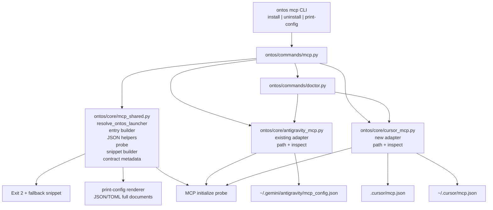
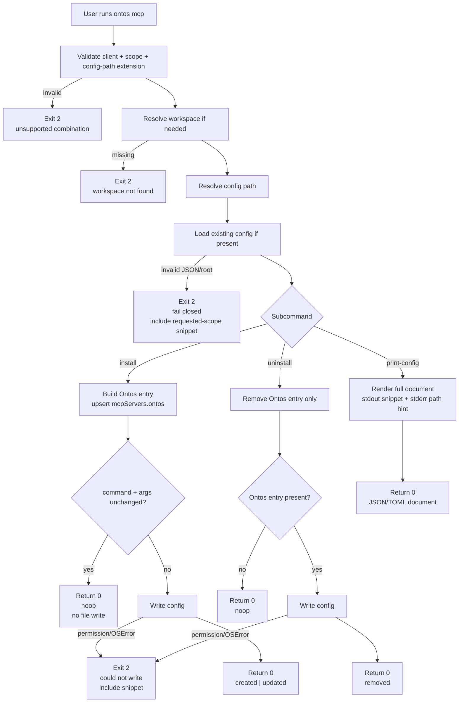
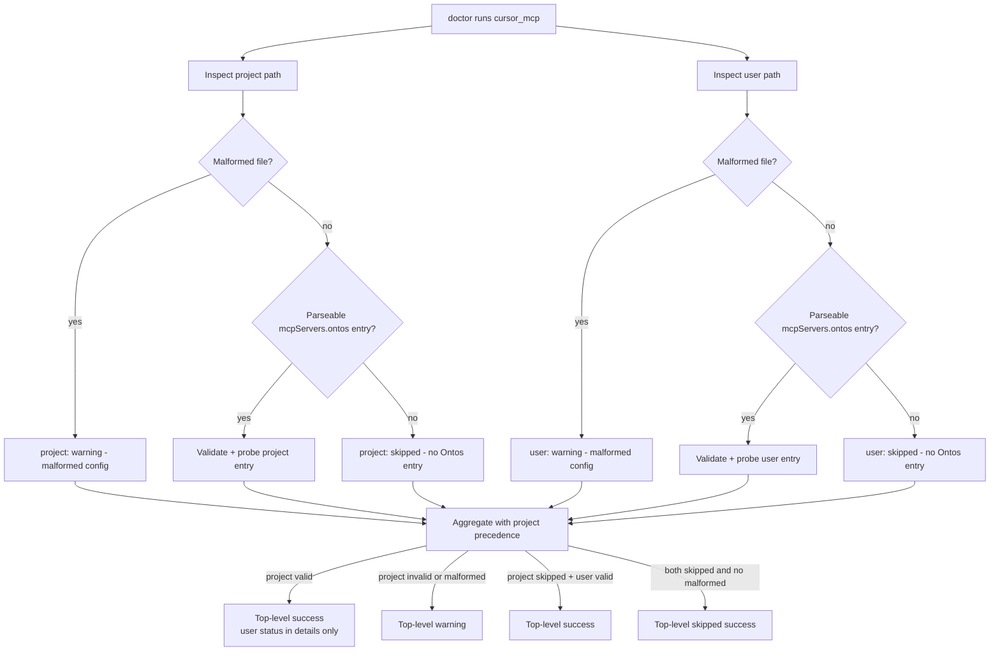

# Ontos v4.2.0 Implementation Spec

**Version target:** `4.2.0`  
**Theme:** Cursor Onboarding + Universal Fallback  
**Tier:** 2  
**Risk level:** Medium  
**Status:** Draft v1.1, revised per Phase B.3 CA response, ready for Phase C

## 0. Overview

`v4.2.0` extends the MCP onboarding pattern proven in `v4.1.3` without
turning Ontos into a generic config mutator for every agent ecosystem at
once.

This release delivers four things:

1. first-class managed Cursor onboarding for both `project` and `user`
   scope
2. a universal `ontos mcp print-config --client X` fallback for managed
   and non-managed clients
3. lifecycle support around managed clients: install, uninstall, and
   rerun-install refresh semantics
4. a Cursor-specific doctor check that validates the configured Ontos
   entry end to end

This release does **not** broaden Ontos into:

- third-party CLI delegation
- managed Claude Code, Codex, or VS Code adapters
- transport work
- daemon mode
- malformed-config repair
- a Python version floor bump

One-sentence summary:

> `v4.2.0` adds a stable, direct-file Cursor adapter and a zero-write
> `print-config` escape hatch for every targeted client while preserving
> the shipped Antigravity contract.

## 1. Key Decisions

These are the governing decisions that all design and implementation
details below must honor.

1. **Delegation policy:** `v4.2` performs direct file management only.
   It does not shell out to `codex mcp add`, `claude mcp add`, Cursor
   CLIs, or any other third-party onboarding command.
2. **Managed-client policy:** the only new managed client in `v4.2` is
   Cursor. Antigravity remains supported as-shipped from `v4.1.3`.
3. **Fallback policy:** `ontos mcp print-config` is the universal,
   copy-pastable fallback path for Antigravity, Cursor, Claude Code,
   Codex, and VS Code.
4. **Contract-drift policy:** managed adapters fail closed on malformed
   or unknown shapes, return exit code `2`, and surface the exact
   `print-config` snippet for manual recovery.
5. **Compatibility policy:** keep Python `>=3.9`; do not add a new floor
   for TOML support. Add `tomli_w>=1.2,<2.0` in Phase C so Codex
   `print-config` emits valid TOML without hand-rolled escaping.
6. **Antigravity stability policy:** do not redesign the shipped
   Antigravity config contract in this phase. New CLI lifecycle features
   may target Antigravity, but `ontos/core/antigravity_mcp.py` should not
   be behaviorally broadened unless a minimal compatibility wrapper is
   unavoidable.
7. **Doctor scope policy:** the only new doctor work in `v4.2` is
   Cursor-specific. Existing `antigravity_mcp` behavior remains a
   compatibility constraint, not a redesign target.
8. **Signal recording policy:** release-expansion evidence is recorded in
   GitHub issues or PRs labeled `mcp-onboarding` and summarized in a
   post-release follow-up log under `docs/logs/`.
9. **Windows policy:** managed install, uninstall, and doctor promises in
   `v4.2` are POSIX-only. Windows users are supported through
   `print-config`.
10. **Entry ownership policy:** Ontos owns the full
    `mcpServers.ontos` object for managed clients. User-added fields
    inside that entry may be overwritten on any non-`noop` install.

## 2. Investigation (A.0)

This section records the codebase verification required before writing
the implementation plan. Each answer is grounded in the current
`v4.1.3` code or in official client documentation reviewed on
`2026-04-13`.

### 2.1 Adapter Architecture Findings

#### I1. Current structure of `ontos/core/antigravity_mcp.py`

**Answer**

The module is a self-contained adapter that owns:

- config-path discovery via `antigravity_config_path()`
- user-scoped detection via `detect_antigravity_installation()`
- launcher resolution via `resolve_ontos_launcher()`
- entry construction via `build_antigravity_ontos_entry()`
- JSON load/write helpers
- `mcpServers.ontos` upsert logic
- workspace extraction and executable resolution
- a subprocess-based MCP `initialize` probe
- doctor inspection logic

**Current references**

- `ontos/core/antigravity_mcp.py:15-26`
- `ontos/core/antigravity_mcp.py:73-100`
- `ontos/core/antigravity_mcp.py:103-148`
- `ontos/core/antigravity_mcp.py:151-226`
- `ontos/core/antigravity_mcp.py:229-396`

**Implication**

The Antigravity module already demonstrates the full adapter pattern
needed for Cursor, but it is monolithic. `v4.2` should introduce shared
helpers without destabilizing the shipped Antigravity behavior.

#### I2. How `build_antigravity_ontos_entry()` constructs the server entry

**Answer**

The builder resolves the launcher via `shutil.which("ontos")`, falling
back to `sys.executable -m ontos`, then emits:

- `command`: resolved launcher executable
- `args`: `prefix_args + ["serve", "--workspace", ABS_PATH]`
- default read-only mode by appending `--read-only` unless
  `write_enabled=True`

**Current references**

- `ontos/core/antigravity_mcp.py:86-100`

**Implication**

Cursor should use the same launcher and argument shape. The builder
interface should stay workspace-first and default to read-only.

#### I3. How `upsert_antigravity_ontos_entry()` merges config

**Answer**

The function:

- shallow-copies the root object
- uses `payload.setdefault("mcpServers", {})`
- validates that the server map is a dict
- writes only `servers["ontos"]`
- returns `(payload, action)` where `action` is `created` or `updated`

It preserves unrelated top-level keys and unrelated MCP servers.

**Current references**

- `ontos/core/antigravity_mcp.py:140-148`

**Implication**

Cursor should reuse this preservation model exactly. It is the correct
merge behavior for a managed MCP adapter.

#### I4. What validation `inspect_antigravity_ontos_config()` performs

**Answer**

The inspection flow validates:

- whether the user has opted in to Antigravity config discovery
- missing config vs malformed config vs invalid root shape
- presence of `mcpServers.ontos`
- `command` string type
- `args` list type
- executable resolvability
- inclusion of `serve`
- presence and validity of `--workspace`
- workspace existence and absoluteness
- effective mode (`read-only` vs `write-enabled`)
- end-to-end MCP `initialize` success

**Current references**

- `ontos/core/antigravity_mcp.py:229-396`

**Implication**

Cursor doctor coverage should follow the same validation phases and reuse
the initialize probe rather than inventing a lighter or different health
model.

#### I5. How the MCP `initialize` probe works in `v4.1.3`

**Answer**

`probe_mcp_initialize()` launches `[command, *args]`, writes a single
JSON-RPC initialize request to stdin, waits up to 15 seconds, then
classifies failure modes:

- executable missing
- timeout
- generic `OSError`
- non-zero exit
- no response
- invalid JSON
- unexpected payload
- success with optional `serverInfo`

**Current references**

- `ontos/core/antigravity_mcp.py:176-226`

**Implication**

The probe is reusable across adapters and should move into a shared core
module or stay as a shared helper imported by Cursor. The timeout remains
fixed in `v4.2`; configurability is explicitly deferred.

### 2.2 CLI Structure Findings

#### I6. Current `ontos mcp install` argument structure

**Answer**

Current CLI surface:

- `ontos mcp install --client antigravity`
- optional `--workspace`
- optional `--write-enabled`
- no `--scope`
- no `--config-path`
- no `uninstall`
- no `refresh`
- no `print-config`

**Current references**

- `ontos/cli.py:300-335`

**Implication**

`v4.2` needs a real `mcp` subcommand family rather than another
single-purpose parser branch.

#### I7. How `_run_mcp_install_command()` dispatches today

**Answer**

The command layer is Antigravity-specific:

- rejects any non-`antigravity` client
- resolves workspace root
- loads existing Antigravity config if present
- builds the Antigravity entry
- upserts and writes the config
- returns `(exit_code, message, data)`

**Current references**

- `ontos/commands/mcp.py:20-81`

**Implication**

`v4.2` needs a dispatch table or structured branching by client and
subcommand, not more client-specific conditionals embedded directly in
the install path.

#### I8. Current exit codes and JSON output structure

**Answer**

The handler returns:

- exit `0` on success
- exit `2` on user/environment/config problems
- exit `5` only through outer CLI exception routing

JSON envelopes are emitted by `_emit_handler_result_json()` and
`emit_command_success()` / `emit_command_error()` with top-level fields:

- `schema_version`
- `command`
- `status`
- `exit_code`
- `message`
- `data`
- `warnings`
- `error`

Current `mcp install` uses command name `mcp-install`.

**Current references**

- `ontos/commands/mcp.py:44-81`
- `ontos/cli.py:34-58`
- `ontos/cli.py:903-924`
- `ontos/ui/json_output.py:131-182`

**Implication**

All new MCP subcommands should keep the same envelope pattern and use
command names `mcp-install`, `mcp-uninstall`, and `mcp-print-config`.

#### I9. Existing `ontos mcp` subcommand infrastructure

**Answer**

There is a bare `mcp` root parser and one subcommand, `install`. The root
already supports `subparsers`, so expansion is straightforward.

**Current references**

- `ontos/cli.py:300-335`
- `ontos/cli.py:888-924`

**Implication**

No CLI redesign is needed; `v4.2` can extend the existing parser family
in place.

### 2.3 Config-Path Findings

#### I10. Cursor project config path

**Answer**

Repo-local docs already document Cursor project config as
`.cursor/mcp.json`.

Official support evidence reviewed on `2026-04-13`:

- Cursor CLI docs indicate MCP configuration is read from `mcp.json`
  using project/global/nested precedence
- OpenAI’s MCP docs page shows Cursor using `~/.cursor/mcp.json` for
  global configuration, which aligns with the repo’s project-level
  `.cursor/mcp.json` pattern

**Current references**

- `README.md:278-291`
- `docs/reference/Ontos_Manual.md:669-679`
- `docs/reference/Migration_v3_to_v4.md:216-226`
- Cursor docs reviewed: `https://docs.cursor.com/en/cli/using`
- OpenAI docs reviewed: `https://platform.openai.com/docs/docs-mcp`

**Implication**

`v4.2` should treat `.cursor/mcp.json` as the managed project path.

#### I11. Cursor user config path

**Answer**

The official OpenAI MCP docs page explicitly documents Cursor’s global
config at `~/.cursor/mcp.json`.

**References**

- OpenAI docs reviewed: `https://platform.openai.com/docs/docs-mcp`

**Implication**

`v4.2` should treat `~/.cursor/mcp.json` as the managed user path.

#### I12. Cursor root key

**Answer**

Both repo docs and the OpenAI MCP docs page use `mcpServers` as the root
server map key for Cursor.

**Current references**

- `README.md:279-287`
- `docs/reference/Ontos_Manual.md:670-678`
- `docs/reference/Migration_v3_to_v4.md:217-225`
- OpenAI docs reviewed: `https://platform.openai.com/docs/docs-mcp`

**Implication**

Cursor belongs in the same JSON adapter family as Antigravity.

#### I13. Cursor support for project and user scope simultaneously

**Answer**

Official Cursor CLI docs indicate config precedence in this order:

1. project
2. global
3. nested parent directories

That means both project and user scope can exist simultaneously, with
project scope taking precedence for the current workspace.

**References**

- Cursor docs reviewed: `https://docs.cursor.com/en/cli/using`

**Implication**

`v4.2` can support both scopes, but must document that:

- a project-scope config overrides a user-scope config for that repo
- user scope is still a single global Ontos entry and is therefore best
  for users who want one default workspace or who accept explicit
  re-installation when switching repos

### 2.4 Doctor Integration Findings

#### I14. How `antigravity_mcp` is registered

**Answer**

`check_antigravity_mcp()` lives in `ontos/commands/doctor.py` and is
added to the `checks` list near the end of `_run_doctor_command()`.

**Current references**

- `ontos/commands/doctor.py:556-575`
- `ontos/commands/doctor.py:636-647`

**Implication**

`cursor_mcp` should be added as another additive check function in the
same module and list, without altering the JSON schema or global doctor
flow.

#### I15. Doctor JSON output schema for MCP checks

**Answer**

Doctor JSON output emits:

- top-level `status`
- `data.checks` as a list of serialized `CheckResult`
- `data.summary` with `passed`, `failed`, `warnings`

Each check has:

- `name`
- `status`
- `message`
- optional `details`

**Current references**

- `ontos/commands/doctor.py:19-52`
- `ontos/cli.py:783-800`
- `tests/test_cli_phase4.py:202-216`

**Implication**

Adding `cursor_mcp` is schema-additive and should not require any
consumer changes beyond accommodating one extra check object.

#### I16. Current Antigravity detection behavior

**Answer**

Antigravity detection already keys on the existence of the user config
directory `~/.gemini/antigravity/`, not on the macOS app bundle.

**Current references**

- `ontos/core/antigravity_mcp.py:73-83`

**Implication**

N5 is confirmed: the shipped path is
`~/.gemini/antigravity/mcp_config.json`, and the user-scoped detection
change from `v4.1.3` is already in place. `v4.2` should leave this logic
alone.

### 2.5 Test Pattern Findings

#### I17. How current tests mock the home directory

**Answer**

CLI integration tests do not monkeypatch `Path.home()` directly. They run
the CLI in a subprocess with a temp `HOME` environment variable and a
controlled `PYTHONPATH`.

**Current references**

- `tests/commands/test_mcp_command.py:16-37`
- `tests/commands/test_mcp_command.py:40-46`

**Implication**

Cursor user-scope tests should follow the same subprocess + temp `HOME`
pattern. Adapter unit tests may monkeypatch `Path.home()` when needed,
but end-to-end tests should prefer the current subprocess model.

#### I18. How current tests verify JSON output contracts

**Answer**

Current tests invoke `--json`, parse stdout with `json.loads()`, and
assert stable fields in `data`, command-specific payloads, and doctor
check names.

**Current references**

- `tests/commands/test_mcp_command.py:168-217`
- `tests/test_cli_phase4.py:202-216`

**Implication**

`print-config`, `uninstall`, install `noop`, and `cursor_mcp` should all be
tested through the same envelope-first strategy rather than brittle
string matching.

## 3. Scope

### 3.1 In Scope

- [x] add Cursor as the only new managed MCP client in `v4.2`
- [x] support Cursor `project` and `user` scope
- [x] add `ontos mcp uninstall`
- [x] add `ontos mcp print-config`
- [x] preserve Antigravity install compatibility inside the expanded CLI
- [x] add Cursor doctor coverage via `cursor_mcp`
- [x] add `--config-path` override to install, uninstall, and
  print-config
- [x] keep install default mode read-only
- [x] make rerun-install the only supported refresh path
- [x] document and test contract-drift fallback behavior
- [x] keep JSON output schema additive-only

### 3.2 Out of Scope

- [ ] managed Claude Code onboarding
- [ ] managed Codex onboarding
- [ ] managed VS Code onboarding
- [ ] any third-party CLI delegation
- [ ] HTTP / Streamable HTTP transport
- [ ] daemon mode
- [ ] security middleware or auth changes
- [ ] malformed-config auto-repair
- [ ] Python version floor bump
- [ ] redesign of Antigravity config detection or wire format
- [ ] new non-Cursor doctor checks
- [ ] changing MCP server tool contracts

### 3.3 Scope Notes

1. Antigravity remains part of the CLI surface because it is already a
   first-class managed client in `v4.1.3`. The `v4.2` rule is:
   **preserve it; do not reinvent it.**
2. Cursor user scope is supported, but it is a single global Ontos entry.
   Users who switch between many repos should prefer project scope.
3. Rerunning `ontos mcp install --client X` is the only supported refresh
   path in `v4.2`; there is no standalone `refresh` subcommand.
4. `print-config` is both a supported user workflow and the fallback path
   when managed writes fail closed.

## 4. Dependencies

### 4.1 Release and Merge Preconditions

- `v4.1.3` must be on the target base branch before `v4.2` work begins.
- The shipped Antigravity contract at
  `~/.gemini/antigravity/mcp_config.json` is a compatibility baseline.
- The reviewed proposal and CA response are required inputs:
  - `.ontos-internal/strategy/proposals/v4.2/Ontos-v4.2-MCP-Client-Onboarding-Proposal.md`
  - `.ontos-internal/reviews/v4.2-proposal-ca-response.md`

### 4.2 Runtime / Dependency Preconditions

- Python floor stays `>=3.9`
- existing `tomli` fallback remains available for TOML reads
- add `tomli_w>=1.2,<2.0` in Phase C for Codex `print-config`
- MCP optional dependency remains unchanged

**Current references**

- `pyproject.toml:7-10`
- `pyproject.toml:29-32`
- `ontos/io/toml.py:12-46`

### 4.3 Documentation Preconditions

Managed and fallback client contracts must be anchored in reviewed docs:

- Cursor canonical contract: `https://docs.cursor.com/context/mcp`
- Cursor CLI behavior and precedence support:
  `https://docs.cursor.com/en/cli/using`
- OpenAI MCP docs for Cursor/Codex/VS Code examples:
  `https://platform.openai.com/docs/docs-mcp`
- Claude Code settings / MCP docs:
  `https://docs.anthropic.com/en/docs/claude-code/settings`
- VS Code MCP config docs:
  `https://code.visualstudio.com/docs/copilot/reference/mcp-configuration`

### 4.4 Success Metric Recording

The proposal-level success metric remains in force for implementation
planning:

- within 4 weeks of release, Cursor onboarding should produce at least
  one confirmed non-Antigravity real-world use / ask
- there should be no contract-drift or config-corruption bug for the
  managed adapters

Recording surface:

- primary: GitHub issues or PRs labeled `mcp-onboarding`
- secondary: a follow-up summary in `docs/logs/`
- supplemental measurable signal: GitHub traffic or docs analytics page
  views for the Cursor onboarding documentation pages captured at the
  4-week follow-up if available

### 4.5 Known Blockers and Mitigations

| Blocker | Impact | Mitigation |
|---|---|---|
| Cursor contract ambiguity around future schema drift | Managed writes could become unsafe | Fail closed, record verified URL/date, surface `print-config` |
| User-scope Cursor entry is single-workspace global | Users may assume multi-repo safety | Document limitation, recommend project scope |
| Windows is not covered by current tests or docs | Managed promises would be misleading | Defer managed Windows support to `v4.3`; direct users to `print-config` |
| Existing Antigravity module is monolithic | Refactor risk | Prefer additive shared helpers consumed by Cursor first |

## 5. Technical Design

### 5.1 Adapter Architecture

#### 5.1.1 Design Goal

Introduce a shared MCP-client core that is small enough for `v4.2`, but
explicit enough that future managed adapters can reuse it without another
round of ad hoc branching.

#### 5.1.2 Architecture Decision

Create a new shared core module for generic behavior, add a Cursor
adapter, and preserve Antigravity as the compatibility reference
implementation.

**Preferred new modules**

- `ontos/core/mcp_shared.py`
- `ontos/core/cursor_mcp.py`

**Existing modules to modify**

- `pyproject.toml`
- `ontos/commands/mcp.py`
- `ontos/cli.py`
- `ontos/commands/doctor.py`
- `tests/commands/test_mcp_command.py`
- `tests/commands/test_doctor_phase4.py`
- `tests/test_cli_phase4.py`
- `tests/commands/test_antigravity_mcp_docs.py`
- `README.md`
- `docs/reference/Ontos_Manual.md`
- `docs/reference/Migration_v3_to_v4.md`
- `docs/releases/v4.2.0.md`

**Files explicitly not targeted in this phase**

- `ontos/mcp/server.py`
- `ontos/mcp/tools/*`
- `ontos/io/toml.py`
- `ontos/core/antigravity_mcp.py` for anything beyond
  compatibility-preserving glue that leaves shipped behavior unchanged

#### 5.1.3 Shared Core Responsibilities

`ontos/core/mcp_shared.py` should own only the behavior shared by
managed direct-file adapters and `print-config` generation:

- `resolve_ontos_launcher()`
- `build_ontos_stdio_entry(workspace_root, write_enabled)`
- `extract_workspace_arg(args)`
- `resolve_executable(command)`
- `probe_mcp_initialize(command, args, timeout=15)`
- JSON load / write helpers for root-object configs
- `mcpServers` upsert / remove helpers
- print-config snippet builders for JSON and TOML output
- contract metadata definitions for managed and fallback clients

It should **not** own:

- Cursor path discovery
- Antigravity path discovery
- doctor registration
- CLI argument parsing

`resolve_ontos_launcher()` is owned by `mcp_shared.py`. Antigravity and
Cursor both import it from there; no adapter owns a private copy.

#### 5.1.4 Adapter Interface Contract

Managed adapters must implement a small, explicit contract for the
command layer.

Required interface:

```python
class ManagedMCPAdapter(Protocol):
    client_name: str
    supported_scopes: tuple[str, ...]
    default_scope: str

    def resolve_config_path(
        self,
        *,
        scope: str,
        workspace_root: Path,
        home: Path | None = None,
        config_path_override: Path | None = None,
    ) -> Path: ...

    def build_ontos_entry(
        self,
        *,
        workspace_root: Path,
        write_enabled: bool,
    ) -> dict[str, object]: ...

    def load_config(self, path: Path) -> dict[str, object] | None: ...

    def write_config(self, path: Path, data: dict[str, object]) -> None: ...

    def upsert_ontos_entry(
        self,
        existing: dict[str, object] | None,
        entry: dict[str, object],
    ) -> tuple[dict[str, object], str]: ...

    def remove_ontos_entry(
        self,
        existing: dict[str, object] | None,
    ) -> tuple[dict[str, object] | None, str]: ...
```

This interface is intentionally smaller than a future generic adapter
hierarchy. `v4.2` only needs enough abstraction to keep Cursor from
copy-pasting the Antigravity implementation, but it is a required
contract, not a suggestion.

### 5.2 Delegation Policy

This is a hard rule for `v4.2`.

Ontos will **not** call:

- `codex mcp add`
- `claude mcp add`
- `cursor-agent mcp ...`
- any GUI automation or native app installer

All managed automation in this release is direct JSON file management,
and all other clients use `print-config` only.

This policy must appear:

- in the implementation spec
- in the proposal-derived docs updates
- in any future implementation prompt handed to developers

### 5.3 Shared Contract Metadata

The common module should define a single source of truth for supported
client metadata.

Recommended data model:

```python
@dataclass(frozen=True)
class MCPClientContract:
    client: str
    managed: bool
    format: str           # "json" | "toml"
    root_key: str         # "mcpServers" | "servers" | "mcp_servers"
    default_scope: str
    supported_scopes: tuple[str, ...]
    source_url: str
    last_verified: str
```

Pinned `source_url` values:

- Cursor canonical contract:
  `https://docs.cursor.com/context/mcp`
- Cursor precedence/search behavior:
  `https://docs.cursor.com/en/cli/using`

Initial contract table:

| Client | Managed | Format | Root | Default Scope | Supported Scopes |
|---|---|---|---|---|---|
| `antigravity` | yes | `json` | `mcpServers` | `user` | `user` |
| `cursor` | yes | `json` | `mcpServers` | `project` | `project`, `user` |
| `claude-code` | no | `json` | `mcpServers` | `project` | `project` |
| `codex` | no | `toml` | `mcp_servers` | `user` | `user` |
| `vscode` | no | `json` | `servers` | `project` | `project` |

This data model supports three outcomes:

1. CLI validation
2. print-config rendering
3. future contract-drift reporting

### 5.4 CLI Surface

#### 5.4.1 Commands

`v4.2` expands the CLI to:

```bash
ontos mcp install --client {antigravity,cursor}
ontos mcp uninstall --client {antigravity,cursor}
ontos mcp print-config --client {antigravity,cursor,claude-code,codex,vscode}
```

There is no standalone `refresh` subcommand in `v4.2`. Refresh means
rerunning `ontos mcp install --client X` against the same target path.

#### 5.4.2 Argument Matrix

| Command | Args | Notes |
|---|---|---|
| `install` | `--client`, `--scope`, `--workspace`, `--write-enabled`, `--config-path`, `--json` | `--scope` validated by client |
| `uninstall` | `--client`, `--scope`, `--config-path`, `--json` | removes only Ontos entry |
| `print-config` | `--client`, `--scope`, `--workspace`, `--write-enabled`, `--config-path`, `--json` | zero-write output |

#### 5.4.3 CLI Defaults

- `--scope`
  - `antigravity`: implicit `user`
  - `cursor`: default `project`
  - `claude-code`: default `project`
  - `codex`: default `user`
  - `vscode`: default `project`
- `--workspace`
  - defaults to resolved Ontos project root using `find_project_root()`
- mode
  - defaults to `read-only`

#### 5.4.4 CLI Validation Rules

The command layer should reject unsupported combinations with exit `2`.

Examples:

- `ontos mcp install --client codex`
- `ontos mcp uninstall --client claude-code`
- `ontos mcp print-config --client antigravity --scope project`
- `ontos mcp install --client cursor --scope project` with no resolvable
  Ontos workspace
- `ontos mcp print-config --client codex --config-path ~/.cursor/mcp.json`

If `--config-path` uses the wrong extension for the selected client,
return exit `2`:

- JSON clients require `.json`
- Codex requires `.toml`

#### 5.4.5 JSON Output Contracts

Successful `install` data payload:

```json
{
  "client": "cursor",
  "scope": "project",
  "action": "created",
  "config_path": "/abs/path/.cursor/mcp.json",
  "workspace": "/abs/path/to/repo",
  "mode": "read-only"
}
```

`install.action` is one of:

- `created`
- `updated`
- `noop`

Successful `uninstall` data payload:

```json
{
  "client": "cursor",
  "scope": "project",
  "action": "removed",
  "config_path": "/abs/path/.cursor/mcp.json"
}
```

`uninstall.action` is one of:

- `removed`
- `noop`

Successful `print-config` data payload:

```json
{
  "client": "codex",
  "scope": "user",
  "config_path": "/Users/example/.codex/config.toml",
  "format": "toml",
  "snippet": "[mcp_servers.ontos]\ncommand = \"/abs/path/to/ontos\"\n..."
}
```

Managed-command failures that fail closed on config shape or permission
should include:

- `client`
- `scope`
- `config_path`
- `error`
- `fallback_format`
- `fallback_snippet`

Fallback snippets always use the scope that was explicitly requested for
the command.

### 5.5 Workspace Resolution

`v4.2` should keep the existing workspace resolution strategy from
`ontos/commands/mcp.py`:

1. use explicit `--workspace` if provided
2. otherwise resolve the current Ontos project root via
   `find_project_root(start_path=Path.cwd().resolve())`
3. error with exit `2` if no Ontos workspace can be resolved

**Current reference**

- `ontos/commands/mcp.py:29-41`
- `ontos/io/files.py:50-88`

Design rule:

- all generated managed entries must carry an explicit absolute
  `--workspace`
- this includes Cursor project scope
- this also applies to Cursor user-scope installs, which default
  `--workspace` to the current Ontos project root

Rationale:

- it removes ambiguity about execution cwd
- it makes user-scope Cursor installs deterministic
- it gives doctor a stable workspace to validate

### 5.6 Cursor Adapter

#### 5.6.1 Purpose

Provide a managed direct-file adapter for Cursor that matches the
Antigravity merge-and-validate behavior but respects Cursor’s two-scope
model.

#### 5.6.2 Config Path Discovery

Recommended adapter API:

```python
def cursor_config_path(
    *,
    scope: str,
    workspace_root: Path,
    home: Path | None = None,
    config_path_override: Path | None = None,
) -> Path:
    ...
```

Rules:

- `project` -> `workspace_root / ".cursor" / "mcp.json"`
- `user` -> `(home or Path.home()) / ".cursor" / "mcp.json"`
- `config_path_override` bypasses default location resolution

#### 5.6.3 Entry Shape

Managed Cursor entry should mirror Antigravity’s launcher resolution and
workspace explicitness:

```json
{
  "command": "/abs/path/to/ontos-or-python",
  "args": ["serve", "--workspace", "/abs/path/to/repo", "--read-only"]
}
```

`--write-enabled` removes `--read-only`.

#### 5.6.4 Load / Validate / Merge Behavior

Cursor adapter behavior must match Antigravity’s preservation policy:

- create parent directory if missing on write
- parse existing JSON if file exists
- fail on invalid JSON
- fail on non-object root
- fail if `mcpServers` exists but is not an object
- preserve unrelated top-level keys
- preserve unrelated entries under `mcpServers`
- mutate only `mcpServers.ontos`

#### 5.6.5 Remove Behavior

`remove_cursor_ontos_entry()` should:

- remove only `mcpServers.ontos`
- return `action="removed"` if entry existed
- return `action="noop"` if absent
- preserve empty `mcpServers` rather than deleting the root key
- preserve unrelated top-level keys
- never delete the file automatically

#### 5.6.6 Install Rerun / Stale Launcher Behavior

Rerunning `ontos mcp install --client cursor ...` is the only supported
refresh path in `v4.2`.

Rules:

- if no config exists, install creates it
- if `mcpServers.ontos` is absent, install creates it
- if the newly generated `command` and `args` match the existing
  Ontos-managed values, install returns `action="noop"` and does not
  rewrite the file
- if `command` or `args` differ, install rewrites the full
  `mcpServers.ontos` object
- user-added fields inside `mcpServers.ontos` do not affect `noop`
  detection and may be overwritten on any non-`noop` install
- if the `ontos` launcher moved because the shell environment changed,
  rerunning install writes the newly resolved launcher path

#### 5.6.7 User-Scope Limitation

Cursor user scope is supported, but the spec must state this plainly:

- `~/.cursor/mcp.json` holds one global `ontos` entry
- that entry points at one explicit workspace at a time
- users working across many Ontos repos should prefer project scope

This limitation is a documentation requirement, not a blocker.

### 5.7 Antigravity Compatibility

#### 5.7.1 Constraint

Antigravity behavior from `v4.1.3` is the compatibility baseline.

The adapter currently:

- resolves the stable path
  `~/.gemini/antigravity/mcp_config.json`
- defaults to read-only
- uses explicit absolute `--workspace`
- exposes `antigravity_mcp` doctor inspection

**Current references**

- `ontos/core/antigravity_mcp.py:15`
- `ontos/core/antigravity_mcp.py:73-100`
- `ontos/core/antigravity_mcp.py:229-396`

#### 5.7.2 What `v4.2` May Change

- add CLI routing so `uninstall` and `print-config` can target
  Antigravity
- add shared helper calls only if they are behavior-preserving
- add tests that prove `v4.1.3 -> v4.2` idempotency

#### 5.7.3 What `v4.2` Must Not Change

- config path
- user-scoped detection logic
- launcher resolution semantics
- default read-only behavior
- `antigravity_mcp` check contract
- error taxonomy for malformed existing config

#### 5.7.4 Public Compatibility Surface

The following Antigravity symbols are treated as public compatibility
surface for `v4.2`:

- `antigravity_config_path`
- `detect_antigravity_installation`
- `build_antigravity_ontos_entry`
- `load_antigravity_config`
- `write_antigravity_config`
- `upsert_antigravity_ontos_entry`
- `probe_mcp_initialize`
- `inspect_antigravity_ontos_config`
- the existing Antigravity dataclasses and error types exported from
  `ontos/core/antigravity_mcp.py`

### 5.8 `print-config` Generator

#### 5.8.1 Purpose

Provide a universal, zero-write, copy-pastable configuration generator
that:

- works for all clients named in the proposal
- doubles as the manual recovery path when managed automation fails
- gives Ontos an escape hatch for contract drift without resorting to
  destructive writes

#### 5.8.2 Output Policy

Plain-text output:

- print the complete self-contained document to stdout
- print the target-path hint to stderr
- no prose wrapper in stdout
- no markdown fences

JSON output:

- return the standard command envelope
- include `config_path` in `data`
- place the snippet in `data.snippet`

`print-config` output is always a valid, complete document for the
selected client, never a fragment.

#### 5.8.3 Client-Specific Shapes

**Antigravity**

```json
{
  "mcpServers": {
    "ontos": {
      "command": "/abs/path/to/ontos",
      "args": ["serve", "--workspace", "/abs/path/to/repo", "--read-only"]
    }
  }
}
```

**Cursor**

```json
{
  "mcpServers": {
    "ontos": {
      "command": "/abs/path/to/ontos",
      "args": ["serve", "--workspace", "/abs/path/to/repo", "--read-only"]
    }
  }
}
```

**Claude Code**

```json
{
  "mcpServers": {
    "ontos": {
      "command": "/abs/path/to/ontos",
      "args": ["serve", "--workspace", "/abs/path/to/repo", "--read-only"]
    }
  }
}
```

**Codex**

```toml
[mcp_servers.ontos]
command = "/abs/path/to/ontos"
args = ["serve", "--workspace", "/abs/path/to/repo", "--read-only"]
```

Codex output is serialized with `tomli_w`; Ontos does not hand-roll TOML
escaping for this document. The canonical top-level table is
`[mcp_servers.ontos]`.

**VS Code**

```json
{
  "servers": {
    "ontos": {
      "type": "stdio",
      "command": "/abs/path/to/ontos",
      "args": ["serve", "--workspace", "/abs/path/to/repo", "--read-only"]
    }
  }
}
```

#### 5.8.4 `--config-path` Semantics for `print-config`

`--config-path` changes:

- reported target path metadata in the JSON response
- any human-readable guidance emitted by managed-command fallbacks

It does **not** change:

- client syntax
- root key
- scope validity

### 5.9 Install / Uninstall Flows

#### 5.9.1 Install

Install behavior:

1. validate client is managed
2. validate scope is supported by that client
3. resolve workspace root
4. resolve target config path
5. load existing config if present
6. build the Ontos entry
7. upsert `mcpServers.ontos`
8. compare the generated `command` and `args` against the existing
   Ontos-owned values if an entry already exists
9. if they are identical, return `noop` without rewriting the file
10. otherwise write pretty-printed JSON
11. return `created` or `updated`

Failure behavior:

- invalid JSON -> exit `2`
- invalid root shape -> exit `2`
- permission / write `OSError` -> exit `2`
- unsupported client / scope -> exit `2`
- missing workspace -> exit `2`

On any managed write failure caused by config shape or permission:

- include the exact `print-config` snippet in the failure payload
- tell the user where it should be written manually

`noop` comparison uses Ontos-generated fields only:

- `command`
- `args`

User-added fields inside `mcpServers.ontos` do not participate in the
comparison.

#### 5.9.2 Uninstall

Uninstall behavior:

1. validate client is managed
2. resolve target config path
3. if file missing, return success with `action="noop"`
4. if file exists, load and validate JSON
5. remove only `mcpServers.ontos`
6. write updated JSON back to disk
7. never delete the file

Failure behavior:

- malformed file -> exit `2`
- invalid root -> exit `2`
- permission `OSError` -> exit `2`

If uninstall fails closed because the config is malformed, the user gets:

- a targeted error
- the target path
- the `print-config` snippet for reference
- manual cleanup guidance

#### 5.9.3 Rerun-Install Refresh Semantics

Refresh is implemented by rerunning `ontos mcp install --client X`.

Rules:

- rerunning install recalculates the launcher path from the current shell
  environment
- if `ontos` moved, the newly resolved path is written
- if the generated `command` and `args` are unchanged, install returns
  `noop`
- there is no separate `refresh` action or subcommand in `v4.2`

#### 5.9.4 Fallback Snippet Scope

If install fails after the target scope has been chosen, the fallback
snippet always uses the scope that was explicitly requested for that
command.

### 5.10 Doctor Integration

#### 5.10.1 Scope

The only new doctor feature in `v4.2` is `cursor_mcp`.

Existing `antigravity_mcp` remains unchanged.

#### 5.10.2 Check Registration

Add one new check function:

- `check_cursor_mcp(repo_root: Optional[Path] = None) -> CheckResult`

Add it to the `checks` list in `_run_doctor_command()` after the existing
environment-manifest and Antigravity checks, or directly adjacent to
`check_antigravity_mcp()` if that makes test ordering clearer.

The choice of exact ordering is not semantically important as long as:

- the new check is additive
- existing check names are not changed
- JSON shape remains stable

#### 5.10.3 Detection Policy

Cursor detection must key on `mcpServers.ontos`, not on file presence
alone.

Detection algorithm:

1. determine project path `repo_root / ".cursor" / "mcp.json"`
2. determine user path `Path.home() / ".cursor" / "mcp.json"`
3. for each existing file:
   - load JSON if possible
   - if JSON parsing fails or the root shape is invalid, mark that scope
     as `warning - malformed config`
   - if `mcpServers.ontos` absent, skip that file
4. if no Ontos entry is found in either scope, return `success` with a
   skipped message unless one or more inspected files were malformed
5. if one or more Ontos entries are found, inspect each and aggregate
   status into one `cursor_mcp` result

Precedence-aware aggregation:

- if project scope has a valid Ontos entry, top-level status reflects the
  project result regardless of user-scope state
- if project scope has an invalid or malformed Ontos-targeted result,
  top-level status is `warning` even if user scope is valid
- if project scope has no Ontos entry and user scope is valid, top-level
  status is `success`
- if neither scope has an Ontos entry and no malformed file is present,
  top-level status is skipped success
- if neither scope has an Ontos entry but one or more files are malformed,
  top-level status is `warning`

This removes the "doctor says green, install says red" trap. Parseable
files still use `mcpServers.ontos` as the opt-in signal; malformed files
warn because the config at the inspected path is already broken.

#### 5.10.4 Validation Rules

Cursor inspection should validate, per scope:

- `command` exists and is a string
- `args` exists and is a list
- resolved executable exists
- `serve` is present in args
- `--workspace` exists and resolves to an absolute path
- workspace exists
- mode is `read-only` unless `--read-only` is absent
- initialize probe succeeds

Doctor details should identify which scope failed:

- `project: <status> - <reason>; user: <status> - <reason>`

#### 5.10.5 JSON Output

No schema change beyond one additional check object.

Example:

```json
{
  "name": "cursor_mcp",
  "status": "success",
  "message": "Cursor Ontos MCP entry valid in project scope",
  "details": "project: success - valid Ontos entry; user: warning - malformed config"
}
```

### 5.11 Contract-Drift Policy Implementation

#### 5.11.1 Code-Level Contract Recording

Managed adapters must carry:

- `source_url`
- `last_verified`
- expected format
- expected root key

Recommended location:

- `ontos/core/mcp_shared.py`

These values should feed:

- developer-facing comments / constants
- fallback error payloads
- docs generation or manual doc edits

#### 5.11.2 Fail-Closed Rules

For managed adapters, Ontos must not write if:

- JSON is invalid
- root is not an object
- expected server map key exists but is not an object
- required adapter assumptions are violated

In those cases:

- return exit `2`
- do not rewrite the file
- include the `print-config` snippet in the failure response

#### 5.11.3 Patch-Latency Policy

The implementation should not attempt to automate the 72-hour patch
target, but it must document it in the release notes / docs as an
explicit maintenance commitment:

- reproduced drift report
- docs/snippet fix or explicit incompatibility message within 72 hours

### 5.12 Upgrade Idempotency

#### 5.12.1 Antigravity

`v4.1.3 -> v4.2` compatibility requirement:

- re-running install rewrites only `mcpServers.ontos` if the newly built
  `command` or `args` differ
- no metadata injection
- no top-level version stamp
- no normalization of unrelated keys

#### 5.12.2 Cursor

Cursor follows the same rule set:

- only `mcpServers.ontos` is owned
- install is safe to rerun
- rerunning install is the supported refresh path
- install `noop` is determined from Ontos-owned `command` and `args`
- uninstall removes only the Ontos entry

#### 5.12.3 Byte Stability vs Semantic Stability

`v4.2` should optimize for semantic idempotency, not literal file
preservation. That means:

- pretty-printed JSON may be normalized on write
- key ordering may follow Python dict insertion order
- unrelated keys and entries must remain present and unchanged in meaning

This is consistent with the existing Antigravity writer:

- `indent=2`
- trailing newline
- `ensure_ascii=False`

**Current reference**

- `ontos/core/antigravity_mcp.py:134-137`

### 5.13 Platform Support

Managed MCP automation in `v4.2` is POSIX-only.

Rules:

- managed `install`, `uninstall`, and `doctor` support are specified for
  POSIX environments only
- Windows support for managed automation is deferred to `v4.3`
- `print-config` remains supported on Windows
- Windows users are directed to `print-config` rather than to managed
  install or uninstall

### 5.14 Documentation Changes

Customer-facing docs must move from the old support tier language to the
new `v4.2` reality.

Required updates:

- README
- manual
- migration guide
- `v4.2.0` release notes

Content requirements:

- Cursor becomes first-class for install / uninstall / doctor
- Antigravity remains first-class
- Claude Code / Codex / VS Code become `print-config` only
- Windsurf and Claude Desktop remain docs-only
- explicit reminder that instruction artifacts and MCP client config are
  separate concerns
- `--config-path` documented as advanced / testing override
- user-scope Cursor single-workspace limitation documented
- rerunning install documented as the launcher refresh path

## 6. Diagrams

### 6.1 Adapter Architecture Diagram



### 6.2 Install / Uninstall / Print-Config Flow



### 6.3 Cursor Doctor Decision Flow



## 7. File Plan

### 7.1 Create

| File | Purpose |
|---|---|
| `ontos/core/mcp_shared.py` | shared launcher, entry, JSON helper, probe, snippet, and contract metadata |
| `ontos/core/cursor_mcp.py` | Cursor config discovery, merge/remove helpers, doctor inspection |
| `tests/fixtures/mcp/antigravity_install_golden.json` | golden snapshot for Antigravity compatibility |

### 7.2 Modify

| File | Change |
|---|---|
| `pyproject.toml` | add `tomli_w>=1.2,<2.0` for Codex `print-config` |
| `ontos/commands/mcp.py` | install/uninstall/print-config runners and requested-scope fallback behavior |
| `ontos/cli.py` | register `install`, `uninstall`, and `print-config`; remove `refresh` surface |
| `ontos/commands/doctor.py` | precedence-aware `cursor_mcp` registration and details formatting |
| `ontos/core/antigravity_mcp.py` | import shared helpers while preserving public compatibility surface |
| `tests/commands/test_mcp_command.py` | CLI integration coverage for install `noop`, uninstall, print-config, and extension validation |
| `tests/commands/test_doctor_phase4.py` | Cursor malformed-file and precedence coverage |
| `tests/test_cli_phase4.py` | CLI help and JSON-output coverage without `refresh` |
| `tests/commands/test_antigravity_mcp_docs.py` | expand docs token assertions for Cursor and `print-config` |
| `README.md` | support policy and command docs |
| `docs/reference/Ontos_Manual.md` | support policy and command docs |
| `docs/reference/Migration_v3_to_v4.md` | support policy and migration guidance |
| `docs/releases/v4.2.0.md` | customer-facing summary |

### 7.3 Delete

No file deletions are planned in `v4.2`.

## 8. Detailed Command Design

### 8.1 `ontos mcp install`

#### Purpose

Create or update the Ontos MCP entry for a managed client.

#### Supported clients

- `antigravity`
- `cursor`

#### Behavioral notes

- install is idempotent
- install may create the file if it does not exist
- install may create the parent directory if it does not exist
- install never removes unrelated entries
- install compares only Ontos-owned `command` and `args` to determine
  `noop`
- if `command` and `args` are unchanged, install returns `noop` and does
  not rewrite the file
- if `command` or `args` change, install rewrites the full
  `mcpServers.ontos` object
- rerunning install is the only supported refresh path

#### Success states

- `created`
- `updated`
- `noop`

#### Plain-text failure output

If install fails closed, stdout carries the normal error message and the
fallback snippet uses the scope that was explicitly requested.

### 8.2 `ontos mcp uninstall`

#### Purpose

Remove only `mcpServers.ontos` for a managed client.

#### Success states

- `removed`
- `noop`

#### No-op rule

If the config file does not exist or if the Ontos entry is absent,
uninstall returns success with `action="noop"`.

### 8.3 `ontos mcp print-config`

#### Purpose

Print the exact minimal full-document config for the requested client
without writing to disk.

#### Supported clients

- `antigravity`
- `cursor`
- `claude-code`
- `codex`
- `vscode`

#### Unsupported in `v4.2`

- `claude-desktop`
- `windsurf`

#### Output routing

- plain mode: full document to stdout, target-path hint to stderr
- `--json`: `config_path` in `data`, document in `data.snippet`

This command must not:

- read or validate the target config file
- invoke third-party CLIs
- mutate disk state

## 9. Test Strategy

### 9.1 Unit Tests

Add or extend unit tests around:

- launcher resolution in `mcp_shared.py`
- JSON root-shape validation
- `--config-path` extension validation
- generic `mcpServers` remove helper
- Cursor config path resolution
- install `noop` equivalence based on `command` + `args` only
- `print-config` JSON rendering
- Codex `print-config` TOML serialization with `tomli_w`

### 9.2 CLI Integration Tests

Required cases in `tests/commands/test_mcp_command.py`:

1. `ontos mcp install --client cursor --scope project` creates
   `.cursor/mcp.json`
2. `ontos mcp install --client cursor --scope user` creates
   `~/.cursor/mcp.json` under temp `HOME`
3. install merges unrelated `mcpServers` entries
4. identical rerun of install returns `noop` and does not rewrite the
   file
5. `noop` ignores user-added fields inside `mcpServers.ontos`
6. non-`noop` install overwrites user-added fields inside
   `mcpServers.ontos`
7. `--write-enabled` omits `--read-only`
8. `--config-path` extension mismatch returns exit `2`
9. uninstall removes only `ontos`
10. uninstall on missing entry returns `noop`
11. print-config returns valid JSON for Antigravity / Cursor / Claude
    Code
12. print-config returns valid TOML for Codex and parses successfully
13. print-config returns valid JSON with `servers` root for VS Code
14. plain `print-config` writes the snippet to stdout and the target-path
    hint to stderr
15. unsupported client/scope combinations return exit `2`
16. permission error on write returns exit `2` and includes fallback
    snippet
17. Antigravity reinstall remains idempotent

### 9.3 Doctor Tests

Required cases in `tests/commands/test_doctor_phase4.py`:

1. skipped success when no Cursor Ontos entry exists in either scope and
   no malformed file is present
2. warning when project-scope Cursor config exists but is malformed
3. warning when user-scope Cursor config exists but is malformed
4. success when project entry is valid and user config is malformed, with
   user status surfaced in `details`
5. warning when project entry is invalid and user entry is valid, because
   project precedence wins
6. success when project has no Ontos entry and user entry is valid
7. warning for missing `command`
8. warning for non-list `args`
9. warning for bad executable
10. warning for missing `serve`
11. warning for missing or non-absolute workspace
12. warning for missing workspace path
13. warning for initialize probe failure
14. `--json doctor` includes `cursor_mcp` and the pinned details format

### 9.4 Golden Snapshot Coverage

Add an Antigravity golden-snapshot test that:

- runs canonical Antigravity install fixture input through the pre-refactor
  builder shape
- compares the post-refactor output against the frozen snapshot
- asserts structural equality for the generated Antigravity entry JSON

### 9.5 CLI Help / Parser Tests

Required cases in `tests/test_cli_phase4.py`:

- `ontos mcp --help` shows `install`, `uninstall`, and `print-config`
- `ontos mcp install --help` shows `cursor` and `--scope`
- `ontos mcp uninstall --help` exists
- `ontos mcp print-config --help` exists
- `ontos mcp refresh --help` does not exist
- doctor JSON check list includes `cursor_mcp`

### 9.6 Docs Tests

Expand docs assertions so customer-facing docs mention:

- `.cursor/mcp.json`
- `~/.cursor/mcp.json`
- `ontos mcp install --client cursor`
- `ontos mcp uninstall --client cursor`
- `ontos mcp print-config --client codex`
- rerun install as the refresh path
- `print-config` support policy language

Keep the existing Antigravity assertions intact.

### 9.7 Manual Test Plan

All manual smoke tests should use isolated temp directories, not the real
home directory.

Recommended sequence:

1. create temp repo with `.ontos.toml`
2. run `ontos doctor`
3. verify no `cursor_mcp` warning before install
4. run `ontos mcp install --client cursor --scope project`
5. inspect `.cursor/mcp.json`
6. rerun the same install command and verify `action=noop`
7. rerun `ontos doctor`
8. verify `cursor_mcp` runs and passes
9. run `ontos mcp uninstall --client cursor --scope project`
10. verify only `mcpServers.ontos` was removed
11. run `ontos mcp print-config --client codex`
12. verify TOML output is copy-pastable and complete

## 10. Migration and Compatibility

### 10.1 Breaking Changes

No intentional breaking changes.

### 10.2 Compatibility Guarantees

- existing Antigravity installs continue working
- doctor JSON schema stays additive
- Python floor remains `>=3.9`
- existing `mcp install --client antigravity` keeps the same config
  semantics

### 10.3 Rollback Plan

If Cursor automation must be backed out after merge:

1. keep `print-config` in place
2. disable Cursor from managed `install` / `uninstall`
3. leave docs pointing users to `print-config`
4. do not rewrite existing Cursor files during rollback

### 10.4 Release-Upgrade Notes

The release notes should state:

- Antigravity behavior is preserved
- Cursor becomes first-class
- non-managed clients use `print-config`
- rerunning install refreshes the launcher path
- there is no standalone `refresh` subcommand
- project vs user scope guidance for Cursor
- Windows users should use `print-config`

## 11. Risk Assessment

### 11.1 Overall Risk

Medium.

The Phase B review temporarily raised the effective risk to
Medium-High. This revision returns it to Medium by pinning:

- the Antigravity golden snapshot
- `tomli_w` for Codex TOML generation
- explicit Windows exclusion for managed automation

The change touches:

- CLI parsing
- command dispatch
- config mutation
- doctor diagnostics
- customer-facing docs

It does **not** touch:

- the MCP server protocol surface
- tool schemas
- transport stack

### 11.2 Main Risks

| Risk | Severity | Why it matters | Mitigation |
|---|---|---|---|
| Cursor contract drift | Medium | Could make writes unsafe | fail closed + `print-config` |
| Antigravity regression via refactor | High-severity, bounded | Existing customer path already shipped | golden snapshot + pinned public surface |
| Cursor user-scope confusion | Medium | Users may assume multi-repo magic | document limitation; prefer project scope |
| JSON preservation bugs | High-severity, bounded | Could corrupt client config | sibling preservation + Ontos-owned field comparison |
| TOML output correctness | Medium | Broken Codex snippet would be user-visible | serialize with `tomli_w` |
| Probe false negatives | Medium | doctor may warn for healthy configs | reuse existing probe; keep warning-level outcome |

### 11.3 Monitoring

Monitor these after release:

- GitHub issues labeled `mcp-onboarding`
- PRs or issues mentioning `cursor_mcp`
- docs fixes tied to drift or path mismatch
- any report of config corruption for managed adapters
- page views for the Cursor onboarding documentation pages when analytics
  are available at the 4-week follow-up

### 11.4 Weekend Bet Test

Would I bet a weekend on `v4.2` shipping safely if it:

- keeps Antigravity stable
- limits managed writes to Cursor
- makes `print-config` the universal escape hatch
- refuses to auto-repair malformed files

Yes.

Would I make that bet if `v4.2` also tried to manage Codex, Claude Code,
and VS Code directly?

No.

## 12. Closed Review Decisions

No open questions remain for Phase C.

| Topic | Decision |
|---|---|
| OQ-1 | `noop` is the correct no-change result for install reruns. |
| OQ-2 | `cursor_mcp` is one aggregate check with project precedence. |
| OQ-3 | `print-config` writes the full document to stdout and the target-path hint to stderr. |
| M1 | `refresh` subcommand dropped; rerun install is the refresh path. |
| M3 | Cursor malformed-file doctor behavior aligned to Antigravity warning semantics. |
| M5 | Codex `print-config` uses `tomli_w`. |
| M6 | Managed Windows automation deferred to `v4.3`; Windows uses `print-config`. |

## 13. Exclusion List

This spec does **not** authorize:

1. adding HTTP transport work
2. adding daemonization
3. touching `ontos serve` protocol behavior
4. redesigning `antigravity_mcp` detection
5. shelling out to third-party CLIs
6. managing VS Code, Codex, or Claude Code files directly
7. editing roadmap docs as part of the implementation patch
8. changing package Python requirements
9. auto-repairing malformed client config files
10. managed Windows install / uninstall / doctor support
11. symlink handling policy beyond default filesystem behavior
12. concurrent-write locking for client config files
13. generic TOML config ownership beyond Codex `print-config` generation

## 14. v1.1 Self-Review Checklist

- [x] Investigation questions I1-I18 remain answered with references
- [x] Overview, Scope, Dependencies, Technical Design, Migration,
  Risk, and Exclusion sections remain present
- [x] `refresh` subcommand removed from public CLI surface
- [x] install `noop` behavior pinned to `command` + `args`
- [x] Cursor malformed-file doctor behavior aligned to warning semantics
- [x] project-precedence aggregation and details format are pinned
- [x] `mcp_shared.py` owns `resolve_ontos_launcher()`
- [x] canonical Cursor source URL pinned to `https://docs.cursor.com/context/mcp`
- [x] Codex TOML serialization pinned to `tomli_w`
- [x] Windows managed automation explicitly deferred
- [x] Antigravity golden-snapshot requirement added
- [x] diagrams updated to match prose and no longer reference `refresh`
- [x] no open questions remain
- [x] risk is defensibly back to Medium

## 15. Definition of Done

`v4.2.0` implementation is ready to merge when:

1. Cursor install, uninstall, and doctor behavior pass the full test
   suite
2. identical rerun of install returns `noop` based only on `command` and
   `args`
3. project-precedence doctor behavior is covered and passing
4. Antigravity golden-snapshot coverage exists and the public
   compatibility surface remains intact
5. Codex `print-config` emits a full TOML document generated with
   `tomli_w`
6. plain `print-config` uses stdout for the document and stderr for the
   path hint
7. Windows managed automation is explicitly documented as out of scope
8. docs reflect the new support tiers and lifecycle semantics
9. release notes describe Cursor as the only new first-class managed
   client

## 16. Phase C Handoff

This spec is ready for implementation with focus on:

- preserving Antigravity behavior while extracting `mcp_shared.py`
- keeping Cursor logic file-based and precedence-aware
- ensuring `install` and `print-config` have fully pinned observables
- treating Windows as `print-config`-only in `v4.2`

**Spec v1.1 status:** Ready for Phase C implementation.

## 17. Revision Log

### v1.1

- dropped the standalone `refresh` subcommand and replaced it with
  rerun-install refresh semantics
- added install `noop` behavior and pinned comparison to `command` +
  `args`
- aligned Cursor malformed-file doctor behavior to warning semantics
- pinned aggregate doctor precedence and details formatting
- renamed the shared helper module to `ontos/core/mcp_shared.py`
- pinned the canonical Cursor contract URL
- chose `tomli_w` for Codex `print-config`
- added POSIX-only managed support and Windows `print-config` fallback
- added Antigravity golden-snapshot and public compatibility-surface
  requirements
- updated diagrams, test plan, and handoff to match the closed review
  decisions
