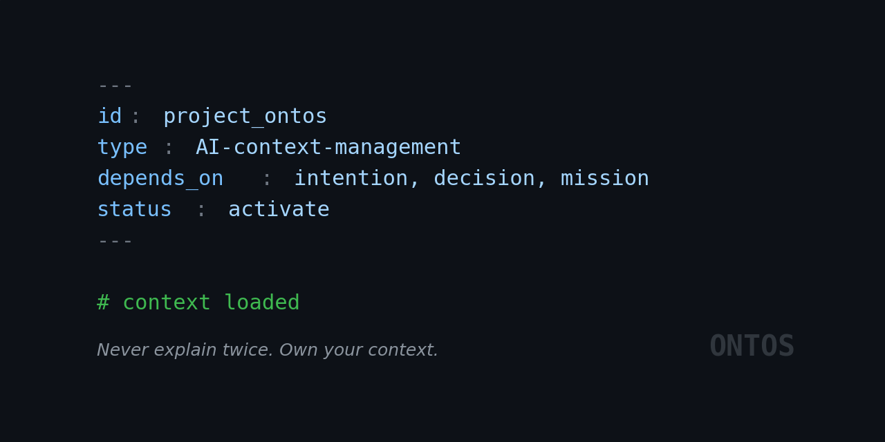

# Project Ontos

[](https://github.com/ohjonathan/Project-Ontos/actions/workflows/ci.yml)
[](https://pypi.org/project/ontos/)
[](https://www.python.org/downloads/)
[](LICENSE)
[](https://github.com/ohjonathan/Project-Ontos)



**Portable context for the agentic era.**

*Never explain twice. Own your context.*

*Source available at [github.com/ohjonathan/Project-Ontos](https://github.com/ohjonathan/Project-Ontos).*

---

## Contents

- [The Problem](#the-problem)
- [The Solution](#the-solution)
- [Philosophy](#philosophy)
- [The Premise](#the-premise)
- [Who Ontos Is For](#who-ontos-is-for)
- [Use Cases](#use-cases)
- [Quick Start](#quick-start)
- [MCP Setup](#mcp-setup)
- [Workflow](#workflow)
- [Best Practices](#best-practices)
- [What Ontos Is NOT](#what-ontos-is-not)
- [FAQ](#faq)
- [Roadmap](#roadmap)
- [Documentation](#documentation)
- [Feedback](#feedback)
- [License](#license)

---

## The Problem

Context dies in three ways:

1. **AI Amnesia.** You explain your architecture to Claude. Then again to ChatGPT. Then again to Cursor. Each starts from zero.

2. **Prototype Graveyards.** You build fast in Streamlit, make dozens of product decisions, then rewrite in Next.js. The code is new. The decisions? Lost in old chat logs.

3. **Tribal Knowledge.** Your project's "why" lives in Slack threads, abandoned docs, and your head. New collaborators (human or AI) rediscover everything from scratch.

The common thread: **context isn't portable.** And even when it exists, you don't own it—it's locked in proprietary platforms, unexportable, unversioned, gone when you switch providers.

---

## The Solution

Ontos creates a **portable knowledge graph** that lives in your repo as markdown files with YAML frontmatter. No cloud service, no vendor lock-in.

**Readable, not retrievable.** Your context is a glass box—inspectable by humans, followable by AIs. Explicit structure instead of semantic search. You know exactly what the AI sees.

**How it works:**

1. Run `ontos scaffold` to auto-tag your docs with YAML headers (or add them manually if you prefer)
2. Run `ontos map` to generate your project's context map
3. Any AI agent reads the map, loads what's relevant, sees the full decision history

```yaml
---
id: pricing_strategy
type: strategy
depends_on: [target_audience, mission]
---
```

**The hierarchy** (rule of thumb: "If this doc changes, what else breaks?"):

| Layer | What It Captures | Survives Migration? |
|-------|------------------|---------------------|
| `kernel` | Why you exist, core values | ✅ Always |
| `strategy` | Goals, audience, approach | ✅ Always |
| `product` | Features, user flows, requirements | ✅ Always |
| `atom` | Implementation details | ⚠️ Often rewritten |

Your prototype atoms get rewritten. Your product decisions don't. Interface specs and data models often survive—implementation code rarely does.

---

## Philosophy

**Intent over automation.** You decide what matters. Tagging a session, connecting decisions to documents—this friction is the feature. Curation beats capture.

**You own your context.** Markdown in your repo, not locked in someone else's platform. No database, no account, no API key. It travels with `git clone`.

**Shared memory over personal memory.** What you remember is useless to your teammate or the AI that just opened a fresh session. Ontos encodes knowledge at the repo level. Everyone who clones gets the same brain.

**Decisions outlive code.** Ontos separates Space (what IS true) from Time (what HAPPENED). Your implementation atoms get rewritten on migration. Your strategy, your product decisions, your session logs—those survive.

---

## The Premise

- **LLMs get better; your tooling should too.** Ontos doesn't fight the model—it gives the model better input. As agents improve, structured context becomes more valuable, not less.
- **Platforms won't solve portability for you.** Vendor lock-in is a feature, not a bug, for model providers. If you want context that moves freely, you have to own it yourself.
- **"Vibe coding" becomes "context engineering."** The bottleneck isn't generating code anymore. It's giving the AI enough context to generate the *right* code.

---

## Who Ontos Is For

- **Small teams (1-5 devs) switching between AI tools** who are tired of re-explaining their project to Claude, then Cursor, then ChatGPT
- **Projects that outlive their prototypes**—when you rewrite from Streamlit to Next.js, your decisions should survive the migration
- **Developers who want context to transfer** across session resets, tool switches, and team changes
- **Anyone betting on AI-assisted development** who needs reliable, portable project memory

The litmus test: *Can a new person (or AI) become productive in under 10 minutes?*

---

## Use Cases

### Multi-AI Workflows
Switch between Claude Code, Cursor, ChatGPT, and Gemini without re-explaining your project. Ontos can generate `AGENTS.md` and `.cursorrules` so your context activates automatically when supported.

### Prototype → Production
Built a demo in Streamlit? When you rewrite in FastAPI or Next.js, your atoms are disposable but your strategy survives. Three weeks of product decisions don't vanish with the old code.

### Project Handoffs
Pass a project to another developer or agency. Because you own your context, everything travels with `git clone`—session logs, context map, decision history. No export wizard, no platform migration, no 2-hour call.

### Native IDE Integration (MCP)
Run `ontos serve` to start an MCP server that exposes your knowledge graph directly to AI agents. Claude Desktop, Cursor, and other MCP-compatible IDEs connect natively — no CLI parsing, no context map re-reads, just structured tool calls with live cache invalidation.

```json
{
  "mcpServers": {
    "ontos": {
      "command": "ontos",
      "args": ["serve"],
      "cwd": "/path/to/your/project"
    }
  }
}
```

### Documentation Health
CI validation catches broken links, circular dependencies, and architectural violations before they become tribal knowledge buried in someone's head.

### Re-Architecture & Decision Extraction
Rewriting an app in a new stack? Export your entire knowledge graph as structured JSON and feed it to an LLM:

```bash
ontos export data --json > project_export.json
```

The export includes every document's content, dependencies, type hierarchy, and graph edges. Decisions live in the document bodies (`## Key Decisions`, `## Alternatives Considered`), not in separate metadata fields—so the full reasoning context travels with the export.

Give the JSON to any LLM with a prompt like:

> *"Extract all key decisions, alternatives rejected, and their rationale from these documents. Group by component. Flag any decisions that would need to be revisited for a migration from [current stack] to [target stack]."*

Your atoms get rewritten. Your decisions don't have to.

---

## Quick Start

**Requirements:** Python 3.9+, inside a git repository

**Install (recommended):**

```bash
# pipx installs in an isolated environment and adds to PATH automatically
pipx install ontos
```

> [!TIP]
> Don't have pipx? Install it with `brew install pipx` (macOS) or `pip install pipx`. See [pipx docs](https://pipx.pypa.io/).

**Alternative install:**

```bash
pip install ontos
```

> [!TIP]
> **Want native AI IDE integration?** See [MCP Setup](#mcp-setup) below to enable `ontos serve` for Claude Desktop, Cursor, and other MCP-compatible tools.

> [!NOTE]
> **"command not found: ontos"?** Your Python scripts directory may not be on PATH.
> - **Quick fix:** Use `python -m ontos` instead (e.g., `python -m ontos map`)
> - **Permanent fix:** Add Python's bin directory to your PATH (the `pip install` output shows the location)

Source available at [github.com/ohjonathan/Project-Ontos](https://github.com/ohjonathan/Project-Ontos).

**Initialize:**

```bash
cd your-project
ontos init
```

This creates:
- `.ontos.toml` configuration file
- `docs/` directory with full type hierarchy (`kernel/`, `strategy/`, `product/`, `atom/`, `logs/`, `reference/`, `archive/`)
- `Ontos_Context_Map.md` document graph
- Git hooks (optional)
- `AGENTS.md` for AI agent activation (optional)

**Scaffold existing docs:** If you have existing markdown files, init will prompt to add Ontos metadata:
```bash
ontos init --scaffold    # Auto-scaffold docs/ without prompting
ontos init --no-scaffold # Skip scaffold prompt entirely
```

**Activate:** Tell any AI agent that supports Ontos activation:

> **"Ontos"** (or "Activate Ontos")

If configured, the agent reads `AGENTS.md`, regenerates the context map, loads relevant files, and confirms what context it has.

---

## MCP Setup

**New in v4.0.** Ontos can run as an MCP (Model Context Protocol) server, exposing your knowledge graph directly to AI agents. Instead of agents shelling out to CLI commands and parsing text, they connect to a persistent `ontos serve` process and call structured tools — with live cache invalidation when your docs change.

### 1. Install with MCP

```bash
# pipx (recommended)
pipx install 'ontos[mcp]'

# or pip
pip install 'ontos[mcp]'
```

> [!NOTE]
> MCP requires **Python 3.10+**. The base `pip install ontos` (without the extra) remains Python 3.9+ and does not include MCP dependencies.
>
> **Already using Ontos?** Your existing documents, context map, and logs work immediately — the MCP server reads the same files as the CLI. No data migration or format conversion required:
> ```bash
> pip install --upgrade 'ontos[mcp]'
> cd your-project
> ontos serve
> ```
> Using pipx? Run `pipx install --force 'ontos[mcp]'` (pipx upgrade does not add new extras).

### 2. Start the Server

```bash
ontos serve                    # Serve current directory
ontos serve --workspace /path  # Serve a specific project
```

The server runs over stdio — your IDE manages the process lifecycle.

### 3. Configure Your IDE

**Claude Desktop** (`~/Library/Application Support/Claude/claude_desktop_config.json`):
```json
{
  "mcpServers": {
    "ontos": {
      "command": "ontos",
      "args": ["serve"],
      "cwd": "/path/to/your/project"
    }
  }
}
```

> [!TIP]
> **`ontos` not found?** Desktop apps may not inherit your shell PATH. Use the absolute path instead:
> ```bash
> which ontos   # Find the path, e.g. /Users/you/.local/bin/ontos
> ```
> Then set `"command": "/Users/you/.local/bin/ontos"` in the config above. Alternatively, use `"command": "python"` with `"args": ["-m", "ontos", "serve"]`.

**Cursor** (`.cursor/mcp.json` in your project):
```json
{
  "mcpServers": {
    "ontos": {
      "command": "ontos",
      "args": ["serve"]
    }
  }
}
```

> [!NOTE]
> Cursor launches the MCP server from your project root by default. If your project is elsewhere, add `"--workspace", "/path/to/your/project"` to the `args` array.

### 4. Available Tools

The MCP server exposes up to 15 tools depending on server flags:

**Core (9 tools — always available):**

| Tool | Purpose | Read-only |
|------|---------|:---------:|
| `workspace_overview` | Project orientation — key documents, graph stats, warnings | ✅ |
| `context_map` | Full context map (supports compact modes) | ✅ |
| `get_document` | Read one document by ID or path | ✅ |
| `list_documents` | Paginated listing with type/status filters | ✅ |
| `export_graph` | Structured graph export (optional file output) | ⚠️ |
| `query` | Dependency details for a single document | ✅ |
| `health` | Server uptime, document count, version | ✅ |
| `refresh` | Force cache rebuild after bulk changes | ⚠️ |
| `get_context_bundle` | Token-budgeted context bundle for a workspace | ✅ |

**Portfolio (2 tools — v4.1, requires `--portfolio` flag):**

| Tool | Purpose |
|------|---------|
| `project_registry` | Inventory of all known workspaces |
| `search` | FTS5 full-text search across workspaces |

**Write (4 tools — v4.1, mutable mode only):**

| Tool | Purpose |
|------|---------|
| `scaffold_document` | Create a new markdown file with scaffold frontmatter |
| `log_session` | Create a dated session log |
| `promote_document` | Change curation level without moving the file |
| `rename_document` | Rename an ID across all referencing files |

Write tools are registered only when the server runs without `--read-only`. All write operations use advisory flock locking for cross-process safety.

### 5. Verify

```bash
ontos --version   # Should show 4.1.0
ontos serve       # Starts the stdio server (Ctrl+C to stop)
```

> [!NOTE]
> The server communicates over stdio (JSON-RPC), so it won't print a "ready" message — silence is normal. To verify it's working, connect through your IDE and call a tool like `health`.

For the full migration guide, including optional usage logging and known limitations, see [Migration Guide v3→v4](docs/reference/Migration_v3_to_v4.md).

---

## Workflow

### Agent Prompts

Use these phrases with an AI agent that supports Ontos activation. They are not shell commands.

| Command | What It Does |
|---------|--------------|
| **"Ontos"** | Activate context—agent reads the map, loads relevant files |
| **"Archive Ontos"** | End session—save decisions as a log for next time |
| **"Maintain Ontos"** | Health check—scan for new files, fix broken links, regenerate map |

```bash
# CLI equivalents
ontos scaffold     # Auto-tag docs with YAML frontmatter
ontos map          # Generate/update context map
ontos log          # Create a session log
ontos doctor       # Check graph health
ontos maintain     # Run weekly maintenance (9 tasks)
ontos link-check   # Scan for broken references
ontos rename       # Safe ID rename across graph
ontos promote      # Promote docs to Level 2
ontos agents       # Regenerate AGENTS.md and .cursorrules
ontos serve        # Start MCP server for IDE integration
```

Compact context maps for token-constrained agents:
```bash
ontos map --compact           # Minimal one-line-per-doc output
ontos map --compact rich      # With summaries
ontos map --compact tiered    # Prose summary + type-ranked compact
```

**Update:** `pipx upgrade ontos` or `pip install --upgrade ontos`

---

## Best Practices

- **Start from the top.** Define kernel and strategy before creating atoms. The hierarchy exists for a reason.
- **Curate, don't hoard.** Not every session needs a log. Archive the ones with decisions that matter.
- **Review scaffold output.** Auto-tagging proposes; you decide. The human judgment is the point.
- **Run `ontos doctor` periodically.** Catch broken links and dependency issues before they compound.
- **Scan for secrets before release.** Use `gitleaks detect` and `trufflehog git file://. --no-update` (see `.trufflehog-exclude-paths.txt`).

---

## What Ontos Is NOT

- **Not a RAG system.** We use structural graph traversal, not semantic search. Concepts are curated tags, not vector embeddings. Deterministic beats probabilistic for critical decisions.
- **Not zero-effort.** You decide what matters (curation). The tooling handles the paperwork (tagging, validation, map generation).
- **Not a cloud service.** Markdown files in your repo. No API keys, no accounts.
- **Not magic.** The graph and map are deterministic—same input, same output. What the AI *does* with that context is still AI.

If you want automatic context capture, use a vector database. If you want reliable, portable, inspectable context, use Ontos.

---

## FAQ

### Why does Ontos start at version 3?

Versions 1 and 2 were internal. I built Ontos as a personal tool to manage context across AI sessions and tech stack migrations. After using it for months and seeing others struggle with the same problems—re-explaining projects to each new AI, losing decisions when prototypes get rewritten—I packaged the workflow as a Python library.

Version 3 is when Ontos became public. The earlier versions live on in the design decisions and battle-tested workflows, just not in a public release.

---

## Roadmap

| Version | Status | Highlights |
|---------|--------|------------|
| **v4.1.0** | ✅ Current | Portfolio index, 4 write tools, advisory flock locking, shared rename orchestrator |
| **v4.2** | Next | HTTP/SSE transport, cross-workspace writes |

v3.0 transformed Ontos from repo-injected scripts into a pip-installable package. v3.1 made all CLI commands native Python. v3.2 added re-architecture support, environment detection, and activation resilience. v3.3 ships 62 audit-derived hardening fixes plus `link-check`, `rename`, unified JSON envelopes, and a canonical document loader. v3.3.1 reduced link-check false positives by 89% and added `promote_check` to the maintenance pipeline. v3.4 adds `--compact tiered` context maps for token-constrained agents. v4.0 adds an MCP server mode with 8 read-only tools, enabling native integration with AI IDEs like Claude Desktop and Cursor without CLI overhead. v4.1 expands MCP to 15 tools — 4 write tools (`scaffold_document`, `log_session`, `promote_document`, `rename_document`), a portfolio index with FTS5 search, advisory flock locking, and a shared rename orchestrator used by both CLI and MCP.

---

## Documentation

> *Note: Documentation links below point to the latest source on GitHub and may reflect features not yet released.*

- **[Ontos Manual](https://github.com/ohjonathan/Project-Ontos/blob/main/docs/reference/Ontos_Manual.md)**: Complete reference—installation, workflow, configuration, errors
- **[Agent Instructions](https://github.com/ohjonathan/Project-Ontos/blob/main/docs/reference/Ontos_Agent_Instructions.md)**: Commands for AI agents
- **[Migration Guide v3→v4](https://github.com/ohjonathan/Project-Ontos/blob/main/docs/reference/Migration_v3_to_v4.md)**: Upgrading from v3.x — what's new and how to enable MCP
- **[Migration Guide v2→v3](https://github.com/ohjonathan/Project-Ontos/blob/main/docs/reference/Migration_v2_to_v3.md)**: Upgrading from v2.x
- **[Minimal Example](https://github.com/ohjonathan/Project-Ontos/blob/main/examples/minimal/README.md)**: 3-file quick start
- **[Changelog](https://github.com/ohjonathan/Project-Ontos/blob/main/Ontos_CHANGELOG.md)**: Version history

---

## Feedback

Issues and feature requests welcome via [GitHub Issues](https://github.com/ohjonathan/Project-Ontos/issues).

---

## License

Apache-2.0. See [LICENSE](LICENSE).

### Why Apache-2.0?

Ontos exists because context should be portable and owned by you. A restrictive license would contradict that philosophy.

You can use, modify, distribute, and build commercial products on Ontos. The requirements: include the license text, keep copyright notices, and note significant changes if you redistribute. Apache-2.0 also includes a patent grant from contributors (though not from unrelated third parties).

### Contributing

Issues and PRs welcome. If you're planning something substantial, open an issue first so we can align on direction.
