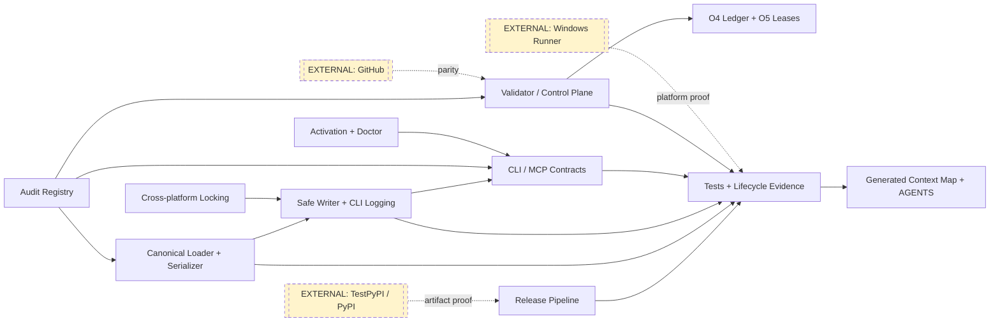

# Spec v1.1 — project-ontos-audit-rebaseline-remediation

## 1. Overview

This code-first integration deliverable reviews and verifies the audit-remediation branch from base `bf91b42f4eb5ba2ed6e0e3ea5e76d22ec6d7ec95` through frozen implementation snapshot I0 `b6f89d77e7fb684b8bd9a181a24c773d5777397a`. It re-baselines the Fable audit, installs a registry-backed control plane, and integrates the implemented serializer, writer, activation, release, MCP, graph, and CLI contract changes. Target releases remain v4.7.1, v4.8.0, and v4.9.0; this deliverable itself is a branch-level lifecycle review, not a release.

Risk is **high**: I0 changes 188 files, includes security-sensitive filesystem and publishing behavior, and intentionally changes public CLI/MCP contracts. The concurrency envelope is `single-operator-crash-safe`: the central writer serializes cooperative writers and attempts rollback, but does not claim a distributed transaction or immunity to process death at every instruction.

Evidence baseline: the 100-row registry contains the 91 original findings and nine `R2-*` findings; at I0 it still records 41 `confirmed_open` and seven partially implemented originals (direct-run: registry parse; static-inspection: `manifests/project-ontos-audit-remediation-registry.yaml`).

**B.1 incorporation note:** v1.1 converts Claude adversarial findings X-M1 and X-M2 into Phase C requirements and makes the public version, ID, JSON, migration, and platform evidence contracts explicit. The B.1 approval does not discharge those requirements or any lifecycle/release nonclaim below.

## 2. Scope

In scope:

- [ ] Review I0 as one immutable integration diff, including mandatory code-first B.2 review and independent D.5 verification.
- [ ] Verify the registry, O4 ledger, O5 lease graph, issue mapping, and addendum agree without reconstructing historical evidence.
- [ ] Verify semantic YAML round trips, string document IDs, configured log paths, collision refusal, and every discovered writer surface.
- [ ] Verify workspace-contained, no-follow, exclusive temporary writes with UTF-8, mode preservation, flush/fsync, replacement, and rollback behavior.
- [ ] Verify hermetic tests and a clean tracked-plus-untracked checkout after the full suite and context-map regeneration.
- [ ] Verify required-version activation, executable doctor probes, cross-platform locking, exhaustive lifecycle types, non-mutating read-only MCP, and CLI/JSON contract changes.
- [ ] Verify one-wheel publishing provenance from tag through downloaded wheel, TestPyPI, and PyPI promotion.
- [ ] Run the strict multi-family lifecycle through D.5, then run the separate loose falsification charter against the stable D.5 result.

Out of scope:

- Closing the 41 open or seven partial original findings; those states remain explicit and release-blocking.
- Claiming historical O5 lease compliance, certifying any child issue lifecycle, or treating this umbrella review as #146/#147 per-issue certification.
- D.6 final approval, tagging, publishing, merging, or declaring a release ready.
- Editing the two preserved user documents named in §9 or admitting them into generated metadata.

## 3. Dependencies

| Dependency | Requirement | State / mitigation |
|---|---|---|
| Frozen diff | Base-to-I0 SHA pair above never moves during review | Re-run all affected review phases if I0 changes. |
| Audit authority | Registry is machine authority; addendum and ledger are renderings | Validator blocks count, severity, scope, lease, and parity drift. |
| Lifecycle runtime | Repo wrapper resolves `.llm-dev/config.yaml`; dedicated worktree only | `scripts/llm-dev doctor` and route probes precede dispatch. |
| GitHub | Issues #146–#158 must match registry state | External-parity validation is required before release, not inferred offline. |
| Windows | Base package import, locking, and CLI smoke require real Windows runners | External blocker: local POSIX emulation is not release evidence. |
| TestPyPI/PyPI | Exact tagged artifact must be downloadable from TestPyPI | External blocker: D.5 may inspect workflow/tests; only a tag-run proves service behavior. |

No dependency may be converted into a synthetic receipt. An unavailable provider or external service yields an explicit pending/blocking state, not certification.

## 4. Technical Design

### 4.1 Audit Registry and Control Plane

**CREATE:** `manifests/project-ontos-audit-remediation-registry.yaml`, `scripts/validate-audit-remediation-registry.py`, and `docs/reviews/2026-07-10-codex-audit-revalidation.md`. **MODIFY:** the historical report only for an addendum pointer, the release-line ledger, issue-linked lifecycle documents, and workflow metadata.

The validator requires every finding field, exact original and R2 cardinality, severity parity, non-phantom IDs, evidence paths, program containment, shared-path lease integrity, and optional live GitHub parity (direct-read: `scripts/validate-audit-remediation-registry.py:18-50,209-266`). It must treat status and lifecycle state as independent. I0 is a real fix commit for this umbrella diff, but it does not retroactively prove earlier issue leases.

Phase C must close B.1 X-M2: a finding row missing `id` must yield the collected `missing fields` validation error and a non-zero exit, never an uncaught `KeyError` (current defect: `scripts/validate-audit-remediation-registry.py:244-285`).

### 4.2 Canonical Loader and Serializer

**MODIFY:** `ontos/core/schema.py`, `ontos/io/yaml.py`, `ontos/io/files.py`, frontmatter edit/repair consumers, CLI mutation commands, and MCP writers.

The public `serialize_frontmatter(mapping) -> str` signature remains stable. Output preserves field order and must parse to a semantically equal mapping; IDs are strings matching the documented ID pattern (direct-read: `ontos/core/schema.py:315-343`, `ontos/io/files.py:388-414`). Format-preserving edit paths retain comments, BOM, quoting, line endings, and multiline values where the operation does not require normalizing the affected node.

The public ID contract is exact: IDs are strings matching `^[A-Za-z0-9](?:[A-Za-z0-9_.-]*[A-Za-z0-9])?$`; non-strings raise `ValueError` beginning `Document id must be a string`, empty IDs say `Document id must not be empty`, and pattern failures use the copy at `ontos/core/schema.py:83-97`. Batch loading records these as `parse_error`; CLI-supplied invalid IDs use `E_USER_INPUT` (tests: `tests/test_document_loading_contract_a1.py:61-79`, `ontos/commands/stub.py:183-192`).

### 4.3 Safe Writer and CLI Logging

**MODIFY:** `ontos/core/context.py`, `ontos/commands/log.py`, MCP shared writes, and their tests. The writer rejects outside-root paths, symlink parents and destinations, duplicate pending destinations, and non-regular targets. It stages unique exclusive files, writes UTF-8, preserves mode, flushes/fsyncs, and replaces through anchored directories (direct-read: `ontos/core/context.py:645-770`).

Log creation uses configured `logs_dir`, the shared safe serializer, and exclusive creation. A collision is a user-visible `E_LOG_EXISTS` error and never overwrites the existing log (direct-read: `ontos/commands/log.py:283-300`). Interrupted multi-file work is best-effort rollback with retained recovery evidence; durable crash recovery remains one of the seven partial areas.

Phase C must close B.1 X-M1: log creation must reject every symlinked `logs_dir` component or use the same anchored no-follow parent pin as `SessionContext`; a test must prove an outside-workspace sentinel is unchanged (current defect: `ontos/commands/log.py:115,336-340`).

### 4.4 CLI, MCP, Activation, and Platform Contracts

**CREATE:** `ontos/command_registry.py`, `ontos/core/locking.py`.
**MODIFY:** `ontos/cli.py`, command handlers, MCP server/tools/portfolio, config,
instruction exports, and JSON output.

The command registry centralizes discovery, aliases, result kind, and nested
command paths while deliberately not claiming all registrar boilerplate is gone
(direct-read: `ontos/command_registry.py:15-84`). `[ontos].required_version` is
validated and activation fails explicitly when incompatible; doctor executes the
PATH program and compares its reported version (direct-read:
`ontos/core/config.py:223-266`, `ontos/commands/doctor.py:593-675`).

The shared lock abstraction selects `fcntl` or `msvcrt` without unconditional
Windows-incompatible imports (direct-read: `ontos/core/locking.py:13-81`). MCP
read-only mode omits write tools, refuses persistent graph export, suppresses
usage logs, and opens only an existing immutable portfolio snapshot (direct-read:
`ontos/mcp/server.py:191-204,1055-1077`, `ontos/mcp/tools.py:384-405`). Type counts
must enumerate every canonical lifecycle type, including zero-count types.

The schema-v4 CLI envelope has exactly the top-level keys `schema_version`, `command`, `status`, `exit_code`, `message`, `result`, `data`, `warnings`, and `error`; `result` separates domain status, result kind, exit category, and diagnostic basis/count completeness. Public exit codes are `0` clean, `1` findings, `2` usage, `3` warnings, `5` internal, and `130` interrupted (code: `ontos/ui/json_output.py:16-49,202-345,414-472`; tests: `tests/test_cli_contract_v4.py:78-155`, `tests/commands/test_link_check.py:315-325`).

`[ontos].required_version` mismatch is exact public behavior: activation returns shell `1`, JSON `error.code: E_ACTIVATION_UNUSABLE`, `data.status: not_usable`, and reason beginning `Incompatible Ontos version`; invalid ranges begin `Invalid [ontos].required_version`. Phase C must remove duplicated invalid-clause copy so each malformed clause appears once in one actionable message (current branches: `ontos/core/config.py:239-266,279-345`).

### 4.5 Release Pipeline, Tests, and Generated Metadata

**MODIFY:** `.github/workflows/ci.yml`, `.github/workflows/publish.yml`, hooks,
test fixtures, golden baselines, `Ontos_Context_Map.md`, and `AGENTS.md`.
**CREATE:** `scripts/check_release_artifact.py` and focused regression modules.
**DELETE:** only proven generated ghost logs and obsolete duplicate tests listed
by I0; no user-authored content.

CI tests supported minimum/latest Python and has real Windows jobs for import,
locking, and CLI smoke (direct-read: `.github/workflows/ci.yml:139-170`). The
publishing graph builds one wheel, records its version/hash, tests the downloaded
artifact, downloads exact `ontos==tag` from TestPyPI with `--no-deps`, compares
the manifest, and grants OIDC only to publisher jobs (direct-read:
`.github/workflows/publish.yml:74-102,128-167,249-320`).

The context map is always generated, never hand-edited. Its expected document
count is derived from a clean tracked snapshot at the final checkpoint after
lifecycle artifacts land; it is not frozen to 175, 177, or any earlier count.
The generator must exclude preserved untracked user documents, and a second
identical generation must produce no timestamp or content diff.

## 5. Open Questions

| Question | Options | Recommendation | Status |
|---|---|---|---|
| Can local review certify Windows behavior? | Emulation / real runner | Require real Windows CI; local inspection is supplemental. | Resolved |
| Can D.5 certify TestPyPI availability? | Workflow inspection / tag-run | Keep external proof pending until a tagged run downloads exact bytes. | Resolved |
| Does umbrella D.5 certify child issues? | Yes / no | No; require each child manifest's own strict receipts. | Resolved |
| What map count is correct? | Fixed baseline / derived snapshot | Derive after lifecycle artifacts from clean tracked inputs. | Resolved |

## 6. Test Strategy

Unit and integration evidence must include:

- Serializer fixtures for quotes, commas in list items, YAML-like/hash-leading
  scalars, date-like IDs, multiline text, Unicode, and every CLI/MCP writer.
- Writer cases for pre-existing temps, temp/destination symlinks, outside-root
  paths, duplicate writes, interrupted commits, recovery, and unchanged externals.
- Hermetic log/map tests in temporary projects plus a post-suite clean-tree check.
- Activation skew, PATH executable version mismatch, lifecycle-type completeness,
  read-only MCP no-write assertions, and Linux/Windows lock smoke. Concrete
  version anchors are `tests/core/test_config_phase3.py:107-113,222-245`,
  `tests/commands/test_agentic_activation_resilience.py:75-93`, and
  `tests/commands/test_doctor_phase4.py:176-234`; lock anchors are
  `tests/mcp/test_locking.py:21-76`, `tests/test_ci_release_workflows.py:20-32`,
  and `.github/workflows/ci.yml:139-170`.
- B.1 regressions for a symlinked `logs_dir`, malformed registry rows, and
  one-copy invalid `required_version` diagnostics.
- Wheel metadata/hash/import tests and static workflow assertions for exact
  TestPyPI version, `--no-deps`, single-artifact promotion, and OIDC scoping.
- Registry validation locally and with live GitHub parity; exact 91+9 assignment
  cardinality and collision-free active leases.

Required commands at the stable snapshot: full `pytest`, registry validator,
`scripts/llm-dev verify`, strict lifecycle receipt verification, base-SHA scope
verification, and `git diff --check HEAD`. Test execution starts and ends from a
recorded clean snapshot and compares all tracked, staged, unstaged, and untracked
paths. A failed check blocks D.5 PASS or returns the lifecycle to D.4.

## 7. Migration / Compatibility

User-visible changes are intentional: YAML serialization guarantees semantic
round trips; invalid/non-string IDs fail; log collisions fail; unsafe buffered
paths fail; MCP type counts become exhaustive; read-only MCP performs no writes;
activation reports version incompatibility; and CLI JSON/exit semantics use the
documented schema. Existing valid call signatures remain compatible where stated.

Phase C must add normative migration copy to `docs/reference/Migration_v3_to_v4.md` and reference copy to `docs/reference/Ontos_Manual.md`. Both must document supported `required_version` ranges, the exact activation exit/code/message contract, string-only ID rules (including quoting date-like, numeric, and `null` YAML scalars), loader `parse_error`, CLI `E_USER_INPUT`, schema `4.0`, and the public exit taxonomy. Documentation drift from the code/test anchors in §§4.2/4.4 blocks D.1.

Rollback is commit-level: revert I0 as one integration unit, then regenerate map
and agent metadata from the reverted clean snapshot. Do not selectively roll back
the serializer without its consumers, the writer without its tests, or release
workflow provenance without its artifact checker.

## 8. Risk Assessment

| Risk | Severity | Mitigation / observable signal |
|---|---:|---|
| Silent document corruption | P0 | Round-trip fixtures and pre-write semantic equality. |
| Symlink/path escape or partial write | P1 | Anchored no-follow writes; external sentinel unchanged; recovery tests. |
| False-green lifecycle/control plane | P1 | Strict receipts, registry parity, immutable SHA pair, no reconstructed evidence. |
| Windows import/lock failure | P1 | Minimum/latest Windows CI import, acquire/release, CLI smoke. |
| Wrong artifact promoted | P1 | Exact tag/version/hash chain and one-wheel publication. |
| Scope overclaim | P1 process | Preserve 41 open/7 partial states; umbrella and issue certification separated. |

Monitoring consists of CI clean-tree status, registry validator output, lifecycle
receipt verification, release-integrity hashes, and explicit external blockers.

## 9. Exclusion List

- Do not touch `docs/specs/project-ontos-rationale-capture-template-proposal.md`
  or `docs/zeta.md`; they are preserved user work outside I0.
- Do not edit `.llm-dev/framework/`, `.git/`, `.venv/`, or framework receipts by
  hand; dispatch evidence is generated only by the wrapper.
- Do not synthesize fix commits, lease history, provider receipts, GitHub state,
  Windows results, or TestPyPI results.
- Do not claim per-issue strict-P3 certification, D.6 approval, merge, tag,
  publication, or release readiness from this deliverable.
- Do not reinterpret the 41 open or seven partial findings as fixed.

## 10. Diagrams

### 10.1 Architecture / Component Diagram

### 10.2 Lifecycle State Machine

```mermaid
stateDiagram-v2
  [*] --> I0_Frozen
  I0_Frozen --> Phase_A_Spec
  Phase_A_Spec --> B1_Design_Review
  B1_Design_Review --> B2_CodeFirst_Review
  B2_CodeFirst_Review --> D1_Implementation_Snapshot
  D1_Implementation_Snapshot --> D2_PostImpl_Review
  D2_PostImpl_Review --> D3_Verdict
  D3_Verdict --> D4_Fix: blocking finding
  D4_Fix --> D2_PostImpl_Review: new I0 and rerun affected reviews
  D3_Verdict --> D5_Verification: blockers closed
  D5_Verification --> D4_Fix: FAIL or reproducible defect
  D5_Verification --> Loose_Falsification: all D.5 seats PASS
  Loose_Falsification --> D4_Fix: reproducible catch
  Loose_Falsification --> D6_Pending: no reproducible catch
  D6_Pending --> [*]: stop boundary; no release claim
```

## 11. Contract / Invariant-to-Evidence Matrix

| Contract or invariant | Implementation anchor | Test / verification anchor | Evidence |
|---|---|---|---|
| Semantic YAML round trip | `ontos.core.schema.serialize_frontmatter` | `tests/test_frontmatter_roundtrip_regression.py` | direct-run |
| String, pattern-valid document ID | `ontos.core.schema.validate_document_id` | `tests/test_document_loading_contract_a1.py` | direct-run |
| Workspace-contained exclusive commit | `SessionContext.commit` | `tests/test_session_context.py` | direct-run |
| Log collision refusal | `ontos.commands.log.log_command` | `tests/commands/test_log.py` | direct-run |
| Runtime version compatibility | `ontos/core/config.py:223-266`; `ontos/commands/activate.py:85-95`; `ontos/commands/doctor.py:593-685` | `tests/core/test_config_phase3.py:107-113,222-245`; `tests/commands/test_agentic_activation_resilience.py:75-93`; `tests/commands/test_doctor_phase4.py:176-234` | direct-run |
| Schema-v4 JSON and exit taxonomy | `ontos/ui/json_output.py:16-49,202-345,414-472` | `tests/test_cli_contract_v4.py:78-155`; `tests/commands/test_link_check.py:315-325` | direct-run |
| Cross-platform lock backend | `ontos/core/locking.py:13-81` | `tests/mcp/test_locking.py:21-76`; `tests/test_ci_release_workflows.py:20-32`; `.github/workflows/ci.yml:139-170` | local direct-run/static-inspection; Windows external pending |
| Read-only MCP performs no writes | `build_server`, `export_graph`, `PortfolioIndex` | `tests/mcp/test_read_only_registration.py` | direct-run |
| Exact wheel provenance | `scripts/check_release_artifact.py` | release artifact/workflow tests + tag-run | local direct-run; external pending |
| Registry is sole status authority | `validate-audit-remediation-registry.py` | local and external-parity modes | direct-run |
| Dynamic clean context map | `ontos.commands.map.generate_context_map` | double-generation + clean-tree assertion | direct-run |

## 12. Helper-Divergence Disclosure

| Existing helper | Existing shape | Integration need | Disposition / rationale |
|---|---|---|---|
| `serialize_frontmatter(fm)` | Mapping to YAML text | Safe semantics across all writers | **Extend internals**; preserve public signature and order. |
| `SessionContext.commit()` | Buffered cooperative write transaction | No-follow workspace-safe staging | **Extend**; one shared pipeline avoids parallel unsafe writers. |
| MCP `export_graph(...)` | Optional persistent file export | Read-only must be non-mutating | **Extend guard**; preserve in-memory export. |
| CLI registration helpers | Per-command registrar boilerplate | Shared discovery/result metadata | **Diverge with registry substrate**; full registrar removal remains partial and is not claimed. |

## 13. Self-Review

- Mandatory sections and both diagrams are present; the architecture diagram
  matches §4 and marks external boundaries, while the lifecycle diagram shows
  failure/retry paths (static-inspection).
- No TBD or placeholder remains; all open questions carry recommendations and
  resolved states (static-inspection).
- Concrete paths and anchors were read from I0 before citation; CREATE items are
  identified explicitly (direct-run).
- Scope preserves the immutable SHA pair, user documents, 41 open/7 partial
  truth, and the D.5-plus-falsification stop boundary (static-inspection).
- High risk is retained because filesystem, release, public-contract, and
  lifecycle-integrity failures remain credible under adversarial review
  (static-inspection).
- B.1 X-M1/X-M2, public-copy/doc migrations, duplicate required-version copy,
  and concrete JSON/version/lock anchors are explicit Phase C gates in v1.1
  (static-inspection).
