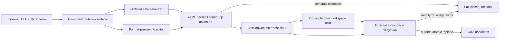

# Project Ontos v4.7.1 Hotfix Specification

## 1. Overview

Project Ontos v4.7.1 is a contract-preserving security and data-integrity
hotfix split from PR #161. It stops the confirmed P0 frontmatter corruption,
retains the already-merged doctor command-execution remediation, and hardens
filesystem mutation without adopting PR #161's breaking JSON, exit-code, CLI,
graph, or MCP response changes.

Risk is high because the release changes the central write transaction and
every serializer-backed document mutation surface. The release boundary is
therefore defined by observable contract parity with `bf91b42`, not by the
audit registry's historical release labels.

## 2. Scope

In scope:

- [x] Replace hand-built YAML emission with safe, ordered serialization and
  exact semantic round-trip validation.
- [x] Retain the line-delimited frontmatter parser foundation required by the
  serializer, including correct handling of `---` inside YAML scalar values.
- [x] Reject non-string or malformed document IDs before a document is written
  or admitted to the canonical loader.
- [x] Preserve comments, BOMs, line endings, bodies, and untouched
  frontmatter fields when promote, migrate, verify, retrofit, repair, rename,
  or MCP mutation changes a field.
- [x] Make transaction staging exclusive, unpredictable, contained within the
  workspace, symlink-safe, mode-preserving, durable, atomic, and recoverable.
- [x] Use one cross-platform workspace-lock abstraction for CLI and MCP write
  paths, with outer-lock identity binding.
- [x] Route CLI logs through configured storage, safe YAML, and exclusive
  creation; refuse collisions instead of overwriting.
- [x] Prevent read-only MCP servers from creating graph exports, usage logs,
  portfolio configuration, databases, or SQLite sidecars.
- [x] Keep the existing compatibility CI gate and align its stale failure
  injections and YAML assertions with the secure writer and semantic
  serializer contracts.
- [x] Ship package version 4.7.1 and document the patch behavior.
- [x] Preserve the doctor RCE fix already present in the `main` base.

Out of scope:

- JSON command-envelope schema 4.0, new result objects, and exit-code taxonomy.
- Declarative CLI registration, global flag reinterpretation, and renamed
  command values.
- Link-check, graph traversal, graph ordering/depth, and exhaustive MCP
  `by_type` output.
- Expanded stub lifecycle types and activation incompatibility result shapes.
- General loader rejection of malformed UTF-8.
- Context-map timestamp suppression.
- Hook rewiring, golden-baseline recapture, and removal of legacy tests. The
  retained compatibility tests may receive expectation-only maintenance.
- Publication changes that would remove the source distribution.
- Merge, tag, release, or issue closure.

## 3. Dependencies

- Baseline: `bf91b42f4eb5ba2ed6e0e3ea5e76d22ec6d7ec95`.
- PyYAML is an existing required runtime dependency.
- MCP tests require the existing `mcp` optional dependency.
- The doctor RCE remediation is inherited from `main`; this deliverable does
  not reconstruct or relabel its lifecycle evidence.
- The llm-dev-framework checkout is the repository-pinned v2.0.1 submodule and
  must be invoked through `scripts/llm-dev`.
- Strict-P3 review needs three non-author families. If a genuine family
  dispatch fails due the documented provider/framework defects, the only
  permitted completion label is the mechanically verified provider-limited
  fallback with D.6 withheld.

No blocker authorizes fabricated receipts, implicit waivers, merging, or
release actions.

## 4. Technical Design

### Safe document representation

`ontos/io/yaml.py` owns safe dumping, line-delimited frontmatter splitting,
and semantic round-trip checks. `ontos/core/schema.py` retains its public
serializer signature and field order but delegates scalar representation to
that foundation. Its compatibility policy for unknown/future schema versions
remains identical to the baseline.

The canonical loader validates explicit IDs as strings matching the documented
ID grammar. A missing ID retains the baseline filename-stem fallback verbatim,
including spaces, leading underscores, and Unicode. README and template
exclusions retain their baseline behavior. General reads keep replacement
decoding for invalid UTF-8; mutation readers use strict decoding and report the
affected path and recovery step before buffering a write.

### Format-preserving mutation

`ontos/core/frontmatter_edit.py` surgically replaces only selected top-level
fields. It rejects duplicates, anchors, aliases, tags, and unsupported scalar
styles when preservation cannot be proven. It reparses the complete modified
frontmatter, validates any explicit ID, and checks exact values before
returning text.

Promote, migrate, verify, retrofit, frontmatter repair, rename scalar emission,
and MCP writers use this safe representation or serializer. Stub, scaffold,
CLI log, and MCP-created documents use the same serializer.

### Transaction and locking envelope

Concurrency envelope: **multi-writer-mutual-exclusion with crash-safe
single-transaction recovery**.

`SessionContext` binds the workspace identity, rejects duplicate or
out-of-root destinations, pins parent directories, creates unique temporary
entries without following links, preserves existing file mode, respects umask
for new files, flushes and syncs staged content, and atomically replaces the
destination. A failed multi-operation commit rolls back already-applied
operations and retains unsafe swapped entries for diagnosis rather than
following them.

`ontos/core/locking.py` provides the platform abstraction. CLI commits own
their lock. MCP holds an outer workspace lock and passes a typed, runtime-bound
guard into the inner transaction. A missing, foreign, replaced, linked, or
unverifiable lock fails closed.

### CLI log and read-only MCP behavior

CLI log paths come from project configuration and remain lexical until the
writer validates each component. Log creation is exclusive. Archive-marker
failure remains best-effort and preserves the baseline success exit and
schema-3.4 envelope.

Read-only MCP keeps in-memory graph export but rejects persistent export,
suppresses usage logging, and opens an existing portfolio snapshot without
initialization, rebuild, journal, or sidecar writes.

### Release metadata

Both package version sources become 4.7.1. The changelog records the
compatibility boundary. The tracked golden baseline directories and command
goldens remain byte-identical to `main`.

## 5. Open Questions

| Question | Decision | Status |
|---|---|---|
| Should general document loading switch from replacement decoding to strict UTF-8? | No. Keep the read contract in 4.7.1; mutation paths remain strict. Revisit in v5 with migration guidance. | Resolved |
| Can the command envelope report schema 4.0? | No. Keep `ontos/ui/json_output.py` byte-identical to `main` and assert schema 3.4/no `result`. | Resolved |
| Should unchanged map content suppress generated timestamps? | No. That changes observable map semantics. Test hermeticity must come from temporary projects and clean-tree verification. | Resolved |
| Should activation incompatibility return new CLI/MCP states? | No. The change is a valid future fix but alters observable results and MCP schema. Hold for v5. | Resolved |
| Should publishing switch to wheel-only provenance? | No. Dropping the sdist changes the distribution contract. Keep the existing workflow until both artifact types can share a verified provenance design. | Resolved |
| Should hook rewiring ride the patch? | No. Which command runs is observable and parity has not been proved. | Resolved |

## 6. Test Strategy

Unit and focused integration tests cover:

- embedded quotes, comma-bearing list items, YAML-like scalars, hash-leading
  values, date-like IDs, multiline values, Unicode, and line-delimiter text;
- each serializer or mutation consumer, including CLI and MCP log creation;
- comments, BOM, CRLF, inline comments, unsupported YAML features, id-less
  documents, legacy filename-derived IDs, and duplicate fields;
- regular predictable temp files, temp symlinks, destination symlinks,
  outside-root paths, duplicate pending writes, interrupted commits, rollback,
  mode/umask, and unchanged external files;
- outer-lock binding, contention, workspace and lock identity swaps, hard
  links, and non-inheritable handles;
- read-only MCP graph, usage-log, portfolio, and SQLite behavior;
- inherited doctor RCE regressions.

Acceptance criteria:

1. Focused security and serialization tests pass.
2. The complete suite passes from the hotfix environment.
3. A test run produces no tracked or non-ignored repository changes.
4. The tracked golden baseline directories and command goldens are unchanged
   from the baseline commit.
5. Standard command success/error envelopes remain schema 3.4, preserve their
   baseline key set and exit semantics, and contain no schema-4 result object.
6. Package and imported versions both report 4.7.1.
7. Manifest, scope, dispatch, receipt, lifecycle, and whitespace gates report
   their real status without waived or reconstructed evidence.

Manual checks run representative CLI log, stub, doctor, and MCP read-only
operations in temporary workspaces. No operation targets maintainer data.

## 7. Migration / Compatibility

No migration is required. Existing valid documents and command consumers keep
their format and envelope contracts.

Two security bug fixes intentionally reject unsafe operations that previously
could appear to succeed:

- a log filename collision now returns an error instead of overwriting;
- a mutation targeting an unsafe, linked, duplicated, or outside-workspace
  path fails before changing external data.

Malformed UTF-8 continues to load through the baseline read-only loader, but a
mutation refuses it through each command's existing `E_COMMAND_FAILED` route,
with the affected path in the message and a UTF-8 recovery step. Exit/envelope
routing remains command-local in 4.7.1; unification is deferred to v5. This
prevents replacement characters from being written back while avoiding a
patch-release change to the visible document set.

Legacy project-local `ontos_config.py` `LOGS_DIR` retains precedence. Import-
path-only legacy modules outside the project are no longer discovered; move
that override into the project or `.ontos.toml`. In the absence of a local
legacy override, `log` now honors `[paths].logs_dir`; existing logs are not
moved, and custom directories must remain inside the workspace. A custom log
directory outside the configured scan scope is writable but is not
automatically added to map/query scope.

Rollback is a single revert of the hotfix PR. No schema migration or generated
artifact rewrite is required. The transaction pipeline itself restores
already-applied paths on commit failure.

## 8. Risk Assessment

| Risk | Severity | Mitigation |
|---|---|---|
| Central writer rejects a legitimate filesystem layout | High | Characterization tests for regular files, modes, umask, nested paths, moves, deletes, POSIX/macOS aliases, and Windows backend seams; validate bulk mutations in a scratch clone before rollout |
| Serializer changes scalar style | Medium | Semantic equality is the contract; existing simple-list and field-order assertions remain, while golden command outputs stay at baseline |
| Selective split accidentally imports v5 behavior | High | Exact-source parity gates for CLI, envelope, link/graph, MCP schemas, stub, and golden paths |
| MCP outer and inner locks diverge | High | Typed guard identity, focused rename/write-tool regressions, and contention tests |
| Invalid UTF-8 is accidentally rewritten | High | Strict mutation reads and byte-unchanged failure tests while broad loading remains baseline-compatible |
| Lifecycle provider cannot produce admissible evidence | Medium | Genuine retry, hash-bound failure artifacts, provider-limited fallback, withheld D.6, draft PR |

Monitoring consists of CI, the draft PR checks, and explicit release gating by
the maintainer. This task does not merge or publish.

## 9. Exclusion List

Do not modify:

- `ontos/cli.py`, `ontos/ui/json_output.py`, or create
  `ontos/command_registry.py`;
- `ontos/commands/link_check.py`, `ontos/commands/map.py`,
  `ontos/commands/stub.py`, `ontos/core/body_refs.py`,
  `ontos/core/graph.py`, or `ontos/core/link_diagnostics.py`;
- `ontos/mcp/schemas.py` or the baseline five-key `by_type` implementation;
- tracked golden baselines or command help goldens;
- activation response/schema behavior;
- release workflow semantics, hooks, legacy test deletion, or PR #161
  lifecycle evidence.

Do not use predictable `<target>.tmp` staging, follow links, normalize entire
documents during a field edit, hand-build YAML scalar quoting, suppress
framework blockers, or claim strict-P3 without valid receipts.

## 10. Diagrams

### Architecture / component flow



Components in the diagram correspond to the command routes, safe document
representation, transaction/locking design, and external filesystem described
above. Both semantic and filesystem failures are explicit.

### Mutation sequence and failure paths

```mermaid
sequenceDiagram
    participant Caller as External caller
    participant Command as CLI/MCP command
    participant YAML as Parser/serializer
    participant Lock as Workspace lock
    participant Tx as SessionContext
    participant FS as External filesystem

    Caller->>Command: request mutation
    Command->>YAML: strict read, patch or serialize, reparse
    alt invalid UTF-8 or semantic mismatch
        YAML-->>Caller: reject; no buffered write
    else validated document
        Command->>Lock: bind identity and acquire
        alt unsafe/replaced workspace or lock
            Lock-->>Caller: reject; no write
        else lock held
            Command->>Tx: buffer unique destination
            Tx->>FS: exclusive stage, flush, sync, atomic replace
            alt path swap or commit failure
                FS-->>Tx: failure
                Tx->>FS: rollback applied operations
                Tx-->>Caller: error
            else commit durable
                FS-->>Caller: baseline-compatible result
            end
        end
    end
```
