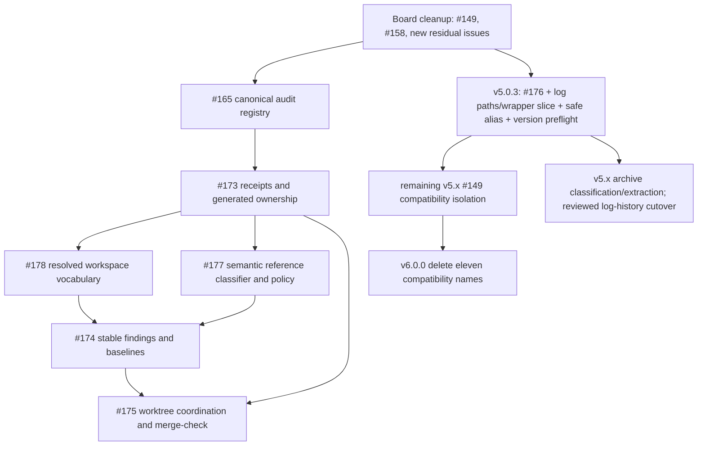

# Project Ontos v5 Remediation Release Plan Proposal

## 1. Executive Decision

Project Ontos should complete the current correctness, portability,
workspace-semantics, validation, and local coordination program within the v5
release line. The full workspace-defined vocabulary capability in issue #178 is
not inherently breaking and should ship in v5.1.0 through an additive,
dual-representation model.

The only work reserved for v6.0.0 is the literal deletion of the eleven public
v2 path-compatibility names tracked by issue #149. Those names are documented
and tested as available throughout v5, so removing them earlier would break an
explicit compatibility promise. During v5, Ontos should isolate that legacy
surface, prove it has no internal consumers, and make the eventual v6 deletion
mechanical.

This proposal therefore adopts the following release train:

| Target | Purpose | Primary custody |
|---|---|---|
| Governance checkpoint | Repair the issue board and make the audit registry authoritative | #158, #165 |
| v5.0.3 | Narrow correctness patch | #176, safe #178 alias and migration-preflight slices, log-path residual |
| v5.1.0 | Portable activation identity and complete workspace vocabularies | #173, #178 |
| v5.2.0 | Semantic references, stable findings, and same-device coordination | #177, #174, core #175 |
| Remaining v5.x maintenance | Compatibility isolation, archive extraction, optional cross-device coordination if separately approved | #149 preparation and extracted follow-ups |
| v6.0.0 | Delete only the eleven promised-through-v5 compatibility names | #149 |

The target version numbers express intended compatibility boundaries. If
delivery capacity requires an additional v5 minor release, the dependency order
in this proposal remains normative even if a feature moves from v5.2.0 to
v5.3.0.

This is a program proposal, not an authorization to implement every release in
one branch or pull request. Each release and major train must receive its own
scope-locked implementation spec, lifecycle manifest, review evidence, and
release decision.

## 2. Evidence Baseline and Current State

The implementation baseline for this proposal is Project Ontos v5.0.2 at
`main@7d07556e0f71c0f1eca8760614aef6d21951f874`. The original authoring
checkout was older than that release, so all source claims were revalidated
against an isolated current-main worktree. Before publication, the proposal
artifacts were moved to the dedicated
`codex/project-ontos-v5-remediation-release-plan` branch created directly from
that baseline. The base-SHA changed-path scope and exact branch-identity gates
pass there; independent Pre-A review and its verdict remain pending.

After that proposal merged and PR #179 was archived, Phase 0 preparation found
that the mandatory v5.0.3 `required_version` preflight had no child owner. This
scope-correction revision adds the sixth independently governed child and moves
the parent review assignment to GLM. The review input is committed on
`codex/v5-remediation-child-scaffolding` from
`main@bd04620376ed6a8d0024e990e04a86da402b9398`; the GLM verdict records the
exact reviewed commit before any child scaffold is created.

The live open-issue inventory covered:

- [#149](https://github.com/ohjonathan/Project-Ontos/issues/149) — deprecated
  path compatibility and inherited cleanup;
- [#158](https://github.com/ohjonathan/Project-Ontos/issues/158) — audit
  remediation coordination tracker;
- [#165](https://github.com/ohjonathan/Project-Ontos/issues/165) —
  machine-readable audit registry and parity;
- [#173](https://github.com/ohjonathan/Project-Ontos/issues/173) —
  content-addressed activation receipts;
- [#174](https://github.com/ohjonathan/Project-Ontos/issues/174) — stable
  validation findings and no-new-debt baselines;
- [#175](https://github.com/ohjonathan/Project-Ontos/issues/175) — Git-aware
  worktree coordination and merge-result validation;
- [#176](https://github.com/ohjonathan/Project-Ontos/issues/176) — bare
  workspace-root file dependency resolution;
- [#177](https://github.com/ohjonathan/Project-Ontos/issues/177) — semantic
  body-reference namespaces and path policy; and
- [#178](https://github.com/ohjonathan/Project-Ontos/issues/178) — governed
  workspace vocabularies and repair mappings.

Current-main verification established the following facts:

1. Issue #176 reproduces through activation, doctor, link-check, and MCP. A
   bare existing file such as `pyproject.toml` is broken while
   `./pyproject.toml` resolves.
2. MCP freshness uses file size and mtime, and AGENTS freshness is mtime-based.
   A same-size content mutation with restored mtime can retain stale cached
   bytes.
3. `DocumentType` and `DocumentStatus` are static enums, unknown values degrade
   to `UNKNOWN`, and map/query/export/MCP consumers directly use `.type.value`
   and `.status.value`.
4. No semantic wikilink namespaces or path-scoped body policy exist.
5. `ValidationError` and document-load diagnostics have different public
   shapes; no stable finding identity, Git diff, or baseline exists.
6. Locks are scoped to `<worktree>/.ontos.lock`; two worktrees sharing one Git
   common directory do not coordinate.
7. Issue #149 has exactly eleven compatibility names: `PROJECT_ROOT` and ten
   callables. No Ontos production path calls them, but package re-exports and
   compatibility tests intentionally preserve them through v5.
8. `ontos log` honors the configured `paths.logs_dir`, while contributor-mode
   consolidation still reads and writes hard-coded `.ontos-internal` paths.
9. The current main tree contains a large internal archive. Much of its non-log
   material appears frozen, but the internal archived-log tree and decision
   history remain an active canonical consolidation authority; extraction must
   classify those states separately and cannot cut over the ledger implicitly.
10. The prior #165 registry prototype is useful seed material but is not on
    current main and embeds stale issue, milestone, and release assumptions.

### 2.1 Evidence ledger

The evidence classes below are intentionally separated. A source observation,
a live issue contract, and an executed reproduction do not have the same
authority.

#### Direct current-main execution

All commands in this subsection ran on 2026-07-14 in the isolated worktree
`/private/tmp/project-ontos-issues-audit` at the full baseline SHA above. The
absolute temporary path is provenance only and is not part of any proposed
identity. In the recorded test command, `<repo-venv-python>` denotes
`.venv/bin/python` from the primary Project Ontos checkout (observed Python
3.14.6); its absolute home path is omitted as non-semantic host metadata. The
command's working directory remained the isolated current-main worktree, so
Python imported that worktree's `ontos` package.

Baseline and post-suite cleanliness were checked with:

```text
git rev-parse HEAD
# 7d07556e0f71c0f1eca8760614aef6d21951f874

git status --short
# no output
```

The current behavior characterization command was:

```text
<repo-venv-python> -m pytest -q \
  tests/core/test_graph.py \
  tests/core/test_link_diagnostics.py \
  tests/core/test_body_refs.py \
  tests/core/test_schema.py \
  tests/core/test_frontmatter_repair.py \
  tests/core/test_snapshot.py \
  tests/core/test_cache.py \
  tests/core/test_paths_v2_deprecation.py \
  tests/commands/test_activate_json_warning_metadata.py \
  tests/commands/test_agentic_activation_resilience.py \
  tests/commands/test_link_check.py \
  tests/commands/test_doctor_phase4.py \
  tests/commands/test_log.py \
  tests/commands/test_consolidate_parity.py \
  tests/mcp/test_activation.py \
  tests/mcp/test_cache.py \
  tests/mcp/test_health.py \
  tests/mcp/test_schemas.py \
  tests/mcp/test_parity.py
# 388 passed in 9.88s
```

The suite left the isolated worktree clean. It characterizes current behavior;
it does not prove any proposed feature.

The #176 unit-level graph reproduction built two otherwise identical in-memory
documents against the real current-main `pyproject.toml` and called
`build_graph(..., workspace_root=root,
allowed_external_dependency_paths=["pyproject.toml"])`. It produced:

```text
pyproject.toml   -> broken_link / error
./pyproject.toml -> external_file_dependency / info
```

The #173 MCP-cache reproduction used `tests.mcp_helpers.create_workspace` and
`build_cache`, replaced `Atom body` with the same-length `Muta body`, restored
the original nanosecond mtime with `os.utime`, and then called
`get_fresh_snapshot()`. It produced:

```json
{"stale_detected": false, "revision_before": 1}
{"revision_after": 1, "cached_contains_mutation": false}
```

The #177 parser probe passed
`[[doc:known]] [[source:src/app.py]] [[entity:Acme]]` through
`scan_body_references(..., include_generic_bare_id_token=False)`. All three
were returned as undifferentiated `bare_id_token` matches; there was no
namespace classification.

The #178 loader probe passed `type: runbook` and `status: backlog` through
`load_document_from_content`. The raw frontmatter retained both spellings, but
the public `DocumentData` values were `unknown`/`unknown` and two
`invalid_enum` issues carried the original values.

#### Static source inspection

Static inspection established the implementation topology and missing
capabilities. Primary anchors were `ontos/core/graph.py`,
`ontos/core/link_diagnostics.py`, `ontos/core/body_refs.py`,
`ontos/core/types.py`, `ontos/io/files.py`, `ontos/mcp/cache.py`,
`ontos/core/context.py`, the CLI/MCP serializers, and their adjacent tests.
Static inspection supports a claim that an interface or algorithm is absent;
it is not substituted for a runtime reproduction where behavior was directly
testable.

#### Live GitHub and user contract evidence

The nine issue bodies linked above were read from live GitHub on 2026-07-14.
Their state, checklist text, and compatibility language are external contract
evidence, not local-code evidence. In particular, #149's v6 removal promise
and #175's optional-lease checklist remain binding until their issue bodies are
formally amended. This proposal makes no GitHub write.

#### Historical/off-main seed evidence

The prior audit session log records `267 passed` on a focused current-main
selection and `207 passed` for the older #165 registry prototype. The exact
original invocations were not preserved in that log. Those numbers are
therefore contextual provenance only; they are not counted as reproducible
validation for this proposal or proof that the off-main prototype integrates
with current main.

Passing characterization tests are evidence that the present behavior is
stable. They are not evidence that the proposed capabilities already exist.

## 3. Problem Statement

Ontos v5.0.2 has a sound transactional core, a canonical loader, shared graph
validation, and mature CLI/MCP surfaces. Its remaining limitations now sit at
the boundaries between machines, worktrees, adopter-specific semantics, and
long-lived historical debt:

- local timestamps cannot prove which repository content an agent activated;
- an opinionated global enum cannot faithfully represent governed local
  vocabulary;
- document, entity, and provenance links are lexically indistinguishable;
- warnings cannot be compared reliably across branches or devices;
- worktree-local locks cannot protect repository-scoped generated outputs;
- one narrow path heuristic still rejects valid root-file dependencies;
- audit custody is recorded in prose rather than one enforceable registry; and
- old compatibility and archive surfaces remain mixed with active code and
  documentation.

The wrong response would be to replace the public model wholesale, accept
arbitrary strings, suppress warnings, add a larger local lock, or postpone every
architectural improvement until v6. The required response is an additive v5
foundation that preserves existing canonical behavior while exposing the extra
identity and semantics mature adopters need.

## 4. Goals

- Fix the confirmed root-file dependency and log-path correctness bugs in a
  patch release.
- Establish a portable, path-independent identity for activated repository
  content, effective configuration, vocabulary, and graph semantics.
- Support workspace-defined types, statuses, and explicit aliases without
  runtime enum mutation or loss of canonical Ontos behavior.
- Preserve both the declared project value and its canonical semantic class.
- Classify body references through one namespace- and policy-aware model shared
  by every consumer.
- Give validation findings stable identities and support deterministic Git
  comparison and reviewed no-new-debt baselines.
- Coordinate repository-scoped generated writes across same-device worktrees
  and validate combined merge results without mutating a checkout.
- Make the audit registry an enforceable authority while preserving historical
  release evidence.
- Isolate all remaining v2 compatibility implementation during v5 and delete
  only that frozen surface in v6.
- Externalize only material proven frozen after its writer paths, inventory,
  integrity, references, and restore procedure are proven; migrate the active
  archived-log/history authority only through its separate one-ledger cutover.

## 5. Non-Goals

- Removing any of #149's eleven promised-through-v5 public names in v5.
- Replacing `DocumentType` or `DocumentStatus` with dynamic enums.
- Accepting arbitrary type or status strings without declared semantics.
- Allowing custom vocabulary to weaken canonical dependency, curation, or
  containment safety.
- Treating mtime or a host-local path as portable identity.
- Hiding inherited findings or automatically accepting the current warning set.
- Turning #165 audit IDs into #174 runtime validation IDs.
- Building an entity-resolution database or importing an external source tree.
- Auto-resolving source, instruction-file, or merge conflicts.
- Claiming a local filesystem lock is a distributed lock.
- Requiring network or GitHub availability for core read/check workflows.
- Rewriting Git history to reduce repository size.
- Automatically migrating, consolidating, or deleting historical logs during
  an installation or activation.
- Implementing all releases in one monolithic lifecycle deliverable.

## 6. Decision Principles and Compatibility Invariants

### 6.1 Existing valid workspaces stay valid

A workspace using only built-in types, statuses, unnamespaced document
wikilinks, and existing configuration must continue to load with the same
canonical semantics. New metadata is additive and should be absent when it
would unnecessarily perturb byte-stable output.

### 6.2 Declared and canonical meanings are separate

The project value answers, “What does this workspace call it?” The canonical
class answers, “Which Ontos rules govern it?” Neither should overwrite the
other.

### 6.3 One authority per concern

- #165's registry is authoritative for curated audit custody.
- The resolved workspace vocabulary is authoritative for type/status meaning.
- The shared body-reference classifier is authoritative for link semantics.
- The canonical `Finding` model is authoritative for runtime diagnostics.
- Source documents and configuration are authoritative over generated
  artifacts.

### 6.4 Portable identity excludes host accidents

Absolute roots, mtimes, discovery order, usernames, hostnames, client labels,
and rendered wording must not participate in semantic identity.

### 6.5 Git binding is not semantic content identity

The same bytes can exist in different commits or in a non-Git workspace. A
receipt therefore records semantic snapshot identity separately from HEAD,
branch/detached state, dirty state, and merge base.

### 6.6 Check and plan precede mutation

Generated artifacts, enum repair, baseline updates, archive extraction, and
coordination ownership all require deterministic read-only check/plan modes.
Apply must revalidate the plan's input identities immediately before writing.

### 6.7 Unknown and ambiguous states fail closed

Unknown vocabulary, cycles, conflicting aliases, path ambiguity, malformed
managed-block markers, stale write receipts, merge conflicts, and uncertain
lease state must produce structured diagnostics rather than guesses.

### 6.8 CLI and MCP share builders, not parallel reconstructions

Receipt, vocabulary, finding, classifier, and coordination payloads must come
from shared internal objects. Serialization parity tests are a release gate.

### 6.9 Version boundaries follow promises, not implementation convenience

Additive opt-in semantics belong in a v5 minor release. Deleting a documented
public API whose warning says “removed in v6.0.0” belongs in v6.

## 7. Terminology

| Term | Meaning |
|---|---|
| Semantic snapshot | Path-independent identity of source inputs and effective semantic contracts. |
| Git binding | Commit/ref/dirty information associated with, but excluded from, the semantic snapshot ID. |
| Declared value | Literal workspace type or status, such as `runbook` or `backlog`. |
| Canonical class | Built-in `DocumentType` or `DocumentStatus` governing core behavior. |
| Alias | An explicit spelling/history mapping intended to be repairable to its target. |
| Extension | A meaningful workspace value retained in source while inheriting canonical semantics. |
| Finding key | Severity-independent identity used to correlate the same semantic locus across classifications. |
| Finding ID | Versioned classification identity including rule contract and severity. |
| Generated ownership | Whether Ontos owns a whole file, a marked block, or no bytes in an artifact. |
| Repository lock | Same-device lock stored under the Git common directory for repo-scoped outputs. |
| Workspace lock | Existing lock protecting a single worktree transaction. |

## 8. Issue Disposition and Custody

| Issue | Proposal disposition | Closure authority |
|---|---|---|
| #149 | Narrow to v6 deletion; land the log-related wrapper isolation slice in v5.0.3, complete the remaining v5 isolation gates, and split log/archive residuals | Close only after v6 artifact verification |
| #158 | Correct stale completion/provenance fields, record successor custody, then close | Board-maintenance change |
| #165 | Rebuild registry/parity on current main before later release trains | Close after all 100 IDs and local/live gates pass |
| #173 | Implement completely in v5.1 | Close after CLI/MCP parity and portability matrix pass |
| #174 | Implement after #177/#178 semantics stabilize | Close after diff, baseline, ratchet, and merge-only fixtures ship |
| #175 | Implement same-device/core responsibilities in v5.2; transfer optional cross-device CAS to an accepted follow-up if it does not ship in the same issue | Close only after v5.2 verification **and** recorded board custody transfer; otherwise keep #175 open |
| #176 | Fix independently in v5.0.3 | Close after published-wheel reproduction |
| #177 | Correct issue wording, then implement classifier/policy before #174 | Close after all consumers share classifier |
| #178 | Ship built-in alias in v5.0.3 and complete feature in v5.1 | Close only after full cross-surface acceptance |

Two new issues should receive the inherited #149 residuals:

1. `[Bug] Align contributor log writes and consolidation with configured logs_dir`
2. `[Chore] Classify and extract eligible internal archive material; repair links`

If #175 retains its optional distributed-leasing checklist, create a third
follow-up:

3. `[Feature] Optional cross-device Ontos writer intent via pluggable CAS`

Mentioning that follow-up is not a custody transfer. Before #175 may close, the
board must show all of the following:

- the follow-up issue exists and a maintainer has accepted its scope;
- every unshipped CAS/lease acceptance item from #175 appears in the follow-up
  body or checklist without semantic weakening;
- #175's body and checklist are amended to identify the transferred items and
  link the successor;
- the successor links back to #175 and has an explicit owner/priority/milestone
  or a recorded reason for leaving one unset; and
- the #175 close comment records the released core artifact and the custody
  transfer separately.

Until that evidence exists, #175 remains open even if its same-device core is
complete.

## 9. Sequencing and Dependency Graph



The graph expresses safety dependencies, not a requirement that every node wait
for the previous package release. For example, #165 can be developed in
parallel with v5.0.3, but it must be blocking before v5.1 release authority is
granted.

## 10. Release Summary

### v5.0.3 — Correctness Patch

Deliver #176, one safe built-in #178 alias, the extracted log-path bug, the
log-related delegation slice of #149's v5 compatibility isolation, and the
narrow `required_version` downgrade preflight needed before v5.1 configuration
ships. Do not introduce custom vocabulary, parse or accept v5.1-only sections,
add finding IDs or namespaces, perform archive/history cutover or deletion, or
remove a public API.

### v5.1.0 — Activation Receipts and Workspace Vocabularies

Deliver #173 and all of #178 through one shared workspace-analysis pipeline.
The release is additive: canonical enums remain, project values are preserved
separately, and vocabulary is immutable per workspace.

### v5.2.0 — Semantic References, Stable Findings, and Coordination

Deliver #177 first, then #174, then the same-device and merge-result core of
#175. This ordering prevents finding IDs from freezing an incomplete namespace
or policy model.

### Remaining v5.x — Maintenance and Optional Coordination

Complete the non-log remainder of #149 isolation, extract frozen archive
material after the log-path fix, and implement optional cross-device CAS only
through a separately approved contract. The internal archived-log and decision-
history authority remains in place until a separately reviewed migration and
cutover is approved.

### v6.0.0 — Deprecated Path API Removal Only

Delete the eleven compatibility names, their re-exports, and now-dead tests and
warning helpers. Do not use v6 as a vehicle for delayed #178 implementation or
unrelated cleanup.

## 11. v5.0.3 Detailed Contract — Correctness Patch

### 11.1 Scope

v5.0.3 contains four independently reversible product changes plus one
compatibility-isolation slice:

1. safe resolution of existing bare root-file dependencies (#176);
2. one consistent resolved log-path contract across writers, readers, counters,
   and consolidation; and
3. the built-in repair alias `in-progress -> in_progress` from #178; and
4. a narrow `[ontos].required_version` preflight before strict configuration
   validation, owning only the downgrade-safety slice of #178's migration.

The log-path change includes delegation of the log-related #149 wrappers to the
same resolver. Those wrappers remain public and retain their v5 signatures,
return types, import locations, and warning behavior; this is isolation, not
removal.

Each change should be a separate commit or narrowly scoped pull request so a
regression can be reverted without discarding the others.

### 11.2 Bare dependency resolution (#176)

#### Current defect

`_looks_like_path()` only recognizes a separator or `.md` suffix. Existing
workspace-root files such as `pyproject.toml`, `Dockerfile`, `Makefile`, and
`LICENSE` bypass filesystem resolution and become hard broken links. Prefixing
the same name with `./` changes the result.

#### Resolution order

Before resolving any `depends_on` value, build one collision-aware document-
target index from both active documents and configured external documents. The
index maps every exact ID to all matching document records, their active/
external role, and privacy-safe repository-relative identity. It is complete
before graph traversal; external IDs must not be discovered only after a bare
token has already been consumed as a filesystem path.

For each `depends_on` value:

1. Consult the combined target index. One exact active or external document ID
   wins over every filesystem interpretation.
2. If the exact ID has multiple active/external records, emit the existing
   duplicate/ambiguous-document diagnostic and stop. Never fall through to a
   path because the ID is ambiguous.
3. Determine whether the raw token already satisfies the pre-v5.0.3 explicit
   path heuristic (separator, explicit `./`/`../`, or other existing recognized
   path spelling). If it does, delegate to the existing path-resolution
   behavior unchanged.
4. Only for a previously unrecognized bare token, construct workspace-root-
   relative and declaring-document-relative candidates.
5. Resolve those new bare-token candidates through the existing containment
   and filesystem identity layer and reject any symlink or reparse-point escape
   from the workspace.
6. For the **new bare-token probe only**, retain existing regular files.
   Existing explicit-path behavior, including its characterized handling of
   directories, is not tightened by this patch.
7. Deduplicate bare candidates that resolve to the same physical entry.
8. If the two candidate bases resolve to different files, return a structured
   ambiguity error. Never choose by ordering accident.
9. Apply `validation.allowed_external_dependency_paths` to the resolved
   workspace-relative path, not the raw spelling.
10. Classify one contained, allowlisted bare file as
    `external_file_dependency`.
11. If no bare candidate exists, preserve the current `broken_link` rule,
    severity, and human result. Ontos must not infer that every dotted or
    extensionless token is a path.

The fix must reuse the shared graph resolver. Activation, doctor, map,
link-check, hooks, and MCP must not reimplement this order.

#### Required structured context

The diagnostic context should retain:

- raw dependency value;
- declaring document ID and relative path;
- candidate-base role labels considered (`workspace_root` and
  `declaring_document`), never absolute base paths;
- resolved relative path when present;
- allowlist rule when matched;
- ambiguity targets as contained repository-relative paths when rejected;
- a stable reason code, including ID collision, path ambiguity, non-regular
  bare candidate, containment escape, and no candidate; and
- final classification.

Human messages remain readable, but callers must not parse them to recover this
data. Structured and human output must not expose the workspace's absolute path
or an escaping symlink/reparse-point target. For an escape, return only the raw
dependency spelling, declaring document's repository-relative identity,
candidate-base role, and reason code. This patch preserves the existing
`broken_link` rule ID and severity for unresolved dependencies; introducing a
new rule or severity is a separately reviewed compatibility change.

#### #176 acceptance matrix

| Fixture | Expected result |
|---|---|
| Existing `pyproject.toml` allowlisted | external file dependency |
| Existing `./pyproject.toml` allowlisted | same result and resolved path |
| Existing extensionless `LICENSE` | external when allowlisted |
| Exact document ID named `pyproject.toml` | document edge wins |
| Exact external-document ID named `pyproject.toml` plus same-named file | external document edge wins |
| Active and external records share exact ID | duplicate/ambiguous document finding; no path fallback |
| Missing dotted value | broken link |
| Existing bare directory | no new file classification; existing broken-link contract |
| Existing explicit `./directory` | characterized pre-patch result unchanged |
| Symlink to outside workspace | contained-security result; no edge and no external target path disclosure |
| Root and source-relative candidates are same inode | one external target |
| Root and source-relative candidates are different files | ambiguity error |
| Case-collision on a case-insensitive filesystem | existing fail-closed behavior |

### 11.3 Resolved log paths

#### Current defect

The active log writer honors `paths.logs_dir`; Project Ontos currently writes
to `docs/logs`. Contributor-mode consolidation separately hard-codes
`.ontos-internal/logs`, `.ontos-internal/archive/logs`, and an internal decision
history. The writer, counter, and consolidator can therefore operate on
different streams.

#### Proposed object

Introduce one immutable `ResolvedLogPaths`-equivalent value built from effective
configuration and repository mode. It should expose at least:

```text
active_logs_dir
archive_root_dir
archive_logs_dir
decision_history_path
inactive_legacy_streams[]
resolution_source
history_authority
cutover_state
```

All of the following consume that value:

- CLI `log`;
- MCP `log_session` and `session_end`;
- `consolidate`;
- `maintain` log counts and consolidation dispatch;
- activation/doctor log health;
- instruction generation; and
- any retention or archive planner.

#### Resolution rules

1. Preserve the effective configured `logs_dir`, including existing 5.x legacy
   configuration precedence.
2. The effective configured directory is always the active log read/write
   stream and the consolidation input, even when it differs from contributor-
   internal paths.
3. In Project Ontos/contributor mode, preserve exactly one canonical history
   authority in v5.0.3:
   `.ontos-internal/reference/decision_history.md`, with consolidation output
   under `.ontos-internal/archive/logs`.
4. Do **not** derive or create `docs/strategy/decision_history.md` or
   `docs/archive/logs` in v5.0.3 merely because the active stream is
   `docs/logs`. Moving the history/archive authority requires the separately
   reviewed migration and cutover in §18.3 Phase C.
5. For non-contributor adopters with no established internal authority,
   preserve the existing configured/docs-derived archive and history behavior;
   do not invent a contributor-internal destination.
6. Resolve, normalize, and contain every path before any write.
7. Detect old active-log streams and report their paths/counts, but never
   merge, move, or reactivate them automatically.
8. Dry-run and JSON output must show every effective source and destination,
   name the canonical history authority, and report `cutover_state` as
   `not_planned`, `planned`, or `approved`.

For Project Ontos, the expected result is:

```text
active_logs_dir       = docs/logs
archive_logs_dir      = .ontos-internal/archive/logs
decision_history_path = .ontos-internal/reference/decision_history.md
history_authority     = contributor_internal
cutover_state         = not_planned
```

The legacy `.ontos-internal/logs` directory is inactive after this fix, but the
internal archived-log and decision-history destinations are still canonical
and may still receive explicit consolidation writes. They are not “frozen” or
eligible for extraction until the Phase C migration gate approves a cutover.

The v5.0.3 #149 isolation slice is mandatory with this resolver:

| Compatibility name | Required delegation |
|---|---|
| `get_logs_dir` | `active_logs_dir` |
| `get_log_count` | the new active-log query service |
| `get_logs_older_than` | the new active-log query service |
| `find_last_session_date` when no directory is supplied | the new active-log query service |
| `get_archive_dir` | the resolver's established archive authority |
| `get_archive_logs_dir` | `archive_logs_dir` |
| `get_decision_history_path` | `decision_history_path` |

Production consumers move to the non-deprecated resolver/query services in the
same patch. The compatibility functions become thin delegates only; their
public signatures, path string return types, warnings, and import/re-export
locations stay pinned for all of v5.

### 11.4 Built-in status alias

Add the exact safe mapping:

```text
in-progress -> in_progress
```

The alias must:

- appear in deterministic repair plans;
- preserve `original_status` when applied;
- retain formatting, comments, quoting, BOM, and line endings;
- remain plan-first and transactionally applied; and
- not imply that any other unknown status is guessable.

This closes only the alias slice. Issue #178 stays open until workspace aliases,
extensions, frozen paths, receipts, and all consumer surfaces are complete.

### 11.5 Required-version preflight

Before the ordinary strict configuration loader reports an unknown v5.1-only
section or field, v5.0.3 must perform one bounded raw-config preflight:

1. Read only `[ontos].required_version` from the raw `.ontos.toml` source.
2. When the field is absent, continue through the existing loader unchanged.
3. When the field is present and excludes the running Ontos version, stop with
   a deterministic incompatible-version diagnostic before any unknown-section
   diagnostic.
4. When the field is present and includes the running version, continue through
   the existing strict loader. v5.0.3 must still reject every v5.1-only section
   and field it does not understand.
5. Reject a malformed requirement deterministically; never reinterpret it as a
   permissive range or ignore it.
6. Reuse the same preflight across CLI and MCP configuration-loading surfaces.

This preflight does not create a second configuration parser, accept the new
vocabulary schema, or weaken strict validation. Its only purpose is to give an
older-but-preflight-aware v5 runtime an actionable version error before users
encounter incidental unknown-section errors during downgrade or mixed-version
operation. The child owns this migration-compatibility slice of #178; issue
#178 remains open for the complete v5.1 workspace-vocabulary contract.

### 11.6 Explicit exclusions

v5.0.3 does not include:

- custom vocabulary configuration;
- a new public document model;
- body namespaces or path policy;
- stable finding IDs or baselines;
- generated-artifact ownership changes;
- archive deletion or migration;
- distributed coordination; or
- removal of #149 compatibility names or isolation of the non-log names beyond
  the mandatory delegation slice in §11.3.

### 11.7 v5.0.3 gates

#### Product gates

- All #176 fixtures pass through activation, doctor, link-check, map, hooks, and
  MCP.
- All log-writing and log-consuming surfaces resolve the same active paths.
- Project Ontos dogfood dry-run reports only the configured active stream and
  reports old streams as inactive.
- Project Ontos retains exactly one canonical internal decision history and
  internal archived-log destination; no `docs/strategy/decision_history.md` or
  `docs/archive/logs` shadow authority is created.
- Every currently inventoried archived-log reference in the canonical history
  resolves before and after consolidation (77 at the current baseline; the
  implementation gate recomputes rather than hard-codes the count).
- Internal-log configurations preserve their existing contributor behavior.
- The seven log-related #149 wrappers delegate to the shared resolver/query
  services while their v5 compatibility contracts remain byte-for-byte pinned
  where applicable.
- Repair output for `in-progress` is deterministic and formatting-safe.
- An incompatible `[ontos].required_version` wins over unknown v5.1-section
  diagnostics, while absent or compatible requirements preserve strict v5.0.3
  configuration behavior.

#### Safety gates

- Containment, symlink/reparse-point, ambiguity, and case-sensitive/case-folded
  filesystem tests pass.
- A dry-run writes no files, lockfiles, Git objects, or generated artifacts.
- Consolidation remains transactional and never performs implicit migration.
- Tests leave tracked and untracked workspace state clean apart from declared
  test artifacts.

#### Release gates

- Full supported Python-version matrix passes.
- Focused graph, log, consolidation, repair, doctor, link-check, and MCP suites
  pass.
- Golden-master and coverage gates pass without threshold reduction.
- Wheel and sdist are built once and hashes are recorded.
- The exact TestPyPI file is installed into an isolated environment outside the
  checkout and its version/hash are verified.
- Published-wheel smoke reproduces the fixed bare-file behavior.

### 11.8 Rollback

- If dependency resolution regresses, revert only the resolver change and ship
  a new patch version; never replace an immutable tag.
- If log resolution regresses, revert the shared resolver and wrapper-
  delegation slice together. Installation itself has moved no files and no
  history authority has changed, so old streams remain recoverable.
- Explicitly consolidated files remain recoverable through the transaction and
  recorded decision-history entry.
- The `in-progress` repair is canonical and remains valid after rollback, but
  no repair occurs without explicit apply.
- If the preflight regresses configuration loading, revert only that preflight;
  v5.0.3 never accepted or rewrote v5.1-only configuration, so rollback does
  not require a data migration.

### 11.9 Closure criteria

- Close #176 only after the released artifact—not merely the source tree—passes
  the reproduction.
- Close the new log-path issue after Project Ontos and one internal-log fixture
  prove writer/reader/consolidator parity.
- Record the built-in alias checkbox in #178, but do not close #178.
- Record the downgrade-preflight slice in #178 only after CLI and MCP fixtures
  prove incompatible-version precedence and unchanged strict validation; do not
  close #178.

## 12. Governance Checkpoint — Machine-Readable Audit Registry (#165)

### 12.1 Purpose

Before the architectural release train begins, the audit program needs one
enforceable custody authority. This is a repository-governance deliverable and
does not need to wait for a PyPI release, but it must block v5.1 release
authority.

#165 IDs and #174 IDs remain separate:

- #165 identifies curated, historical audit findings such as
  `D5b-dead-code-3` and `R2-control-plane-parity-1`.
- #174 identifies runtime validation observations computed from an adopter's
  current graph.

No mapping is inferred between those namespaces.

### 12.2 Canonical registry

Bootstrap one checked-in registry containing all 91 Fable findings and all nine
R2 findings. A record should include:

```yaml
id: D5b-dead-code-3
source: fable-2026-07
severity: P2
title: Deprecated v2 path compatibility names remain public
owning_issue: 149
state: deferred
disposition: scheduled_breaking_removal
target_release: v6.0.0
evidence:
  - kind: source
    ref: ontos/core/paths.py
  - kind: release
    ref: docs/releases/v5.0.1.md
lifecycle_state: released_deprecation_removal_pending
transferred_from: null
updated_at: 2026-07-14
```

The registry schema must define:

- stable ID grammar and source namespace;
- legal severity values;
- issue ownership and transfer representation;
- implementation/disposition states;
- lifecycle evidence states distinct from code state;
- terminal-state evidence requirements;
- release placement;
- historical supersession without deletion; and
- a registry/schema version.

### 12.3 Authority and render flow

The registry is the sole mutable authority. The O4 release-line ledger becomes
a deterministic rendering or a byte-verified projection. Humans must not edit
the registry and ledger independently.

Recommended flow:

```text
registry edit
  -> schema/state validation
  -> deterministic ledger rendering
  -> checked-in GitHub checklist projection validation
  -> authenticated live GitHub parity at protected/release gate
```

### 12.4 Validation tiers

#### Local deterministic tier — required on every pull request

- schema validity;
- exactly 100 unique IDs;
- no missing or duplicate source finding;
- exactly one current owner or explicit terminal disposition;
- legal state transitions;
- required evidence for terminal states;
- transfer source and destination consistency;
- deterministic O4 projection;
- checked-in issue/checklist projection parity; and
- actionable diagnostics naming the record and violated rule.

This tier must be offline and reliable in forks.

#### Authenticated live tier — protected/manual release gate

- owning issue exists;
- expected state and checklist entries agree;
- transferred/closed custody is represented;
- live issue labels or milestones agree when declared authoritative; and
- no authenticated data is written by a check-only invocation.

Normal fork CI must not fail because GitHub is unavailable or unauthenticated.
Live parity should be enforced before protected-main merge or release.

### 12.5 Bootstrap strategy

1. Extract only registry, validator, renderer, and focused tests from the prior
   prototype.
2. Rebase the data against current main and released v5.0.2 evidence.
3. Preserve historical baseline SHAs and release evidence as provenance fields;
   do not rewrite history as if later state existed earlier.
4. Run the validator in observational mode and resolve every discrepancy.
5. Make deterministic local parity blocking.
6. Exercise authenticated live parity and record the result.

The old implementation branch must not be merged wholesale because its
hard-coded issue ranges, milestones, states, and lifecycle assumptions are
stale.

### 12.6 #165 gates and rollback

Gates:

- all 100 IDs represented exactly once;
- registry round-trips deterministically;
- invalid/missing/duplicate/unassigned fixtures fail;
- terminal records without evidence fail;
- transfer and historical-supersession fixtures pass;
- O4 rendering is deterministic;
- offline CI passes without credentials;
- authenticated parity succeeds against the live board; and
- contributor documentation explains add, transfer, defer, supersede, and
  close operations.

Rollback:

- if the blocking workflow is too strict, disable only the blocking step while
  retaining the registry and diagnostics;
- never discard the canonical data to make CI green; and
- no registry tool receives issue-write authority in this deliverable.

Close #165 only after both validation tiers have passed and the current board
is reconciled.

## 13. v5.1.0 Part I — Content-Addressed Activation Receipts (#173)

### 13.1 Shared workspace-analysis pipeline

CLI and MCP currently assemble overlapping repository state through different
paths. v5.1 must introduce one internal analysis builder:

```text
load and validate config
  -> resolve immutable workspace vocabulary
  -> resolve scan scope and semantic input manifest
  -> hash source inputs
  -> load documents through the resolved vocabulary
  -> build graph and validation findings
  -> compute config/vocabulary/graph digests
  -> inspect Git binding
  -> evaluate generated artifact ownership/freshness
  -> emit WorkspaceAnalysis + ActivationReceipt
```

An illustrative internal shape is:

```python
@dataclass(frozen=True)
class WorkspaceAnalysis:
    root: Path
    config: OntosConfig
    vocabulary: ResolvedVocabulary
    documents: Mapping[str, DocumentData]
    vocabulary_states: Mapping[DocumentInstanceKey, DocumentVocabularyState]
    load_result: DocumentLoadResult
    graph: DependencyGraph
    validation_result: ValidationResult
    receipt: ActivationReceipt
```

The precise module boundary is implementation-owned. Frozen wrappers alone are
not sufficient: mappings and nested values exposed by an analysis must be
immutable snapshots or defensive read-only views. The following surfaces must
consume the same builder or its immutable results:

- CLI activation, doctor, map, query, maintain, and export;
- MCP cache, activation, health, list/get/query/export, and context bundle;
- portfolio workspace snapshots; and
- later finding and merge-check builders.

No caller may independently reconstruct a receipt from timestamps or a subset
of the configuration.

### 13.2 Full digest primitive

Receipt identity requires a new full SHA-256 primitive. The existing
`compute_content_hash()` is truncated and has downstream compatibility
obligations; it must not be silently repurposed.

Canonical serialization rules:

- UTF-8;
- deterministic Unicode normalization documented by contract;
- sorted object keys;
- compact JSON separators;
- deterministic array ordering where the semantic collection is unordered;
- repository-relative POSIX paths;
- no absolute roots or platform-specific separators;
- explicit domain separators for every digest type; and
- collision rejection when two source paths normalize to the same canonical
  path.

Each published digest is represented as `sha256:<64 lowercase hex>`.

### 13.3 Receipt schema

The public contract is versioned as `ontos-activation-receipt-v1`:

```json
{
  "receipt_version": "ontos-activation-receipt-v1",
  "snapshot": {
    "snapshot_id": "sha256:...",
    "scope": "docs",
    "config_source_digest": "sha256:...",
    "config_digest": "sha256:...",
    "vocabulary_digest": "sha256:...",
    "ontology_contract": "ontos-ontology-v1",
    "validator_contract": "ontos-validator-v1",
    "graph_digest": "sha256:...",
    "inputs": [
      {
        "kind": "document",
        "path": "docs/reference/Ontos_Manual.md",
        "sha256": "sha256:..."
      }
    ]
  },
  "git": {
    "available": true,
    "head_sha": "7d07556...",
    "ref": "refs/heads/main",
    "detached": false,
    "dirty": false,
    "semantic_inputs_dirty": false,
    "semantic_dirty_scope": "snapshot-inputs-v1",
    "semantic_dirty_digest": "sha256:...",
    "merge_base": null
  },
  "artifacts": {
    "context_map": {
      "applicable": true,
      "ownership": "ontos_whole_file",
      "status": "fresh",
      "generated_snapshot_id": "sha256:...",
      "generator_contract": "ontos-context-map-renderer-v1",
      "generation_id": "sha256:...",
      "expected_managed_content_digest": "sha256:...",
      "observed_managed_content_digest": "sha256:...",
      "reasons": []
    },
    "agents": {
      "applicable": true,
      "ownership": "ontos_managed_block",
      "status": "fresh",
      "generated_snapshot_id": "sha256:...",
      "generator_contract": "ontos-agents-renderer-v1",
      "generation_id": "sha256:...",
      "expected_managed_content_digest": "sha256:...",
      "observed_managed_content_digest": "sha256:...",
      "reasons": []
    }
  },
  "producer": {
    "ontos_version": "5.1.0",
    "receipt_builder_version": 1
  }
}
```

Observation timestamps and privacy-safe client/session labels may appear in an
outer response envelope but are excluded from every identity. Every
receipt-aware CLI and MCP response uses this exact serializer. Existing
top-level response fields may remain as a compatibility view, but the complete
receipt is exposed under a declared `receipt` member rather than reconstructed
or abbreviated independently by each surface.

### 13.4 Snapshot input manifest

`snapshot_id` hashes a canonical manifest containing:

- receipt and snapshot contract versions;
- effective scan scope;
- sorted source input paths and raw-byte hashes;
- relevant concept/source vocabulary inputs;
- existing, missing, and allowlisted external-dependency states that affect the
  graph;
- source configuration digest and normalized effective configuration digest;
- resolved workspace vocabulary digest;
- ontology and validator contract digests; and
- any other input proven to affect document loading or graph semantics.

Generated context maps, AGENTS files, decision-history renderings, caches, and
receipt output files are excluded from snapshot inputs to avoid digest cycles.

The manifest is path-independent but not path-insensitive: relative path is
semantic because moving a document can change link resolution. The absolute
workspace root is never included.

### 13.5 Digest definitions

#### Config source digest

Hash raw effective configuration source files so comment/order-only changes can
be explained even when they do not alter behavior.

#### Effective config digest

Hash normalized configuration after defaults, legacy precedence, and path
normalization. Do not serialize secrets or raw config values into the receipt.

#### Vocabulary digest

Hash the fully resolved built-in-plus-workspace vocabulary, independent of TOML
ordering or comments.

#### Graph digest

Hash a sorted semantic projection containing:

- canonical document ID and relative path;
- declared and canonical type/status;
- normalized graph-relevant frontmatter;
- resolved edge kind and target;
- reference-policy identities that affect graph findings; and
- ontology, validator, vocabulary, and rule-contract versions.

Exclude line numbers, messages, timestamps, absolute paths, discovery order,
and client metadata.

### 13.6 Git binding

Git data is adjacent to, not part of, `snapshot_id`:

- `head_sha`;
- full ref or detached state;
- repository `dirty` boolean covering all staged, unstaged, and non-ignored
  untracked paths visible to Git;
- `semantic_inputs_dirty`, stating whether any snapshot input differs from its
  index/HEAD state;
- a `semantic_dirty_digest` over the canonical staged, unstaged, and untracked
  states of snapshot inputs only, with an explicit
  `semantic_dirty_scope = snapshot-inputs-v1`;
- optional merge base when the caller requests comparison; and
- explicit unavailable states for non-Git or resource-limited environments.

A dirty tree must never be represented as merely clean HEAD. If Ontos cannot
compute the complete semantic-input digest, it reports that field as
`unavailable` with a reason and blocks write operations that require a precise
semantic base. A repository may be dirty only outside the semantic scope; in
that case `dirty` is true, `semantic_inputs_dirty` is false, and the semantic
digest is the canonical empty-change digest. No partial digest is called a
`dirty_tree_digest`.

Remote URLs, usernames, email addresses, hostnames, credential helpers, and
credentials are never included.

### 13.7 Coherent input hashing

An authoritative receipt uses consecutive full-manifest passes rather than a
collection of unrelated per-file checks:

1. Resolve scan scope, external states, and the complete contained input set,
   without following an untrusted final symlink.
2. For each input, open it safely; record platform file identity, size,
   high-resolution modification/change metadata where available; stream the
   full hash; and verify the open object did not change during that hash.
3. After hashing every input, re-enumerate the scan scope and external states,
   then re-check every input fingerprint. Added, removed, replaced, or changed
   inputs invalidate the whole pass.
4. Repeat the full content-manifest pass. Two consecutive canonical manifests,
   including paths, missing/external states, and full hashes, must be identical
   before a receipt is authoritative.
5. Retry the complete sequence once after an unstable pass. If instability
   remains, fail with `E_INPUT_CHANGED_DURING_SNAPSHOT` and produce no
   authoritative receipt.

Ontos-owned writes participate in the workspace read/write coordination
contract. The algorithm detects ordinary concurrent external writers but does
not claim an operating-system filesystem snapshot or protection from an
adversary that can rewrite bytes and metadata between observations. The
receipt identifies the two matching observed content manifests; later changes
make it a prior verified receipt, not a claim about perpetually current state.

The implementation must define equivalent safe behavior for Windows reparse
points and case-insensitive filesystems.

### 13.8 Cache behavior

Mtime/size may remain a local accelerator, never portable authority.

- Explicit CLI/MCP activation, refresh, receipt export, health verification,
  generated apply, repair apply, baseline apply, and every write precondition
  perform authoritative content verification.
- Cached state stores the full input hashes and last verified receipt.
- A local probe may include device, inode/file ID, size, mtime, and ctime to
  identify likely changed files, but its result cannot mint a new receipt or
  prove that cached content is current.
- A same-size content change with restored mtime may be noticed by an expanded
  local probe, but only the consecutive full-content manifest passes satisfy
  the authoritative correctness contract.
- Hot reads may return the last verified receipt only with a
  `content_verified_at` observation and `cache_status = last_verified` field.
  They must not label a stat-only check as current or semantically verified.

The current `freshness_mode = file-mtime-fingerprint` label becomes a truthful
two-part contract, for example:

```json
{
  "freshness_mode": "content-addressed-v1",
  "cache_probe_mode": "stat-and-content",
  "cache_status": "last_verified",
  "snapshot_id": "sha256:...",
  "content_verified_at": "2026-07-14T21:00:00Z"
}
```

### 13.9 Generated artifact ownership

Instruction and map synchronization must distinguish:

1. `ontos_whole_file` — Ontos owns the file except an explicitly preserved
   user-custom region;
2. `ontos_managed_block` — Ontos owns only bytes within canonical markers; and
3. `user_managed` — Ontos owns no bytes.

Managed-block boundary markers are versioned but stable. Generating identity is
stored inside Ontos-owned bytes so refreshing metadata never changes an
unmanaged boundary:

```html
<!-- ontos:agents:start version=1 -->
<!-- ontos:generation contract=ontos-agents-renderer-v1 generation=sha256:... snapshot=sha256:... -->
... managed bytes ...
<!-- ontos:agents:end -->
```

Whole-file artifacts carry equivalent metadata in their Ontos-owned header. A
cycle-free `generation_id` hashes the artifact kind, ownership contract,
renderer contract, and semantic input/config/version digests. It excludes the
rendered artifact bytes and the embedded `generation_id`. After inserting that
identity, Ontos deterministically renders the managed bytes and records their
expected digest separately. Freshness requires the stored and expected
generation identities and managed-byte digests to match.

Rules:

- no marker means user-managed unless the whole file has positive legacy Ontos
  ownership evidence defined by an exact versioned header contract;
- malformed, duplicated, nested, or partially missing markers mean diverged;
- user-managed files are never stale solely because of mtime;
- managed-block writes preserve every unmanaged byte exactly;
- whole-file writes preserve the existing `USER CUSTOM` contract;
- no ownership is inferred merely from a filename; and
- a user-managed artifact reports `applicable: false` and
  `status: not_applicable`; it never claims freshness for bytes Ontos does not
  own.

Artifact status values:

- `missing` — a positively managed artifact is absent;
- `fresh` — generating identities and expected managed bytes match;
- `stale` — ownership is intact but inputs/contracts changed;
- `diverged` — managed bytes or markers changed unexpectedly; and
- `not_applicable` — the artifact is explicitly user-managed and Ontos owns no
  bytes.

Freshness comes from embedded identities and deterministic re-rendering, not
checkout times.

### 13.10 Commands and MCP surfaces

Required read/check operations:

```text
ontos receipt show --json
ontos receipt compare <left> <right> --json
ontos generated check --json
ontos generated plan --json
ontos agents --plan
ontos map --check
```

Activation human output shows abbreviated identities and status. CLI
activation JSON, MCP activation, MCP health, and receipt export expose the same
complete `ontos-activation-receipt-v1` object under a declared `receipt` member
through one serializer; health must not substitute a compact reconstruction.
Existing top-level keys remain unchanged. Consumers that require the exact
v5.0 response bytes may request an explicitly versioned `legacy-v5` response
view, but that view is not described or accepted as an activation receipt.

Receipt comparison reports deterministic categories:

- identical;
- scope changed;
- inputs added, removed, or changed;
- source config changed;
- effective config changed;
- vocabulary changed;
- ontology/validator/rule contract changed;
- graph changed;
- Git binding changed;
- generated artifact missing, stale, or diverged; and
- producer-version skew only.

Comparison must not require access to either original workspace when both
receipts contain input manifests.

### 13.11 #173 acceptance and gates

- Identical semantic bytes/configuration at different roots yield identical
  snapshot, config, vocabulary, and graph digests.
- Touch-only changes do not alter semantic identity.
- Same-size content mutation with restored mtime changes identity and cannot
  return stale document bytes after authoritative refresh.
- Input addition/removal and a first input changing while later inputs are
  hashed either produce two matching full manifests or fail without a receipt.
- Clean and dirty trees never share a Git binding.
- Repository dirt outside semantic inputs is represented by `dirty: true` and
  `semantic_inputs_dirty: false`, never by a misleading partial tree digest.
- Generated outputs do not create snapshot digest cycles.
- User-managed AGENTS files are neither overwritten nor declared stale by
  timestamp and report `not_applicable`, not `fresh`.
- Managed blocks preserve unmanaged bytes under mixed newline and encoding
  fixtures.
- Renderer-contract-only changes invalidate managed generation identity without
  changing snapshot identity.
- For the same verified workspace state, CLI activation, MCP activation, MCP
  health, and exported receipts contain canonically identical full receipt
  objects.
- Receipt comparison explanations and ordering are deterministic.
- No receipt contains absolute paths, usernames, hostnames, remotes, secrets,
  or credential-bearing URLs.
- Tests cover clone, worktree, checkout, detached/non-Git state, dirty content,
  config/version skew, input mutation during hashing, and multi-workspace MCP.
- Performance benchmarks cover at least 5,000 documents, streaming memory,
  authoritative refresh latency, and unchanged hot-read latency. Review must
  set an explicit measured regression budget before implementation is approved.

### 13.12 Receipt rollback

- Receipt generation is read-only unless the caller explicitly writes an
  export file.
- Generated ownership metadata is ordinary versioned text and can be reverted
  through a normal Git commit.
- A failed or unstable analysis leaves existing managed artifacts untouched.
- The old stat fields may remain temporarily for compatibility, but they must
  be labeled non-authoritative and must not decide writes.
- Generated multi-file apply remains unavailable until the scoped transaction
  prerequisite in §22.1 is present; refusal occurs before any destination is
  changed.
- No rollback path uses unscoped Git restore or checkout.

## 14. v5.1.0 Part II — Workspace-Defined Vocabularies (#178)

### 14.1 Compatibility decision

The full #178 capability ships in v5.1 without replacing the public enums or
changing the field set, equality, representation, or `dataclasses.asdict()`
shape of `DocumentData`:

```python
doc.type: DocumentType       # canonical semantic class, preserved
doc.status: DocumentStatus   # canonical lifecycle class, preserved
```

Declared values and resolution metadata live in an immutable analysis sidecar
keyed by a stable document-instance identity, not as new `DocumentData` fields.
The key combines repository-relative source path with the validated/fallback
document ID so duplicate-ID diagnostics retain both instances instead of one
sidecar entry overwriting the other:

```python
@dataclass(frozen=True, order=True)
class DocumentInstanceKey:
    document_id: str
    relative_path: str

@dataclass(frozen=True)
class DocumentVocabularyState:
    declared_type: str | None = None
    declared_status: str | None = None
    type_resolution: VocabularyResolution | None = None
    status_resolution: VocabularyResolution | None = None
```

`DocumentInstanceKey` is path-independent with respect to the absolute clone
root but path-sensitive within the repository. Consumers may index a
successfully unique document by ID as a derived convenience only after the
duplicate-ID check has proved that lookup unambiguous.

The shared analysis API exposes accessors whose `None`-safe fallback is the
canonical enum value. A legacy library-created document with no sidecar
therefore has declared type/status equal to `doc.type.value` and
`doc.status.value`, never an empty string. Canonical loading populates a
sidecar whenever source spelling, extension identity, alias provenance, or an
unresolved raw value must be retained. Explicit serializers receive the
analysis/sidecar rather than introspecting `DocumentData`.

Examples:

| Source value | Declared value | Canonical field | Resolution kind | Repairable? |
|---|---|---|---|---|
| `reference` | `reference` | `DocumentType.REFERENCE` | built-in | no |
| `runbook` extending `reference` | `runbook` | `DocumentType.REFERENCE` | workspace extension | never |
| `meta-orchestrator-report` aliasing `report` | `meta-orchestrator-report` | `DocumentType.REPORT` | workspace alias | yes |
| `in-progress` | `in-progress` | `DocumentStatus.IN_PROGRESS` | built-in alias | yes |
| undeclared value | raw value | `UNKNOWN` | unresolved | no |

Raw frontmatter remains unchanged until an explicit repair apply.

### 14.2 Immutable per-workspace model

Introduce a dedicated vocabulary module with frozen definitions equivalent to:

```python
@dataclass(frozen=True)
class ResolvedTypeDefinition:
    name: str
    extends: str
    canonical_type: DocumentType
    rank: int
    valid_status_names: tuple[str, ...]
    valid_status_classes: tuple[DocumentStatus, ...]  # derived projection
    allowed_dependency_type_names: tuple[str, ...]
    allowed_dependency_classes: tuple[DocumentType, ...]  # derived projection
    required_fields: tuple[str, ...]
    requires_depends_on: bool
    requires_concepts: bool
    map_group: str

@dataclass(frozen=True)
class ResolvedStatusDefinition:
    name: str
    extends: str
    canonical_status: DocumentStatus
    lifecycle_group: str

@dataclass(frozen=True)
class VocabularyResolution:
    declared_value: str
    canonical_value: DocumentType | DocumentStatus
    kind: str
    mapping_id: str | None
    repair_target: str | None

@dataclass(frozen=True)
class ResolvedVocabulary:
    types: Mapping[str, ResolvedTypeDefinition]
    statuses: Mapping[str, ResolvedStatusDefinition]
    type_aliases: Mapping[str, str]
    status_aliases: Mapping[str, str]
    digest: str
```

`DocumentType`, `DocumentStatus`, and the built-in ontology definitions remain
the public compatibility layer. A `ResolvedVocabulary` belongs to exactly one
workspace analysis. It must never be cached globally or mutate built-in enums.
Exact definition names are the authority for configured allowlists; canonical
class projections drive legacy/core grouping only and must never replace exact
name checks.

### 14.3 Proposed `.ontos.toml` schema

```toml
[frontmatter]
vocabulary_mode = "workspace"
frozen_paths = [
  "docs/archive/**",
  ".ontos-internal/archive/**",
]

[frontmatter.aliases.type]
"meta-orchestrator-report" = "report"

[frontmatter.aliases.status]
"in-progress" = "in_progress"

[frontmatter.types.runbook]
extends = "reference"
valid_statuses = ["draft", "active", "deprecated", "archived", "backlog"]
allowed_dependency_types = ["kernel", "strategy", "reference"]
required_fields = ["owner"]

[frontmatter.statuses.backlog]
extends = "proposed"

[frontmatter.statuses.halted-serving-restored]
extends = "complete"

[frontmatter.statuses.provider_limited_fallback_complete]
extends = "complete"
```

The configuration names are proposed contracts and may be refined during
design review, but the distinction is normative:

- an alias is historical/spelling input intended to normalize and repair;
- an extension is meaningful project vocabulary retained in source;
- `valid_statuses` selects exact resolved built-in or custom status definition
  names; and
- `allowed_dependency_types` selects exact resolved built-in or custom type
  definition names.

Selecting a canonical built-in name does not implicitly select every workspace
extension that shares that canonical ancestor. If class-wide selectors are
ever needed, they require distinct syntax and a separate compatibility review.
An exact custom selector is nevertheless a valid tightening when that selected
definition descends from an inherited allowed definition: selecting `backlog`
may refine inherited `proposed`, but it does not also select another custom
status that happens to extend `proposed`.

### 14.4 Token and namespace rules

Recommended vocabulary token grammar:

```text
^[a-z][a-z0-9_-]{0,63}$
```

Configuration rejects whitespace, uppercase spellings, colons, path
separators, dots, empty values, overlong values, and reserved `unknown` names.
No fuzzy matching is performed.

Built-in canonical names are reserved. A workspace may not redefine them.
Configured type/status extension names and alias sources must be disjoint.

### 14.5 Resolution algorithm

Resolution runs before document scanning or any artifact write:

1. Validate section/key/value types and frozen-path syntax.
2. Seed built-in type and status definitions.
3. Seed protected built-in aliases, including
   `status:in-progress -> in_progress`.
4. Register project type/status definitions.
5. Reject built-in, reserved, or cross-kind redefinitions.
6. Build type and status extension graphs.
7. Detect cycles and report the complete cycle path.
8. Resolve every extension through a finite chain to a built-in ancestor.
9. Register project aliases.
10. Reject alias/extension source collisions.
11. Resolve alias chains and detect cycles.
12. Require every alias to terminate at a built-in or configured extension.
13. Permit repetition of a protected built-in alias only when the target is
    identical; conflicting overrides fail.
14. Resolve inherited rank, grouping, status, dependency, curation, and required
    field policy while retaining exact resolved definition names.
15. Expand parent and child exact-name selectors and prove each child selector
    is either inherited exactly or descends from an inherited allowed
    definition. This refinement proves tightening without making sibling
    definitions that share a canonical enum ancestor members of the allowlist.
16. Reject any override that loosens the canonical parent's safety constraints.
17. Canonically serialize the fully resolved result and compute its digest.

For v5, custom definitions may preserve or tighten inherited safety. Relaxing a
canonical dependency or curation constraint requires a separate future design.

### 14.6 Loader and validation behavior

The canonical loader accepts an optional resolved vocabulary and sidecar sink;
absence defaults to the built-in vocabulary for library-call compatibility.
It returns the existing `DocumentData` shape plus analysis-owned vocabulary
state. Legacy callers that request documents only retain their current equality,
repr, and serialization behavior.

| Input | Load result | Diagnostic |
|---|---|---|
| Built-in | canonical enum + same declared value | none |
| Extension | canonical ancestor + custom declared value | none |
| Explicit alias | canonical target + original declared value | structured `alias_used` |
| Unknown | `UNKNOWN` + preserved declared value | structured `invalid_enum` |
| Missing | existing missing-field behavior | existing rule |

An alias diagnostic includes:

```json
{
  "code": "alias_used",
  "field": "status",
  "observed_value": "in-progress",
  "resolved_value": "in_progress",
  "mapping_id": "builtin:status:in-progress",
  "mapping_source": "builtin",
  "repairable": true
}
```

Custom type/status compatibility is validated against exact resolved names;
canonical classes provide inherited core behavior but do not broaden an exact
allowlist. If a custom type inherits log semantics, it inherits log curation
requirements rather than being treated as an unknown generic type.

The release must not activate unrelated stricter built-in ontology checks over
the entire existing corpus as a side effect. New enforcement applies to
configured custom semantics unless a separate ratcheted change is reviewed.

### 14.7 Query, map, export, and MCP behavior

#### Query

Existing `type:` and `status:` filters keep their canonical meaning. Add exact
declared/canonical filters backed by the analysis sidecar and its canonical
fallback:

```text
declared_type:runbook
canonical_type:reference
declared_status:backlog
canonical_status:proposed
```

Human output for a differing value displays both, for example:

```text
runbook (canonical: reference)
backlog (canonical: proposed)
```

#### Map

Hierarchy placement and safety behavior use canonical rank/class. Custom
declared values remain visible in labels and machine output. Built-in-only map
rendering remains unchanged except separately approved receipt metadata.

#### Export

Preserve existing keys and canonical meaning:

```json
{"type": "reference", "status": "proposed"}
```

When declared and canonical values differ, add:

```json
{
  "declared_type": "runbook",
  "canonical_type": "reference",
  "declared_status": "backlog",
  "canonical_status": "proposed"
}
```

Existing canonical summaries remain. Add declared-value summaries and receipt
provenance rather than changing current totals.

#### MCP and portfolio

Add optional declared/canonical fields to document list, get, query, graph, and
export schemas. Existing `type` and `status` stay canonical. Serializers read
the analysis sidecar, never mutate or infer new fields on `DocumentData`.
Every served workspace holds its own immutable vocabulary and receipt;
definitions from one workspace must never leak into another.

### 14.8 Governed repair

Extend the existing plan/apply path. Each proposed edit contains:

```json
{
  "path": "docs/example.md",
  "field": "status",
  "old_value": "in-progress",
  "new_value": "in_progress",
  "original_field": "original_status",
  "mapping_id": "builtin:status:in-progress",
  "mapping_source": "builtin",
  "reason_code": "explicit_alias",
  "frozen": false,
  "repairable": true,
  "vocabulary_digest": "sha256:...",
  "snapshot_id": "sha256:...",
  "source_file_digest": "sha256:..."
}
```

Normative rules:

- sort by relative path and field;
- extensions never become repair edits;
- unknown values remain unresolved;
- frozen matches are diagnosed as `skipped_frozen` and never edited;
- frozen skips may coexist with safe edits elsewhere;
- ambiguous, conflicting, unknown, or stale plan entries block apply;
- revalidate config, vocabulary, snapshot, and source-file digests immediately
  before apply;
- preserve existing `original_type`/`original_status` and never overwrite them;
- if absent, preserve the actual original scalar before changing it;
- retain BOM, comments, quoting, key order, and newline style;
- require clean-Git safety and the scoped multi-file transaction prerequisite
  defined in §22.1;
- stage edits in Ontos transaction storage, never in the caller's Git index;
  and
- refuse before changing any destination when that transaction capability is
  unavailable, then roll back the whole edit set on a commit failure or recover
  it deterministically after interruption.

The result reports modified, skipped-frozen, unresolved, and stale-plan counts
separately.

Frozen globs are normalized repository-relative paths. Symlink escapes are
rejected. Negated or order-dependent glob semantics are excluded from v5 so a
file cannot be accidentally unfrozen by a later rule.

### 14.9 Doctor and activation

Doctor gains one vocabulary check reporting:

- resolved/invalid status;
- counts of custom types, statuses, and aliases;
- vocabulary digest;
- extension and alias cycles/conflicts;
- unknown targets;
- frozen-path validity; and
- configured policy tightening/invalid loosening.

Frontmatter diagnostics distinguish valid extension, repairable alias,
unresolved value, frozen repair candidate, and invalid type/status pairing.

Activation includes the vocabulary digest and consumes the same resolver as
doctor, repair, map, query, export, and MCP.

### 14.10 v5.1 migration

1. Upgrade to v5.1 without adding vocabulary config.
2. Set `ontos.required_version` to a range including v5.1 and excluding runtimes
   that reject the new section, then commit that floor before adding vocabulary
   configuration.
3. Run activation and doctor; built-in behavior should remain stable.
4. Add explicit aliases, extensions, and frozen paths.
5. Run vocabulary check and frontmatter repair dry-run.
6. Review repairable, unresolved, and frozen entries.
7. Commit configuration before applying repairs.
8. Apply repairs from a clean tree.
9. Review and commit source changes.
10. Re-activate, save the receipt, and compare pre/post identities.
11. Regenerate only positively managed artifacts after the scoped multi-file
    transaction prerequisite is available.

The preceding v5.0.3 release must add a narrow config preflight that reads and
enforces `[ontos].required_version` before strict unknown-section validation.
It does not accept or interpret v5.1 sections; it returns the actionable
incompatible-runtime result first. Without that preflight, a pre-v5.1 runtime
will fail on `[frontmatter]` as an unknown section before its normal activation
path can evaluate the version floor, and migration documentation must say so.

### 14.11 v5.1 rollback

- No vocabulary section means current behavior apart from the safe built-in
  alias.
- Configuration rollback must accompany a runtime downgrade because older
  strict parsers reject unknown sections.
- Alias repairs produce canonical values and may remain after downgrade.
- Custom extensions require reverting both their config and source values when
  downgrading below v5.1.
- Failed resolution, a stale plan, or an unavailable multi-file transaction
  capability writes nothing.
- Generated and repair writes are all-or-nothing only after that scoped
  transaction prerequisite is implemented and verified; the proposal does not
  relabel the current best-effort multi-operation commit as atomic.
- No automatic migration occurs during install, activation, or config load.

### 14.12 #178 acceptance matrix

- built-in behavior parity, legacy constructors, and unchanged
  `DocumentData` equality/repr/`asdict()` behavior;
- built-in and workspace aliases;
- custom type/status extensions, including custom-to-custom chains;
- cycles, unknown parents, alias conflicts, and built-in redefinition attempts;
- protected alias identical repetition versus conflicting override;
- exact-name status/dependency selectors, including two extensions sharing one
  canonical ancestor where only one is allowed;
- custom selectors refining an inherited allowed definition without implicitly
  admitting their siblings;
- policy tightening and forbidden loosening after exact selector expansion;
- custom lifecycle grouping and curation inheritance;
- deterministic vocabulary digest independent of TOML order;
- two conflicting workspace definitions in one MCP process;
- deterministic repair provenance;
- frozen exact paths, globs, and symlink escapes;
- stale plan/config/vocabulary/source digest rejection;
- preservation of existing original fields, comments, quoting, BOM, and
  newlines;
- load/query/map/export/MCP/portfolio round trips through sidecar-backed
  declared/canonical fields;
- receipt invalidation when effective vocabulary changes; and
- finding baselines bound to an earlier effective
  config/vocabulary/policy/rule-contract digest becoming deterministically
  `stale` or `incomparable`, never silently applicable. Comment/order-only TOML
  changes that leave effective digests unchanged do not stale a semantic
  baseline.

### 14.13 v5.1 implementation trains

1. **Identity primitives:** full digest/canonical JSON, input manifest, shared
   analysis builder, config/graph/Git identity.
2. **Public receipts and ownership:** CLI/MCP receipt parity, compare, map
   provenance, AGENTS/map ownership and plans.
3. **Vocabulary core:** config schema, immutable resolver, sidecar document
   vocabulary state, exact policy selectors, multi-workspace isolation.
4. **Repair and frozen policy:** vocabulary diagnostics, provenance, stale-plan
   guards, and the scoped multi-file transaction prerequisite before apply.
5. **Surface completion:** map/query/export/MCP/portfolio, curation/graph
   integration, documentation, migration, performance, and acceptance matrix.

Each train requires a narrow spec and review. v5.1 release authority requires
all five; issue #178 must not close after only aliases or loader support.

## 15. v5.2.0 Train A — Semantic Body References (#177)

### 15.1 Corrected current contract

The #177 issue body should be corrected before implementation: current
Markdown targets resolve within the adopter workspace, source-relative first
and workspace-root-relative second. They are not simply interpreted relative to
the repository root.

Unnamespaced `[[id]]` remains a strict Ontos document reference by default.
Frontmatter `depends_on`, `impacts`, `describes`, and related graph fields are
outside body policy and retain their existing semantics.

### 15.2 Namespace grammar

The first parser stage recognizes an explicit namespace before interpreting
aliases, headings, line fragments, or paths:

```text
[[doc:decision-record-123]]
[[doc:decision-record-123#Consequences|decision]]
[[entity:Person Name]]
[[source:tests/example.py#L20]]
```

Normative namespace behavior:

- `doc:` is always an Ontos document reference.
- `entity:` is an annotation and never becomes `body.bare_id_token`.
- `source:` is logical source provenance; it need not exist in the adopter
  workspace.
- unnamespaced targets retain current strict document behavior unless a
  path-scoped body rule explicitly changes their default interpretation.
- unknown explicit namespaces are invalid, not silently treated as document
  text.
- malformed namespace syntax produces a structured parser finding.
- `#Heading` parsing is namespace-specific. For `source:`, `#L20` or another
  source locator remains part of source provenance and is not stripped as an
  Obsidian heading.
- aliases after `|` remain display labels and do not affect target identity.

The parser must preserve raw spelling and exact source offsets for safe rename
and diagnostic rendering.

Markdown destinations use the same namespace classifier. In addition to
wikilinks, Ontos recognizes the reserved pseudo-schemes `doc:`, `entity:`, and
`source:` inside inline and reference-style Markdown link destinations. For
example, `[decision](doc:decision-record-123)` is the Markdown force-document
equivalent of `[[doc:decision-record-123]]`. These reserved forms are consumed
before generic URI-scheme handling.

The normative classification table is:

| Source syntax | `document` mode | `entity` mode | `source_provenance` mode | `off` mode |
|---|---|---|---|---|
| `[[doc:id]]` or `[x](doc:id)` | document | document | document | document |
| `[[entity:name]]` or `[x](entity:name)` | entity | entity | entity | entity |
| `[[source:path#L20]]` or `[x](source:path#L20)` | source provenance | source provenance | source provenance | source provenance |
| Unnamespaced `[[target]]` | strict document | entity annotation | source provenance | policy-disabled record |
| Relative inline Markdown `[x](path)` | preserve current local/document-link behavior | preserve current local/document-link behavior | source provenance, whether or not the local path exists | policy-disabled record |
| Relative reference definition `[k]: path` used by `[x][k]` | same as inline; one target plus all use locations | same as inline | source provenance; definition and use locations retained | policy-disabled record |
| `#local-heading` | local Markdown anchor; not an Ontos document edge | same | same | same |
| `https:`, `mailto:`, or another non-reserved URI scheme | external URI; not an Ontos document edge | same | same | same |
| Markdown image `` | existing asset-link classification | same | same; never promoted to source provenance | same |
| HTML link/autolink not represented by the shared Markdown parser | existing non-Ontos classification | same | same; no lexical guessing | same |
| Absolute filesystem path or logical-root escape | malformed/containment finding with privacy-safe context | same | same | same |

For `source_provenance` mode, classification precedes local existence checks.
A relative Markdown path that happens to resolve to a local Ontos document is
still source provenance; existence may populate `resolved_path` and
`resolution_status`, but cannot change `kind` or identity. Authors who intend a
document edge must use `doc:`. This makes classification portable across clones
where an optional source checkout may or may not exist.

Every source-provenance record has a symbolic `logical_source_root` and a
normalized logical target. A source-provenance policy rule must declare
`logical_root`; explicit `source:` outside such a rule uses the stable default
`workspace-source`. Logical roots are tokens, not host filesystem paths. The
identity is `(logical_source_root, normalized_target, source_locator)`; local
source-relative then workspace-root-relative probing is metadata-only,
contained, and never leaks an absolute path. `..` may normalize within the
logical root but a logical-root escape is malformed. Rename never rewrites a
source-provenance target, even when its optional local probe resolves to an
Ontos document.

### 15.3 Path-scoped policy configuration

Proposed deterministic configuration:

```toml
[body_references]
default_mode = "document"

[[body_references.rules]]
id = "imported-entity-register"
glob = "docs/imported/entities/**"
mode = "entity"

[[body_references.rules]]
id = "source-provenance-register"
glob = "docs/imported/source-register/**"
mode = "source_provenance"
logical_root = "upstream-source"

[[body_references.rules]]
id = "frozen-no-inference"
glob = "docs/archive/**"
mode = "off"
```

Modes:

- `document` — current strict document semantics;
- `entity` — unnamespaced wikilinks are annotations unless explicitly `doc:`;
- `source_provenance` — source targets are retained as logical provenance;
- `off` — no unnamespaced body inference, but a structured policy record
  explains the disposition.

Rule contract:

1. IDs are required, unique, and stable.
2. Globs are normalized repository-relative patterns and cannot escape.
3. Rules evaluate in declaration order; the first match wins.
4. The default rule is always present conceptually and has stable ID
   `body-policy:default-document-v1`.
5. A file reports the winning rule and matching glob.
6. Invalid or duplicate rule IDs, malformed globs, and unsupported modes fail
   configuration before scanning.
7. Policy changes participate in config/snapshot/finding identity.
8. `source_provenance` rules require a stable `logical_root` token; other modes
   reject that field so a typo cannot silently alter identity.

First-match semantics are intentionally simple. Specific rules must precede
broad rules; doctor should warn when a later rule is provably shadowed.

### 15.4 Shared classified-reference object

All consumers use one immutable result equivalent to:

```python
@dataclass(frozen=True)
class ClassifiedBodyReference:
    syntax: str
    raw_text: str
    namespace: str | None
    kind: str
    raw_target: str
    normalized_target: str
    display_label: str | None
    source_path: str
    start_line: int
    start_column: int
    resolution_status: str
    resolved_document_id: str | None
    resolved_path: str | None
    logical_source_root: str | None
    source_locator: str | None
    policy_rule_id: str
    policy_glob: str | None
    rewrite_eligibility: str
```

Reference kinds include at least `document`, `entity`, `source_provenance`, and
`policy_disabled`. Resolution status distinguishes resolved, missing, external,
intentionally unresolved, malformed, and policy-disabled cases.

### 15.5 Consumer behavior

- **Link-check:** emits strict failures only for document references that fail
  document resolution. Other kinds remain visible as info/structured records.
- **Activation/map:** consumes the same classifications and counts; no separate
  lexical inference.
- **Query:** can filter reference namespace, policy rule, and resolution status.
- **Rename:** rewrites only references classified as document references and
  proven eligible. Entity/source text is never rewritten because it resembles
  a document ID or because an optional local provenance probe happens to
  resolve. Markdown authors can opt into document rename with `doc:`.
- **Export:** includes structured reference records when requested.
- **MCP:** adds a read-only link-diagnostics tool or equivalent shared response
  so the CLI/MCP acceptance criterion is real rather than documentary.

No downgraded reference disappears. Machine output includes namespace, kind,
location, policy rule/glob, normalized target, and disposition.

### 15.6 #177 gates

- Mixed namespaces in one file.
- Unnamespaced default compatibility.
- Explicit `doc:` inside entity/off paths remains strict.
- `entity:` never becomes a document failure.
- `source:...#L20` retains the source fragment.
- Markdown source-relative then root-relative behavior remains intact outside
  `source_provenance` mode.
- Inline and reference-style Markdown links follow the classification table;
  images, anchors, external URIs, and HTML/autolinks are not guessed as source
  provenance.
- A locally existing Markdown target in `source_provenance` mode remains
  provenance; `[x](doc:id)` forces document semantics and rename eligibility.
- Logical roots, locator identity, containment, and privacy-safe local probes
  are deterministic across a present/absent optional source checkout.
- Unknown and malformed namespaces fail deterministically.
- First-match policy and shadow-warning fixtures.
- Policy applies only to body text, never graph frontmatter.
- Rename changes only classified document targets.
- CLI, map/query, rename, export, and MCP serialize the same classification.
- Policy rules and namespace participate in later #174 finding identity.

Close #177 only after every consumer has moved to the shared classifier and the
v5.2 release artifact passes adopter canary verification.

## 16. v5.2.0 Train B — Stable Findings and Ratchet Baselines (#174)

### 16.1 One canonical finding model

Introduce one adapter/model over both `DocumentLoadIssue` and
`ValidationError`. The public model must not require MCP or CLI to infer rule
IDs from rendered message prefixes.

Illustrative shape:

```python
@dataclass(frozen=True)
class Finding:
    finding_schema: str
    finding_key: str
    finding_id: str
    rule_family: str
    rule_id: str
    rule_contract_version: str
    severity: str
    document_id: str | None
    file_path: str | None
    semantic_locus: str
    field: str | None
    edge_kind: str | None
    normalized_value: str | None
    policy_namespace: str | None
    participant_identities: tuple[str, ...]
    related_paths: tuple[str, ...]
    occurrence_count: int
    locations: tuple[FindingLocation, ...]
    message: str
    fix_suggestion: str | None
    context: Mapping[str, object]
```

Existing legacy fields remain available while CLI and MCP schemas explicitly
add the new fields. Because MCP response models forbid undeclared properties,
schema updates and parity tests must land atomically with serialization.

### 16.2 Rule registry

Create a versioned rule registry defining:

- stable `rule_id`;
- stable `rule_family` used only to correlate successive classifications of
  the same semantic predicate;
- owning validator;
- severity default/range;
- semantic-locus fields included in identity;
- rule-contract version;
- baseline eligibility;
- hard/non-baselineable classification;
- migration/supersession relationships; and
- documentation URL or local reference.

Changing message wording does not increment the rule contract. Changing the
semantic predicate, normalization, identity fields, or baseline eligibility
does.

Two rules that can emit simultaneously for the same locus must have different
families. A family may be shared only by declared mutually exclusive
supersession/reclassification variants. Registry validation rejects overlapping
emitters in one family; this prevents unrelated rules from collapsing onto one
`finding_key`.

### 16.3 Two identities

Use a severity-independent correlation key and a versioned classification ID:

```text
finding_key = sha256(
  finding-key-v1,
  rule_family,
  canonical participant identity or sorted participant-identity set,
  semantic locus,
  field or edge kind,
  normalized target/value,
  policy namespace
)

finding_id = sha256(
  finding-id-v1,
  finding_key,
  rule_id,
  rule_contract_version,
  severity class
)
```

`finding_key` deliberately excludes severity so a warning promoted to an error
can be correlated as `reclassified`. `finding_id` records the current rule and
classification contract.

Participant identity is rule-defined. A single-document rule uses the
canonical document ID, or a repository-relative path fallback when no stable ID
exists. A symmetric multi-document rule, such as duplicate-ID detection, uses a
sorted, deduplicated set of privacy-safe repository-relative participant
identities; no discovery-order “primary” path is allowed. Ordered relationships
may retain explicit role labels such as `source` and `target`. Changing a
semantic participant changes the key.

Line/column offsets are deliberately not used to manufacture unique IDs for
repeated equal findings. The canonical analyzer emits one record per
`finding_id` with:

- `occurrence_count` equal to the number of equal semantic occurrences;
- all privacy-safe locations sorted in `locations` for rendering and repair;
- all involved repository-relative paths sorted in `related_paths`; and
- the rule-defined participant identities used in the hash.

The finding collection is therefore a multiset, not a set of assumed-unique
per-line hashes. Serialization must reject two separate records with the same
`finding_id`; producers aggregate them first. A message-only or line-only move
may change `locations` without changing identity or count.

Both identities exclude:

- absolute path;
- line and column;
- rendered message/fix text;
- discovery order;
- mtime and size;
- device/client/session; and
- Git branch name.

Changed target/value or policy namespace produces a different key. Changed
severity or rule contract with the same semantic locus produces a new ID linked
by the key. Different rule families cannot correlate merely because their
target and locus happen to be equal.

### 16.4 Git comparison

Add a read-only workflow such as:

```text
ontos findings diff --base <ref> --json
ontos validate --base <merge-base> --json
```

The comparison engine:

1. resolves the Git base tree without checking it out over the user's files;
2. builds a base workspace analysis with the same contracts;
3. builds the current analysis;
4. joins canonical multisets by `finding_key`, `finding_id`, and
   `occurrence_count`; and
5. reports complete counts and records for:
   - introduced;
   - resolved;
   - unchanged;
   - reclassified; and
   - incomparable due to contract/config/vocabulary mismatch.

For equal IDs, `min(base_count, current_count)` occurrences are unchanged;
positive current delta is introduced multiplicity and positive base delta is
resolved multiplicity. Within one `finding_key`, remaining counts from
different IDs are paired deterministically by registry supersession, contract
version, severity class, and full ID and reported as reclassified. Any unpaired
counts remain introduced or resolved. Machine output exposes both record counts
and occurrence counts so repeated references cannot disappear behind set
deduplication.

Ordinary two-tree `findings diff` remains incomparable when its semantic
contract digests differ; it must not pretend that native findings produced
under different config/vocabulary/policy contracts are directly comparable.
Section 17.5 defines the separate merge-check projection that can safely
re-evaluate parent content under the merged contract.

All temporary material remains outside the worktree and is removed safely.
Read-only comparison never rewrites a map, AGENTS file, baseline, index, or
working file.

### 16.5 Reviewed baseline

Default committed path:

```text
.ontos/baselines/findings-v1.json
```

The path may be configured, but it must remain within the workspace and be
explicitly committed. A canonical entry is:

```json
{
  "finding_id": "sha256:...",
  "finding_key": "sha256:...",
  "rule_id": "schema.required_field",
  "rule_contract_version": "1",
  "accepted_occurrences": 1,
  "disposition": "accepted_legacy",
  "owner": "docs-platform",
  "reason": "Imported immutable record",
  "reviewed_sha": "...",
  "reviewed_snapshot_id": "sha256:...",
  "expires_on": "2026-12-31"
}
```

Baseline rules:

- creation and update are plan-first and explicit;
- entries require owner and non-empty rationale;
- an entry accepts at most its reviewed `accepted_occurrences`; an increase is
  introduced debt even when the `finding_id` is unchanged;
- optional expiry becomes actionable when reached;
- entries remain visible in all output with disposition;
- baseline never suppresses a finding;
- hard structural errors are non-baselineable;
- unknown/stale rule contracts require migration, not silent carry-forward;
- config/vocabulary/policy compatibility is checked using #173 digests;
- normal document-content evolution does not invalidate the entire baseline;
  changed findings are compared individually; and
- canonical ordering makes review diffs stable.

### 16.6 Ratchet modes

Configuration may select:

- report-only;
- reject introduced errors;
- reject introduced warnings and errors;
- reject severity regressions;
- enforce per-rule or aggregate warning budget; and
- enforce expiry.

Default remains report-only until a baseline is explicitly reviewed and
committed. Ontos never creates a baseline by accepting “whatever exists now.”

### 16.7 Surface parity

CLI, MCP, hooks, CI annotations, JSON exports, and merge-check consume the same
`Finding` objects and category calculation. Every surface reports complete
introduced/inherited/resolved/reclassified totals.

Human output may abbreviate IDs; machine output always returns full IDs and
schema versions.

### 16.8 #174 gates

- Stable IDs across root relocation, line movement, message changes, mtimes,
  randomized discovery order, clone, and worktree.
- Changed target, policy namespace, rule contract, and severity fixtures.
- Reclassification correlated by key.
- Two different rule families at one locus never collide or reclassify into one
  another.
- Repeated equal references preserve multiplicity, and added/removed
  occurrences produce deterministic deltas without line numbers in identity.
- Duplicate-ID and other multi-path findings are invariant to discovery order
  and expose every sorted repository-relative participant.
- Load and graph diagnostics share one public shape.
- CLI/MCP/hook/CI parity.
- Deterministic base comparison with no checkout mutation.
- Baseline create/update plans are read-only and diffable.
- Owner/rationale/expiry and stale-contract enforcement.
- Hard errors cannot be baselined.
- Inherited findings remain visible.
- One branch resolves a finding while another introduces it.
- Two individually valid branches create a combined-only finding for #175.

Close #174 only after Git diff, baseline, ratchet, contract migration, and the
combined-branch fixtures ship in a released artifact.

## 17. v5.2.0 Train C — Git-Aware Coordination (#175 Core)

### 17.1 Scope boundary

v5.2 owns same-device repository coordination, generated ownership, stale
receipt guards, and non-mutating merge-result validation.

Optional cross-device writer intent has different provider, availability,
security, expiry, and race semantics. It should move to a separate issue. If it
is not split, #175 remains open after v5.2 even when the local correctness layer
ships. “Split” means the board-custody transaction in §8 is complete: an
accepted successor contains every unshipped lease/CAS criterion, both issues
cross-link the transfer, and #175's checklist is amended before closure. A
proposal sentence or future-work note is not sufficient custody.

### 17.2 Repository and worktree identities

For Git workspaces, resolve the common directory with Git itself. Do not infer
it from `.git` file layout.

Separate:

- portable semantic snapshot ID (#173);
- Git HEAD/ref/dirty binding (#173);
- same-device local repository coordination identity derived from the resolved
  Git common directory; and
- worktree identity/path used only locally.

The portable receipt must not leak the common-directory absolute path. Local
coordination diagnostics may return a privacy-safe hash and a role label rather
than the raw path.

Non-Git workspaces retain the existing workspace-only transaction model and
report repo coordination as `not_applicable`, not falsely `free`.

### 17.3 Locking

Writers of repository-scoped generated outputs acquire locks in one global
order:

```text
Git-common-directory repository lock
  -> worktree .ontos.lock
  -> transaction staging/commit
```

No caller may reverse that order. Lock-order regressions require dedicated
deadlock tests.

The repo lock:

- is stored in a contained, Ontos-owned directory below the Git common
  directory;
- uses secure file creation and restrictive permissions;
- contains no claim of distributed protection;
- protects only repo-scoped Ontos outputs; and
- is not acquired for ordinary read/query/check operations.

### 17.4 Generated ownership and write preconditions

Required operations:

```text
ontos generated check --json
ontos generated plan --json
ontos generated refresh --owner-token <token> --expect-snapshot <id>
```

A write plan carries:

- repository/worktree identity;
- expected source snapshot and Git base;
- current artifact digest;
- ownership mode and exact managed paths/ranges;
- intended target digest;
- deterministic diff; and
- expiry/nonce for the local ownership token.

Immediately before write, Ontos revalidates:

- expected #173 receipt;
- Git binding/dirty precondition;
- current artifact digest;
- ownership token and scope;
- repository and workspace locks; and
- path containment.

Stable errors include at least:

```text
E_REPO_BUSY
E_WORKSPACE_BUSY
E_GENERATED_NOT_OWNER
E_STALE_RECEIPT
E_ARTIFACT_DIVERGED
E_MANAGED_BLOCK_INVALID
```

A non-owner can still activate, query, validate, compare, and render a plan.

### 17.5 Merge-result validation

Add:

```text
ontos merge-check --base <sha> --head <sha> --json
```

`--base` and `--head` name the two proposed parents; the command computes their
merge base. The command may also accept a hosting provider's test-merge SHA.
Core behavior must not require a provider.

The normative merge algorithm separates native validity from the three-tree
semantic comparison:

1. Resolve merge base `B`, left parent `L`, and right parent `R`, then compute a
   clean merge tree `M` using a non-checkout Git operation such as
   `git merge-tree --write-tree` (or verify a supplied test-merge tree).
2. If source conflicts exist, stop and report them before Ontos validation.
3. In contained temporary workspaces, build native read-only analyses for `B`,
   `L`, `R`, and `M`, each under the config, vocabulary, body policy, rule
   contracts, and source inputs committed in that tree. Native `B -> L` and
   `B -> R` finding deltas are reported only where their contract digests are
   compatible; otherwise that native branch delta is explicitly
   `incomparable` as required by §16.4.
4. Emit a per-component contract-drift matrix for effective config, vocabulary,
   body policy, rule registry, and reviewed baseline. Categories are
   `unchanged`, `left_only`, `right_only`, `both_same`,
   `both_divergent_resolved_by_merge`, `merged_only`, and
   `projection_incomparable`. Each category includes privacy-safe digests, not
   raw host paths or secret-bearing configuration.
5. Treat `M`'s complete effective semantic contract as authoritative for the
   proposed merge result. If a parent's contract digest equals `M`'s, reuse its
   native analysis. Otherwise re-evaluate that parent's **content** under `M`'s
   contract in isolation. The projection imports the merged contract bundle,
   not merged document content, and is identified separately from the native
   parent analysis.
6. If a merged contract dependency cannot be applied to a parent source tree,
   the relevant projection is `projection_incomparable`; Ontos must not compare
   native findings produced under unequal contracts as if they were equal.
7. Compare the projected `L`, projected `R`, and native `M` finding multisets
   using §16.3 identities. This is the normative **three-tree comparison**. A
   merged record absent from both parents is `combined_only`. For a shared ID,
   `max(0, M_count - max(L_count, R_count))` is
   `combined_only_occurrence_delta`; lower/equal counts are attributed as
   inherited from left, right, or both. Resolved and reclassified records remain
   explicit rather than disappearing through set union.
8. Evaluate `M` against the baseline and ratchet policy committed in `M`.
   Acceptance present only in a parent but absent from `M` is not inherited.
   Report combined-only duplicate IDs, cycles, broken edges, contract drift,
   body-policy drift, baseline regressions, and generated divergence.
9. Return a machine decision of `pass`, `blocked`, or `incomparable`. Invalid
   merged contracts, hard merged findings, ratchet violations, source
   conflicts, and projection failures are never reported as `pass`. In an
   enforcing hook/CI invocation they produce a non-zero result; report-only
   mode may return the complete payload but must retain `merge_safe=false` and
   must not imply approval.
10. Never modify the caller's index, worktree, branch, map, AGENTS file, or
    baseline.

This projection is intentionally distinct from ordinary two-tree finding diff.
It supplies one shared merged contract for the three semantic trees and makes
contract drift first-class; it does not weaken §16.4's incomparability rule.

`git merge-tree --write-tree` may add unreachable Git objects; the proposal
must disclose this distinction rather than claiming it is a pure no-write Git
operation. The user-visible checkout remains untouched.

### 17.6 Conflict policy

- No silent `ours`/`theirs` merge driver for source documents.
- No silent merge driver for user-managed AGENTS bytes.
- Resolve source and unmanaged-content conflicts explicitly.
- Regenerate deterministic derived artifacts after source resolution.
- Generated artifacts are never more authoritative than their source inputs.

### 17.7 #175 core gates

- Two worktrees simultaneously request a repo-scoped refresh; exactly one
  acquires ownership and the loser receives a stable error.
- Lock order is fixed and deadlock-tested.
- Non-owner read/check/plan remains available.
- Stale receipt/base is detected before any write.
- Whole-file, managed-block, and user-managed content are preserved correctly.
- Two individually valid branches whose merge introduces a duplicate ID and a
  cycle are caught.
- Both parents change config/policy and documents: native branch deltas remain
  truthful, merged-contract projections are deterministic, and debt created
  only by the resolved merged contract is reported as combined-only.
- Divergent vocabulary/policy contracts exercise every drift category; a
  failed parent projection returns `incomparable`/`merge_safe=false` and blocks
  enforcing CI.
- Repeated equal findings retain occurrence counts across both parent
  projections and the merge result.
- Merge conflict stops before graph validation.
- Generated bytes/digests are identical across roots and devices after
  volatile-field normalization.
- CLI and MCP report repository/worktree/receipt/ownership state consistently.
- Non-Git behavior remains supported and does not claim repo coordination.
- CI validates a test-merge result without changing checkout status.

### 17.8 Optional cross-device follow-up and custody

If approved for a later v5 release, the separate CAS contract covers:

- pluggable backend;
- owner/session/base receipt and scoped path globs;
- nonce and compare-and-swap generation;
- TTL, renewal, release, and takeover;
- offline/unknown state distinct from free;
- race, expiry, renewal, and stolen-token fixtures; and
- explicit non-malicious-writer threat model.

Core offline reads never depend on this backend.

The successor issue is accepted only when its body maps every transferred #175
criterion to an acceptance test, records owner/priority/milestone disposition,
and links back to the exact #175 checklist revision. The #175 core release does
not close the parent automatically: a maintainer must verify that mapping on the
board and record the released core artifact separately from deferred custody.
If the successor is rejected, incomplete, or later deleted before closure,
#175 remains open with the original criteria restored as active scope.

### 17.9 Rollback

- Generated check/plan and merge-check are read-only with respect to the
  checkout.
- Repo coordination can be disabled while retaining workspace transactions if
  an emergency patch is needed; diagnostics must then say coordination is
  unavailable, not free.
- Ownership metadata and baseline files remain ordinary reviewable artifacts.
- Source files are never automatically converted or conflict-resolved.

## 18. Remaining v5.x Maintenance

### 18.1 #149 compatibility isolation

The exact public compatibility inventory is frozen:

1. `PROJECT_ROOT`
2. `get_logs_dir`
3. `get_log_count`
4. `get_logs_older_than`
5. `get_archive_dir`
6. `get_decision_history_path`
7. `get_proposals_dir`
8. `get_archive_logs_dir`
9. `get_archive_proposals_dir`
10. `get_concepts_path`
11. `find_last_session_date`

`resolve_config` is live and supported; it is not part of the deletion. Current
supported helpers such as `resolve_project_root` and `is_ontos_repo` also remain.

During v5:

- all eleven names remain importable and functional at their documented import
  locations;
- call-time deprecation warnings retain the v6.0.0 removal statement and a
  current replacement;
- importing `PROJECT_ROOT` remains warning-free if that is the established
  contract;
- a static gate rejects any new production import or call from Ontos itself;
- the legacy implementation is isolated behind a private compatibility
  boundary while thin wrappers remain defined or re-exported at the old public
  locations;
- signatures, return types, warning behavior, and import paths remain pinned by
  tests;
- live private utilities, including any still-used deprecation helper, move out
  of the v6 deletion boundary; and
- a migration table maps every name to supported configuration/context APIs.

The seven log-related names listed in §11.3 complete this delegation boundary
in v5.0.3 because delaying them would leave deprecated and supported callers on
different log/history paths. The remaining names are isolated in later v5.x.
No name is removed before v6.

The objective is zero active maintenance coupling: by the final v5 release,
the only reason the names exist is the public compatibility promise.

### 18.2 Archive extraction prerequisite

Archive work has two different prerequisites. Non-log classification may begin
after v5.0.3 proves `.ontos-internal/logs` is not an active log stream and
identifies every remaining writer. Archived-log/history extraction may **not**
begin on that basis: `.ontos-internal/archive/logs` and
`.ontos-internal/reference/decision_history.md` remain the canonical
contributor destinations until the separately reviewed Phase C migration is
approved.

The initial current-main inventory is approximately:

- 383 non-log files below `.ontos-internal/archive`;
- 77 archived logs below that tree; and
- 25 `.project-internal` files.

Implementation must regenerate the inventory rather than treating those counts
as permanent acceptance constants.

### 18.3 Archive extraction phases

#### Phase A — classify and freeze

- enumerate every file, size, content hash, source commit, live inbound link,
  and known generator/writer;
- classify each source path as active destination or frozen evidence and prove
  no current command writes to any path labeled frozen;
- separate active documentation from immutable evidence;
- correct live documentation that still points at stale internal paths; and
- produce a deterministic inventory committed for review.

Phase A must label the internal archived-log tree and decision history as
active authority, not frozen evidence, while consolidation still targets them.

#### Phase B — externalize non-log material

- package the non-log archive and stale `.project-internal` material into the
  approved durable destination;
- include a content-tree hash, source commit, inventory, link map, and restore
  instructions;
- publish or pin a durable ref/asset before deleting repository copies;
- verify an independent restore into a temporary directory; and
- update every live link to either current documentation or the durable archive.

#### Phase C — reviewed archived-log/history migration and cutover

Retain the internal archived logs and canonical internal decision history until
a separate migration proposal is reviewed and approved. That proposal must
name one target authority and one cutover release; merely creating
`docs/archive/logs` or `docs/strategy/decision_history.md` is forbidden because
it would fork the ledger.

The migration plan must:

- regenerate the archived-log inventory and every decision-history reference
  (77 archived logs at the current baseline, never a hard-coded constant);
- define a transactional copy/rewrite/cutover with precondition digests,
  deterministic link rewriting, idempotent retry, and rollback before any
  source deletion;
- preserve every decision-history row, ordering key, log identity, source
  commit, and provenance field;
- prove exactly one canonical decision-history path before and after cutover,
  with every inventoried archived-log reference resolving;
- update the shared `ResolvedLogPaths` authority and all supported/deprecated
  delegates atomically in the cutover release;
- prohibit consolidation during the cutover transaction or make it acquire the
  same migration lock and stale-state preconditions;
- independently restore and link-check the target from its inventory and
  content-tree hash; and
- obtain maintainer approval of durability and the final deletion plan.

Until those gates pass, consolidation continues to use the internal authority
and archived-log/history repository copies are not extracted or deleted.

### 18.4 Archive constraints and rollback

- No Git history rewrite.
- No deletion before verified durable copy.
- No opaque archive without per-file inventory and hashes.
- No replacement of current canonical docs with frozen historical copies.
- No automatic network write by Ontos runtime.
- No interval with two writable decision histories or two claimed canonical
  history authorities.

Rollback is restoration from the pinned archive tree/asset or original Git
commit. The extraction pull request must exercise that restore before merge.
For Phase C, rollback also restores the resolver authority, compatibility
delegates, complete ledger, and links in one transaction; a partially rewritten
or split history is a failed rollback.

### 18.5 Optional cross-device coordination

If separately approved, target a later v5 minor rather than coupling it to
v5.2. The feature is opt-in, and offline state is `unknown`, never `free`.
Failure or unavailability of the backend must not block activation, query,
validation, receipt comparison, or merge-check.

## 19. v6.0.0 Contract — Compatibility Deletion Only

### 19.1 Scope

Delete the eleven names listed in §18.1 from:

- `ontos.core.paths`;
- `ontos.core` re-exports;
- top-level `ontos` re-exports; and
- documentation, compatibility tests, and private helpers rendered dead solely
  by their removal.

Retain supported path/config APIs, including `resolve_config`,
`resolve_project_root`, and `is_ontos_repo`.

### 19.2 Non-goals

v6.0.0 does not:

- implement or redesign workspace vocabularies;
- change receipt identity without a separately versioned contract;
- alter #177 policy semantics;
- accept or hide validation debt;
- rewrite archives or Git history;
- remove unrelated deprecated commands or flags; or
- bundle opportunistic cleanup that weakens migration review.

### 19.3 Migration guide

The v6 migration document must provide, for every deleted name:

- old import and typical use;
- supported replacement;
- configuration/context initialization example;
- behavior difference, if any;
- final v5 version for users who cannot migrate; and
- a test or command that verifies migration.

### 19.4 v6 gates

- Negative public-surface tests prove all eleven names are absent from every
  former import location.
- Positive tests prove all supported replacements remain importable and
  warning-free.
- No Ontos source, docs, examples, templates, or tests refer to deleted names
  except migration history/allowlisted release notes.
- Wheel and sdist install and run outside the checkout.
- Upgrade tests cover latest v5 -> v6.
- Pinning to the final v5 release is documented as the downstream rollback.
- Release notes state that #178 was completed in v5 and is not a v6 break.

Close #149 only after the v6 artifact is published and independently verified.

## 20. Compatibility and Migration Matrix

| Surface | Existing v5 workspace | New v5 behavior (opt-in where noted) | Downgrade considerations |
|---|---|---|---|
| Bare dependency paths | Existing document IDs unchanged | Existing root files resolve safely | No source migration required |
| Log paths | Configured active logs become authoritative while established contributor archive/history remains canonical | JSON/dry-run exposes active, archive, history authority, and cutover state | No automatic moves or ledger cutover to undo |
| Activation receipt | Existing activation keys preserved | Same full receipt object under declared `receipt` member in CLI activation, MCP activation/health, and export | Explicit `legacy-v5` response view; receipt files remain inert data |
| AGENTS/map ownership | Existing recognized generated files supported | Stable boundaries, cycle-free generation identity, managed-block/user-managed modes | Revert owned metadata/markers with Git if needed |
| Built-in type/status | Canonical enums and `DocumentData` shape unchanged | Sidecar fallback makes declared values equal canonical values | Fully compatible |
| Workspace extension | Not configured, no behavior change | Declared value retained; exact selectors govern policy and canonical class drives core grouping | Revert custom config and source values before pre-v5.1 runtime |
| Alias repair | Unknown/invalid before mapping | Explicit alias resolves; apply is opt-in | Canonical repaired value remains valid |
| Body references | Unnamespaced remains strict | Namespaces and path policy opt in | Namespaced syntax may be unknown to older runtimes |
| Finding output | Legacy fields retained | Stable key/ID and categories added; baselines bind to effective contract digests | Baseline ignored or rejected by older runtime; no source rewrite |
| Ratchet | Off by default | Explicit reviewed baseline enables enforcement | Disable policy; baseline remains reviewable |
| Worktree coordination | Existing workspace lock retained | Repo lock and owner preconditions protect generated writes | Emergency fallback must report coordination unavailable |
| Multi-file generated/repair apply | Current best-effort multi-operation behavior is not relabeled atomic | Scoped transaction prerequisite provides preflight, transactional staging outside Git, and whole-set rollback | Refuse apply when prerequisite is unavailable; read/check remains available |
| #149 names | Available throughout v5 | Isolated and warning-pinned | Final v5 remains supported rollback after v6 |

### 20.1 Public JSON/MCP compatibility

MCP models use strict schemas, so every additive field requires an explicit
schema update. Existing keys retain their meaning. Receipt-bearing v5.1
responses add one declared `receipt` member serialized identically by CLI
activation, MCP activation, MCP health, and receipt export. Where exact byte
compatibility is important:

- omit declared/canonical additions when values are identical;
- expose an explicit `legacy-v5` response version that preserves old response
  bytes but is not represented as the #173 receipt contract;
- preserve compact legacy health keys as compatibility fields while the same
  response also carries the complete receipt;
- version rule/finding/receipt payloads independently; and
- publish schema fixtures and consumer migration notes before release.

No implementation may inject undeclared keys and rely on permissive clients.

### 20.2 Config downgrade rule

Older Ontos versions reject unknown `.ontos.toml` sections before their normal
activation path can enforce `required_version`. v5.0.3 therefore adds a narrow
preflight that reads and rejects an incompatible `[ontos].required_version`
before strict unknown-section validation; it does not parse or accept the new
section. Adopters commit the v5.1 floor before enabling v5.1 vocabulary or v5.2
policy/ratchet config. Runtimes older than that preflight may still report an
unknown section, which migration documentation must state honestly. Downgrade
requires reverting unsupported config and any retained custom source values
together.

### 20.3 Vocabulary and baseline compatibility

Finding-baseline applicability binds to effective config, vocabulary, policy,
and rule-contract digests, not the raw config-source digest. An effective
contract mismatch yields a deterministic `stale` or `incomparable` baseline and
never applies old dispositions silently. Revalidation or migration is
plan-first and explicit. Comment- or order-only configuration changes remain
visible through `config_source_digest` but do not invalidate a baseline when
all effective digests are unchanged.

## 21. Work Breakdown and Child Deliverables

### 21.1 Parent proposal lifecycle

This document is a terminal Pre-A program proposal. Its requested Template 16
disposition is **Split into multiple proposals**. That verdict closes this
parent at Pre-A and routes each child below back to Phase 0; every child then
re-enters `-A.proposal` with its own proposal and manifest. It does not
authorize a Phase A specification, implementation, or A–E certification for
this parent.

A non-author proposal review must use one exact Template 16 label:

- **Split into multiple proposals** — requested outcome; accept the charter,
  close this parent at Pre-A, and scaffold the child proposals;
- **Revise and re-review** — amend this proposal and repeat its Pre-A review;
- **Proceed to Phase A** — not an acceptable outcome for this deliberately
  split parent; if a reviewer selects it, revise the lifecycle design before
  any work begins; or
- **Abandon direction** — stop this program without creating children.

No abbreviated verdict such as “Proceed,” “Revise,” or “Split” is valid
lifecycle evidence.

### 21.2 Required child deliverables

| Child | Owned scope | Must compose from | Must not own |
|---|---|---|---|
| Board hygiene | #149/#158 edits, labels, milestones, residual issues | live GitHub audit | product code |
| #165 registry | registry, validator, renderer, governance docs/tests | released audit evidence | runtime finding IDs |
| v5.0.3 dependency resolver | graph resolver and parity tests | current containment/allowlist | body-reference policy |
| v5.0.3 log paths | resolved log paths and consumers | config/context/write transactions | archive deletion |
| v5.0.3 alias | one built-in repair mapping | repair engine | custom vocabulary |
| v5.0.3 required-version preflight | narrow version check before strict validation | raw config and current version-range semantics | v5.1 section parsing or acceptance |
| v5.1 identity primitives | canonical digest and analysis builder | config, loader, graph | generated writes initially |
| v5.1 receipts/ownership | public receipt and generated plan/check | identity primitives | custom vocab resolution |
| v5.1 vocabulary core | config, resolver, dual model | receipts/config digest | repair apply initially |
| v5.1 repair/frozen | plans, provenance, apply | vocabulary core, receipts | query/export UI |
| v5.1 surface completion | all CLI/MCP/map/query/export/portfolio | prior v5.1 trains | new body policy |
| v5.2 reference classifier | namespaces, policy, consumers | #173 config identity | finding baseline |
| v5.2 finding model | canonical finding/diff/baseline | #173, #177, #178 | repo lock |
| v5.2 coordination | repo lock, ownership apply, merge-check | #173, #174 | distributed CAS |
| v5 compatibility isolation | frozen wrappers and migration docs | existing deprecations | deletion |
| archive extraction | inventory, durable copy, link/restore verification | log-path fix | Git history rewrite |
| v6 deletion | exact eleven-name removal | v5 isolation/migration | unrelated cleanup |

### 21.3 Shared-file serialization

Likely collision surfaces include:

- `ontos/core/config.py`;
- `ontos/core/types.py`;
- loader/frontmatter modules;
- graph/validation modules;
- MCP schemas/tools/cache;
- CLI registration/result envelopes;
- map/query/export; and
- manual/ontology/migration/release docs.

Child manifests must declare composition targets and forbidden sibling scopes.
The v5.1 and v5.2 trains are serialized at shared model/schema boundaries even
when research or isolated tests run in parallel.

### 21.4 Baseline discipline

Every implementation child:

1. fetches current `origin/main`;
2. records an immutable base SHA;
3. runs its characterization suite before editing;
4. uses a dedicated branch/worktree;
5. declares owned and forbidden paths;
6. revalidates after upstream merges; and
7. receives its own lifecycle evidence and release decision.

Every child proposal, specification, and manifest must also carry a scoped
copy of the parent release-boundary watch item:

- every v5 child owning #173, #177, or #178 work must state that complete
  delivery is a v5 obligation and that deferral to v6 is forbidden;
- every child that changes CLI, configuration, query/export, JSON, MCP, or
  migration behavior must set `user_facing: true` and receive the framework's
  Product/user-facing review coverage;
- the v6 child may delete exactly the eleven names inventoried in §18.1 and
  must forbid unrelated breaking cleanup; and
- each child gate must test its own normative specification, not merely find a
  phrase in this parent proposal.

The v6 child must mechanically count the §18.1 inventory as eleven and map each
deleted symbol one-to-one to that frozen list. A mismatch is a scope breach,
not a documentation warning.

## 22. Program Verification Strategy

### 22.1 Global invariants

Every release must prove:

- no validation load errors in the proposal/test fixtures;
- full supported Python matrix;
- deterministic JSON and stable sorting;
- CLI/MCP schema and count parity;
- workspace containment and symlink/reparse-point safety;
- no implicit writes from read/check/dry-run commands;
- for every multi-file generated/repair workflow introduced or changed by this
  program, a scoped preflight plus failure-injected all-or-nothing transaction,
  or refusal before the first destination change when that prerequisite is
  unavailable;
- clean tracked/untracked tree after tests;
- no coverage threshold reduction;
- install-from-wheel behavior outside the checkout; and
- release artifact provenance from build through TestPyPI/PyPI.

This invariant does not retroactively describe the current best-effort
multi-operation `SessionContext.commit()` as a global two-phase transaction.
The v5.1 identity/ownership and repair trains own the scoped transaction
primitive they require. Transaction staging is private Ontos storage and never
the caller's Git index. That primitive must durably record the complete target
set, precondition and before-image digests, staged-byte digests, backup/recovery
locations, and commit state before replacing the first destination. It must
fsync the journal/parent directories where supported, make restart recovery
idempotent, retain recovery material until a durable terminal marker exists,
and refuse unrelated writes while an incomplete transaction is present.
Failure injection covers validation, staging, every replacement boundary,
metadata persistence, rollback failure, and process termination/restart; the
observable result after recovery is the complete old set or complete new set,
never an unreported mixture.

### 22.2 Determinism fixtures

Run the same fixture at:

- two absolute roots;
- a clone and linked worktree;
- randomized discovery order;
- touched-but-byte-identical inputs;
- same-size changed inputs with restored mtimes;
- input addition/removal and mutation during a multi-file hash pass;
- repository dirt confined outside the semantic input scope;
- LF and CRLF variants where semantic normalization applies;
- supported case-sensitive and case-insensitive filesystem environments; and
- CLI and MCP entry points.

Expected identities, classifications, and plans must match where the contract
says they are portable.

v5.1 fixtures additionally cover renderer-contract-only generation skew,
user-managed `not_applicable` status, exact policy selectors for sibling
extensions sharing one canonical class, unchanged `DocumentData`
equality/repr/`asdict()` behavior, and baseline staleness on effective
vocabulary/config/policy changes. A comment/order-only config change must alter
only source identity when effective contracts are unchanged. Compatibility
fixtures run the v5.0.3 required-version preflight against config containing a
v5.1-only section and prove it reports the version floor before the unknown
section.

### 22.3 Adopter canaries

Before each minor release:

- run a small canonical Ontos fixture;
- run Project Ontos dogfood;
- run a mature warning-bearing adopter fixture;
- run at least two workspaces with conflicting custom vocabularies in one MCP
  process for v5.1;
- run imported-document namespace fixtures for v5.2; and
- validate a synthetic merge that introduces combined-only debt for v5.2.

Canary data must be privacy-safe and checked in or reproducibly generated.

### 22.4 Performance

Before implementation review closes, each child sets a measured budget for:

- authoritative activation/receipt scan;
- hot MCP read after verified activation;
- vocabulary resolution by definition count/depth;
- finding diff over a warning-heavy repository;
- merge-check materialization/validation; and
- generated plan/render.

Tests impose explicit caps on vocabulary nodes, inheritance depth, alias-chain
depth, policy rules, and receipt input count to prevent configuration or hashing
resource abuse. Caps must be documented and produce structured diagnostics.

### 22.5 Release provenance

- Build wheel and sdist once from the approved commit.
- Record exact SHA-256 hashes.
- Upload those bytes to TestPyPI.
- Install the exact uploaded file in an isolated environment.
- Run version, CLI, MCP, and targeted release smokes outside the repository.
- Promote the same immutable bytes to PyPI when the workflow supports it.
- Record tag, commit, workflow, artifact hashes, and any lifecycle waiver
  honestly.

No green source-tree test substitutes for published-artifact verification.

## 23. Documentation and GitHub Updates

### 23.1 Immediate board maintenance

#### #149

Historical priority note: the 2026-07-10 revalidation called #149
`P1-containing` because the then-combined issue still carried four P1 patch
items. Those patch items shipped through v5.0.2. The proposed `[P2]` title below
applies only to the residual v6 compatibility-shim deletion; it does not
rewrite the severity of the completed historical work.

The live body observed on 2026-07-14 still described PR #170 as a draft with
merge pending even though #170 had merged and shipped in v5.0.2. The board
update must correct that stale state explicitly rather than merely changing the
title or labels.

Retitle to:

```text
[P2] v6.0.0: remove deprecated ontos.core.paths v2 compatibility API
```

Update the body to say the patch-safe work shipped through v5.0.2, list the
exact eleven remaining names, mark PR #170 merged/released, split the log and
archive residuals, use `audit` + `P2-hygiene`, and assign a v6 milestone.

#### #158

Mark #148 and TestPyPI provenance complete, change 10/12 to 11/12, record #149,
#165, and the extracted residual issues as successor custody, then close with a
statement that coordination is complete without claiming successor work fixed.

#### #165

Promote to `P1-high` or record an explicit severity-downgrade rationale. Clarify
offline deterministic parity versus authenticated live parity and reference the
old prototype only as seed material.

#### #173–#178

Apply `enhancement` plus appropriate priority/milestone labels; #176 receives
`bug`, `P1-high`, and the v5.0.3 milestone. Correct #177's Markdown-resolution
wording, add `finding_key` to #174, and split optional CAS from #175.

### 23.2 Release documentation

| Release | Required docs |
|---|---|
| v5.0.3 | root-file dependency behavior, effective log paths, safe alias, required-version downgrade preflight, release notes |
| v5.1.0 | receipt contract, generated ownership, vocabulary config/reference, migration/downgrade, CLI/MCP examples |
| v5.2.0 | namespace grammar, path policy, finding IDs/diff/baselines, generated ownership/merge-check, CI recipes |
| final v5.x | full v6 path API migration table, archive location/restore guide |
| v6.0.0 | breaking-change guide and final v5 pin guidance |

Update at least README, Ontos Manual, ontology specification, agent
instructions where generated behavior changes, MCP documentation, migration
guide, configuration reference, and release notes. Examples must be executable
or covered by documentation tests.

## 24. Security, Privacy, and Integrity Requirements

- Receipts contain hashes and relative paths, not raw secret/config values.
- Only in-scope, contained semantic input content is hashed. Git may report a
  repository-wide dirty boolean, but content hashing remains explicitly scoped
  to `snapshot-inputs-v1`; no home-directory or credential file discovery and
  no partial digest labeled as a whole dirty-tree digest.
- Authoritative hashing requires two matching full manifests and fails closed
  on membership or fingerprint instability; stat probes never confer semantic
  authority.
- External dependency and frozen-path matching resolve symlinks before policy.
- Configuration cycles and excessive depth/count fail before scanning.
- Managed-block writes validate stable boundary markers, keep generation
  metadata inside owned bytes, and preserve unmanaged bytes.
- User-managed artifacts report `not_applicable`; Ontos never certifies
  freshness for bytes it does not own.
- Baseline reasons are data, never executable expressions.
- Baseline dispositions apply only when effective config, vocabulary, policy,
  and rule-contract digests match; a mismatch is stale/incomparable and fails
  closed.
- Multi-file apply preflights the scoped transaction capability and stages in
  private Ontos storage, never the caller's Git index.
- Git refs and command arguments are passed as argv, never shell-interpolated.
- Merge-check validates object IDs and contains temporary material.
- Repo locks use secure creation and do not follow attacker-controlled paths.
- Cross-device state, if later implemented, is untrusted coordination metadata,
  not authorization against malicious writers.
- Live GitHub parity is read-only and never prints tokens or credential-bearing
  URLs.
- Archive publication requires content hashes and independent restore.

## 25. Risks and Mitigations

| Risk | Impact | Mitigation |
|---|---|---|
| Receipt hashing slows activation | Adoption regression | Streaming hash, measured budgets, shared analysis, truthful hot cache |
| Same-size mutation remains stale | Incorrect agent context | Full authoritative hash path; expanded local probe; write-time refresh |
| Global vocabulary leakage | Cross-workspace corruption | Immutable per-workspace resolver; concurrency/isolation tests |
| Custom types bypass ontology | Graph/curation weakening | Required built-in ancestor; tightening-only v5 overrides |
| Strict MCP clients reject additions | Integration break | Explicit schemas, optional/additive fields, fixtures and migration notes |
| Query semantics become ambiguous | Incorrect results | Preserve canonical filters; add explicit declared/canonical filters |
| Body policy hides real debt | False clean result | Strict default; explicit rule IDs; non-document records remain visible |
| Finding IDs churn | Baseline unusable | Rule registry, separate key/ID, contract versions, migration tooling |
| Baseline becomes suppression | Hidden debt | Findings always visible; owner/reason/expiry; hard errors non-baselineable |
| Repo lock claimed as distributed | False safety | Explicit same-device scope and `not_applicable/unknown` states |
| Merge-check mutates checkout | Data loss | Git-tree/temp analysis; clean-status integration tests |
| Log fix forks decision history | Split or lost ledger | One configured active-log stream plus one established internal archive/history authority; report-only inactive streams; reviewed transactional cutover only |
| Archive extraction loses evidence | Irrecoverable history | Inventory, durable ref, hashes, independent restore before delete |
| v5 scope becomes monolithic | Review/release failure | Child deliverables and serialized shared-model boundaries |
| v6 accumulates unrelated breaks | Migration overload | Exact eleven-name scope and forbidden unrelated cleanup |

## 26. Alternatives Considered

### 26.1 Defer #178 to v6

Rejected. The current enum shape makes a naive replacement breaking, but an
additive declared/canonical representation is compatible with v5. Deferral
would prolong real adopter data loss without a semantic necessity.

### 26.2 Remove #149 names in a v5 minor

Rejected. Warnings, docs, and tests promise v6 removal. Breaking that promise is
more harmful than retaining isolated shims for the rest of v5.

### 26.3 Create dynamic Python enums per workspace

Rejected. Process-global mutation conflicts with multi-workspace MCP, static
consumers, serialization, typing, and cache isolation.

### 26.4 Replace `.type`/`.status` with arbitrary strings

Rejected. It breaks direct enum consumers and discards the canonical ontology
needed for graph and curation rules.

### 26.5 Treat stat fingerprints as semantic authority

Rejected by direct reproduction. Mtime and size can be preserved independently
of content and cannot prove cross-device equality. Device/inode/ctime additions
improve a local change probe but do not change that conclusion; only matching
full-content manifest passes mint an authoritative receipt.

### 26.6 Suppress imported-document warnings by path

Rejected. It hides genuine document debt. Namespaces and structured policy
retain visibility and intent.

### 26.7 Use one finding hash including severity only

Rejected. Severity changes could not be correlated as reclassification. The
separate `finding_key`/`finding_id` model preserves that relationship.

### 26.8 Use a larger workspace lock

Rejected. Two Git worktrees have distinct workspace roots. Same-device
repository outputs require a Git-common-directory lock in addition to the
worktree transaction lock.

### 26.9 Require live GitHub parity in every CI job

Rejected. It makes fork CI credential- and network-dependent. Deterministic
local parity is the ordinary gate; authenticated parity belongs at protected or
release boundaries.

### 26.10 Baseline the current warning set automatically

Rejected. It converts unknown debt into silent policy. Baseline entries require
review, ownership, rationale, and optional expiry.

### 26.11 One monolithic implementation PR

Rejected. The surfaces collide heavily and have strict dependency order.
Separate child lifecycles improve rollback, review, and release evidence.

### 26.12 Add vocabulary fields directly to `DocumentData`

Rejected for v5. Defaulted trailing dataclass fields preserve constructor
syntax but still change equality, repr, `asdict()`, and third-party generic
serialization. An immutable analysis sidecar preserves the public object shape
while explicit serializers expose additive declared/canonical fields.

### 26.13 Use canonical enum classes as workspace policy selectors

Rejected. Distinct custom definitions may share one canonical ancestor. A
class-only allowlist would silently permit sibling extensions not named by the
workspace. Exact resolved definition names govern v5 policy; canonical classes
remain a derived projection for core grouping and legacy behavior.

### 26.14 Treat user-managed artifacts as fresh

Rejected. Ontos cannot certify bytes it does not own. User-managed artifacts
are `not_applicable`; managed artifacts use a cycle-free generation identity
and expected managed-content digest stored within owned bytes.

### 26.15 Hash every dirty repository file for the Git binding

Rejected as the default receipt contract. It would read unrelated source or
secret material outside Ontos semantic scope. The Git binding reports a
repository-wide dirty boolean and separately hashes dirty semantic inputs under
an explicit scope.

### 26.16 Assume the current multi-operation commit is globally atomic

Rejected. Current behavior is best-effort across operations. New generated and
repair workflows must own a scoped preflight/rollback transaction prerequisite
or refuse before changing a destination.

## 27. Open Decisions and Recommended Defaults

| Decision | Recommended default | Owner/checkpoint |
|---|---|---|
| Exact `.ontos.toml` section names | Use `frontmatter` and `body_references` shapes in this proposal | v5.1/v5.2 design reviews |
| Receipt inclusion in legacy JSON | Preserve existing keys and add the same full `receipt` member to CLI activation, MCP activation/health, and export; exact old bytes use an explicit `legacy-v5` response view | CLI/MCP API review |
| Vocabulary query semantics | Existing filters canonical; add explicit declared/canonical filters | Product + compatibility review |
| Body policy precedence | Required unique IDs, declaration-order first match | #177 design review |
| Baseline default path | `.ontos/baselines/findings-v1.json`, configurable and contained | #174 design review |
| Cross-device CAS | Split from #175 core | Board cleanup |
| Archive destination | Durable release asset, history branch, or companion repository with immutable ref and restore contract | Maintainer before extraction |
| Performance budgets | Measure current main and approve explicit budgets before implementation | Each child B.3 verdict |
| Exact-byte generated determinism | Normalize volatile timestamps in v5.1; complete identical rendered bytes under #175 where feasible | #173/#175 reviews |

None of these decisions changes the principal release boundary: complete #178
in v5 and reserve v6 for #149 deletion.

## 28. Program Acceptance Criteria

### Board and governance

- [ ] #149 is narrowed and its two residuals are split.
- [ ] #158 records successor custody and closes.
- [ ] #165 contains all 100 IDs and passes local and authenticated parity.
- [ ] #173–#178 have accurate labels, milestones, wording, and dependency links.
- [ ] If #175 core is split from cross-device CAS, an accepted successor owns
  every transferred criterion and both issue checklists record the custody
  transaction before #175 closes.

### v5.0.3

- [ ] Bare existing root files resolve without `./` while IDs retain
  precedence through the combined active/external ID index and ambiguity/
  containment fail closed without absolute-path disclosure.
- [ ] Log writer, counter, consolidator, MCP, and instructions use one resolved
  path contract.
- [ ] Project Ontos retains exactly one canonical internal decision history and
  archived-log destination; all inventoried history links resolve and no docs-
  tree shadow ledger is created.
- [ ] The seven log-related #149 wrappers delegate to the shared resolver/query
  boundary with their complete v5 compatibility contracts pinned.
- [ ] `in-progress -> in_progress` is safely repairable.
- [ ] Config preflight enforces an incompatible `required_version` before
  strict validation encounters a v5.1-only section.
- [ ] The exact published artifact passes isolated reproduction.

### v5.1.0

- [ ] For the same verified workspace state, CLI activation, MCP activation,
  MCP health, and receipt export share one content-addressed builder and
  canonically identical full receipt object.
- [ ] Snapshot, config, vocabulary, graph, and Git identities are deterministic
  and privacy-safe.
- [ ] Authoritative receipts require two matching full input manifests;
  stat-only probes cannot certify current content.
- [ ] Repository dirt outside Ontos inputs remains visible without hashing
  unrelated content or mislabeling a partial digest as a dirty-tree digest.
- [ ] Generated whole-file/block/user ownership is explicit and plan-first;
  managed outputs use cycle-free generation identity and user-managed outputs
  are `not_applicable`.
- [ ] Workspace aliases and extensions resolve through immutable per-workspace
  vocabularies.
- [ ] Exact resolved names govern status/dependency policy even when sibling
  extensions share a canonical class.
- [ ] Declared values survive every surface through a sidecar while canonical
  enums and `DocumentData` equality/repr/`asdict()` remain unchanged.
- [ ] Effective vocabulary/config/policy changes stale relevant receipts and
  finding baselines; comment/order-only source changes do not stale a semantic
  baseline.
- [ ] Frozen paths and repair provenance are deterministic; generated/repair
  multi-file apply either uses the verified scoped transaction or refuses
  before the first write.
- [ ] Two conflicting MCP workspace vocabularies remain isolated.
- [ ] Full #173 and #178 acceptance matrices pass before either issue closes.

### v5.2.0

- [ ] Namespace and path-policy classification is shared across all consumers.
- [ ] Markdown and wikilink provenance classification, logical roots,
  force-document syntax, and rename behavior follow the normative table.
- [ ] Stable rule-family finding keys/IDs, multiset occurrence semantics, diff,
  baseline, ratchet, and schema parity ship.
- [ ] Same-device repo/worktree locking and stale-receipt ownership guards ship.
- [ ] Merge-check catches combined-only graph debt without checkout mutation.
- [ ] Merge-check uses the merged-contract three-tree projection, reports
  contract drift, and fails closed when projection is incomparable.
- [ ] Optional cross-device CAS is either implemented in #175 or transferred by
  the accepted board-custody transaction in §8/§17.8; otherwise #175 stays open.

### Remaining v5.x

- [ ] No production code consumes any of #149's eleven compatibility names.
- [ ] Compatibility wrappers and migration mappings remain tested through final
  v5.
- [ ] Non-log archive inventory, durable copy, hashes, link repair, and restore
  are verified before deletion.
- [ ] Archived logs/history remain internal until a separately reviewed,
  transactional one-ledger migration passes link, idempotency, cutover, and
  rollback gates.

### v6.0.0

- [ ] Exactly the eleven compatibility names are removed.
- [ ] Supported replacements remain.
- [ ] No unrelated breaking cleanup is bundled.
- [ ] Upgrade and final-v5 rollback documentation are verified.
- [ ] #149 closes only after artifact publication and independent validation.

## 29. Traceability Matrix

| Concern | Owning issue | Normative sections |
|---|---|---|
| Audit custody and parity | #165 | §12, §22, §23 |
| Portable activation identity | #173 | §13, §20, §22, §24 |
| Runtime finding identity and ratchet | #174 | §16, §17.5, §22 |
| Worktree coordination, merge result, and optional-CAS custody | #175 | §8, §17, §20, §24 |
| Bare root-file dependency | #176 | §11.2, §11.7 |
| Semantic namespaces and body policy | #177 | §15, §16.3 |
| Workspace vocabulary and repair | #178 | §11.4, §14, §20 |
| Compatibility isolation and deletion | #149 | §11.3, §18.1, §19 |
| Tracker closure/custody | #158 | §8, §23.1 |
| Log-path residual | extracted issue | §11.3, §11.7 |
| Required-version downgrade preflight | #178 migration slice | §11.5, §14.10, §20.2 |
| Archive residual | extracted issue | §18.2–§18.4 |

## 30. Review Questions

Reviewers should answer explicitly:

1. Does the proposal preserve every documented v5 compatibility promise?
2. Is the declared/canonical vocabulary model sufficient to complete #178
   without dynamic enums or hidden data loss?
3. Are snapshot, Git, vocabulary, graph, and finding identities separated at
   the correct boundaries?
4. Can any check/plan path mutate user files, the checkout, the index, or a
   generated artifact?
5. Can any config, alias, policy, symlink, or managed-block ambiguity be guessed
   instead of rejected?
6. Do CLI and MCP have one shared source of truth for every new contract?
7. Are #165 audit IDs and #174 runtime IDs unmistakably distinct?
8. Is optional cross-device coordination cleanly separable from v5.2 core?
9. Can the archive be restored and its links audited before repository copies
   are removed?
10. Is the v6 scope mechanically limited to the exact eleven names?

## 31. Recommendation and Next Step

Approve the direction by returning the exact Template 16 verdict **Split into
multiple proposals**. That verdict terminates this parent at Pre-A. It
authorizes only Phase 0 scaffolding of independent child proposals; it does not
authorize product implementation or certify this parent through A–E.

Scaffold board hygiene, #165, and four v5.0.3 product children—dependency
resolver, log paths, built-in status alias, and required-version preflight—first.
These six children must each receive their own non-author Pre-A decision before
progressing. Do not begin v5.1 implementation until #165 is authoritative and
the v5.0.3 log-path contract has made the active stream and still-canonical
internal archive/history authority explicit. That step does not freeze or
migrate the latter authority.

The core strategic decision is final unless review finds a concrete
compatibility contradiction:

> Project Ontos will complete workspace vocabularies, portable receipts,
> semantic references, stable findings, and local Git-aware coordination in
> v5. v6.0.0 is reserved for deleting the eleven compatibility names already
> promised for that major release.
